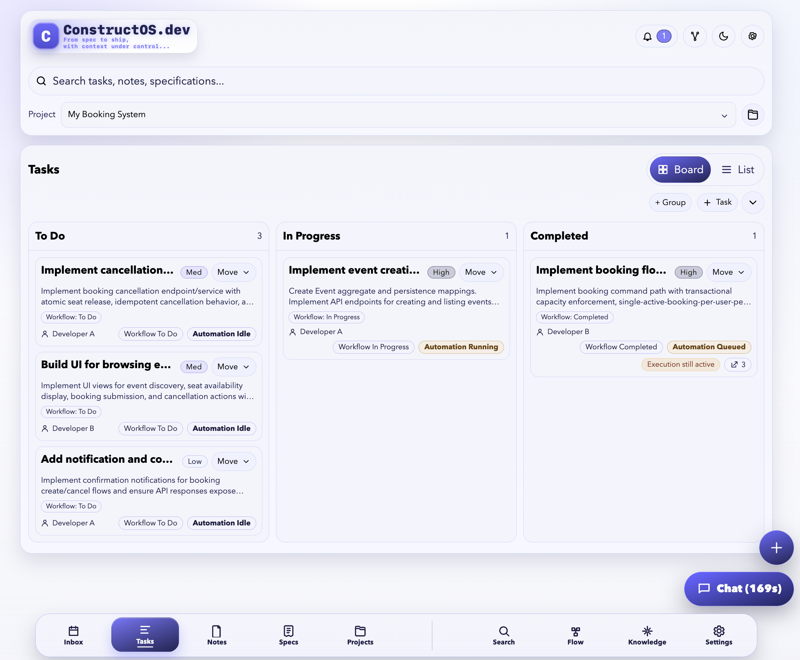
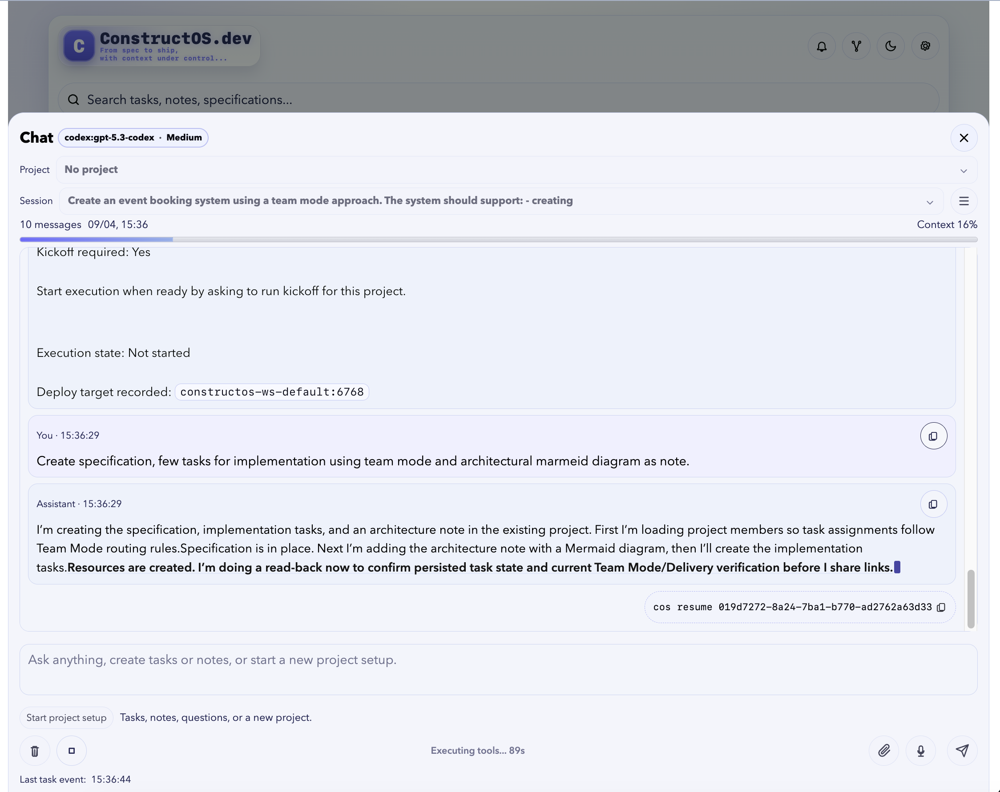
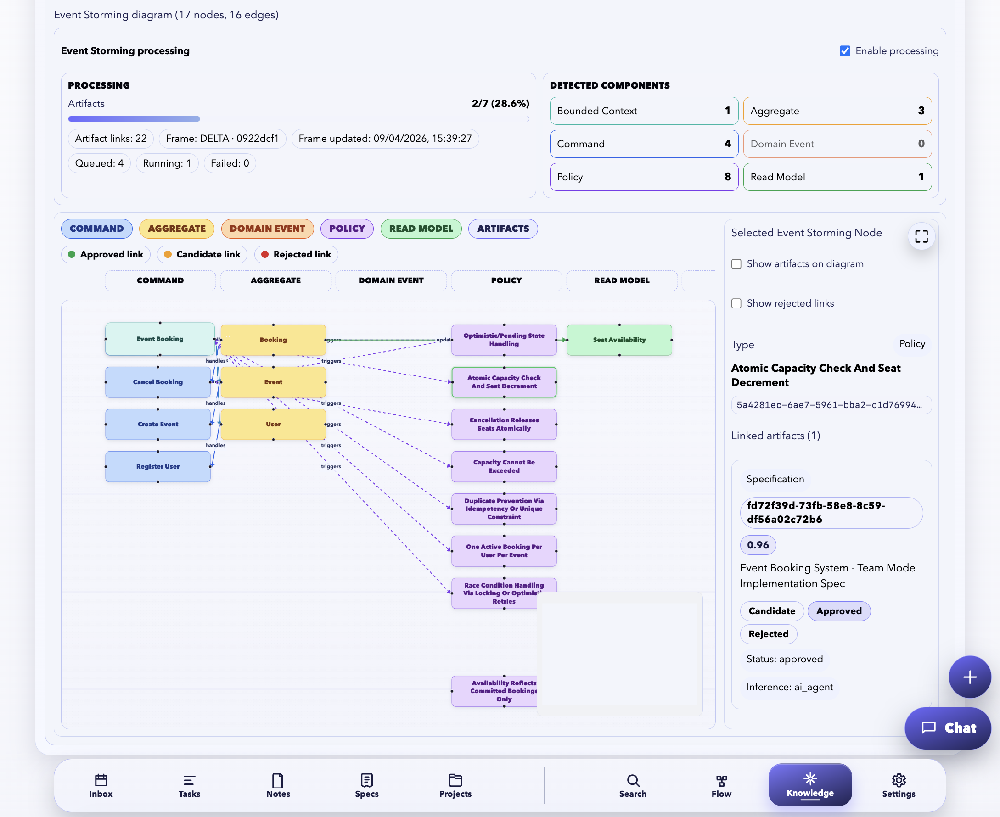
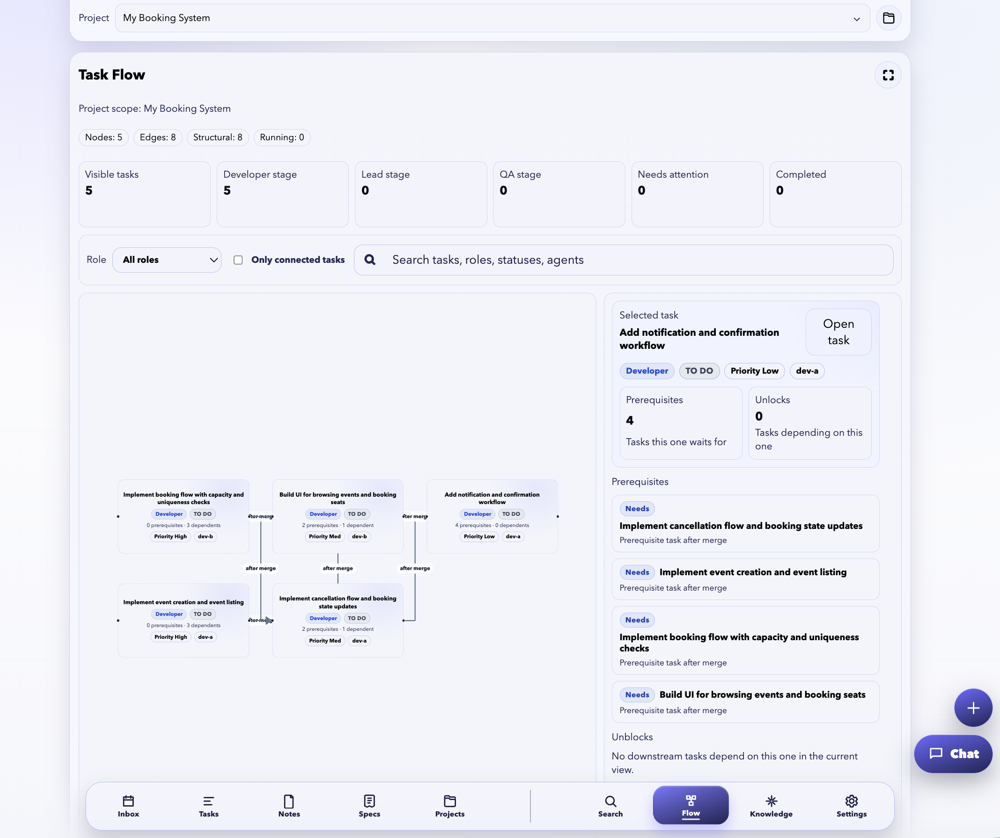
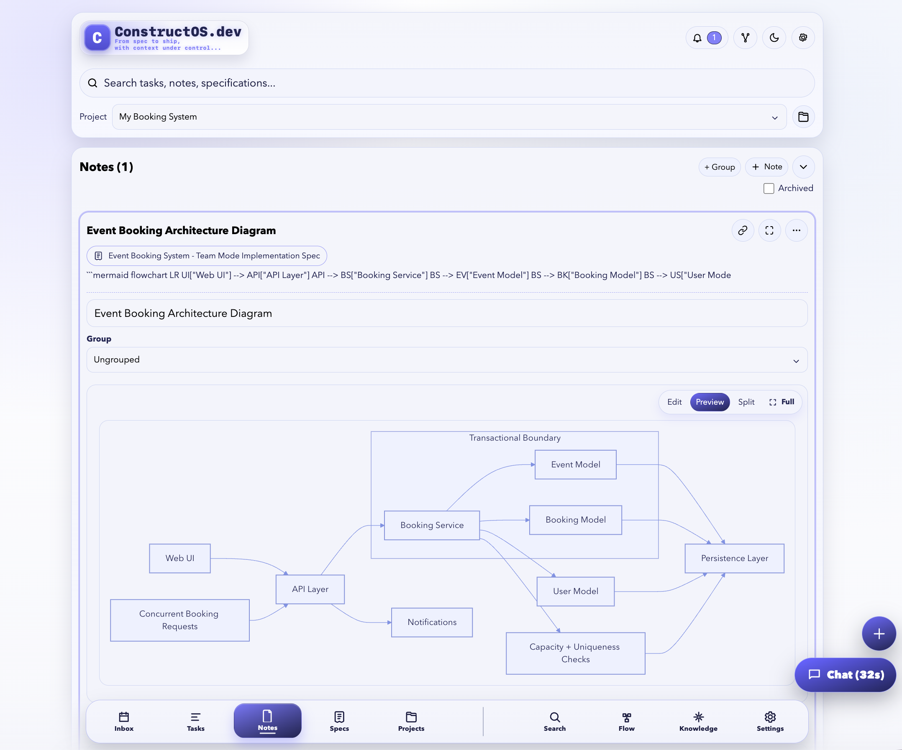
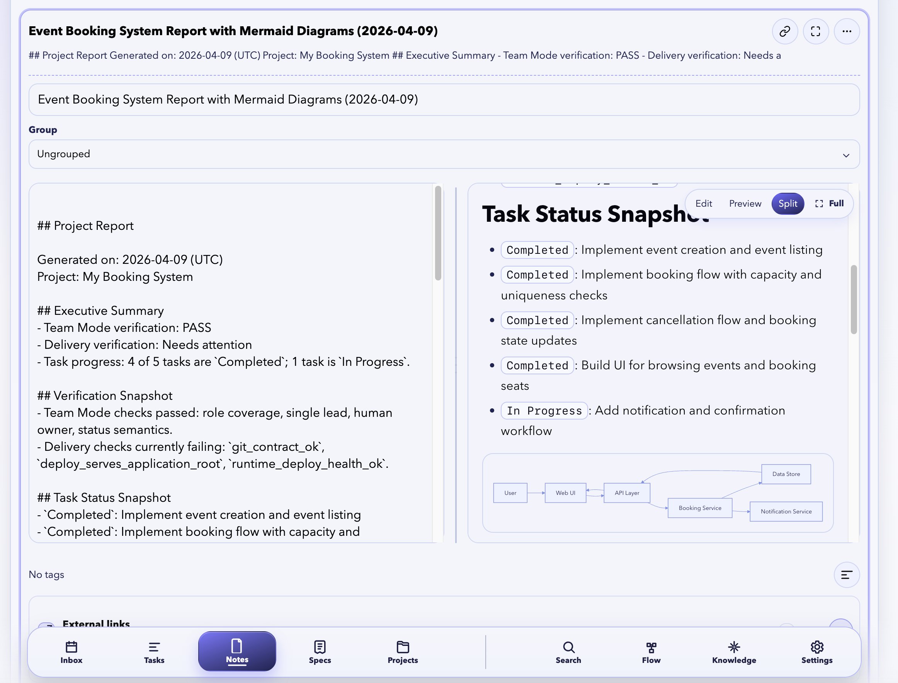
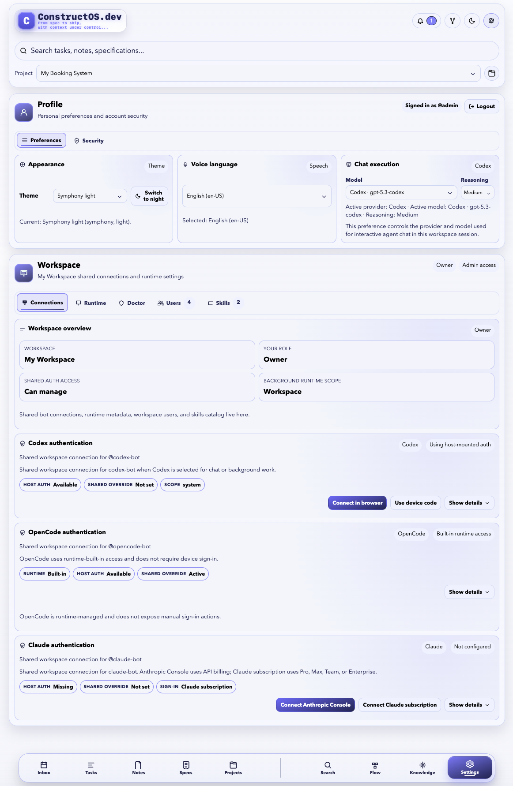
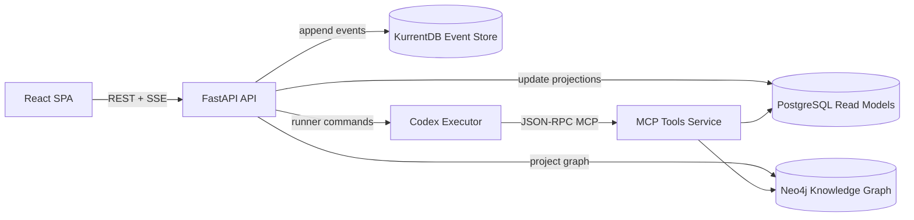

# ConstructOS

ConstructOS is an AI-native project delivery platform for planning, execution, and traceability.
It combines task orchestration, specification workflows, knowledge graph context, and agent-assisted execution in a single system.

## Why ConstructOS
- Team-oriented task execution with board/list views and lifecycle tracking.
- Specification-first workflow connected to tasks and notes.
- Event-storming and dependency-aware flow visualization.
- Knowledge graph context for retrieval, linking, and evidence-based answers.
- Agent-assisted chat for setup, generation, and iterative delivery.
- Event-sourced write path with fast SQL read models.

## Screenshots

### Task Board


### Chat Assistant (Team Mode)


### Event Storming + Knowledge View


### Task Flow Dependency Graph


### Notes + Mermaid Diagram Preview


### Generated Project Report (with Mermaid)


### Workspace Settings and Auth Providers


## Architecture At A Glance


## Quick Start
1. Start the full stack:
```bash
./scripts/deploy.sh
```

2. Check API health:
```bash
curl -sS http://localhost:1102/api/health
```

3. Open local services:
- App + API: `http://localhost:1102`
- Version: `http://localhost:1102/api/version`
- MCP endpoint: `http://localhost:8091/mcp`
- KurrentDB UI: `http://localhost:2113/web/index.html`

## Development
```bash
# Full clean redeploy (resets DB + volumes)
./scripts/recreate_from_zero.sh

# Run backend tests
docker compose -p constructos-app -f docker-compose.yml run --rm --build task-app pytest

# Run core bounded-context tests
docker compose -p constructos-app -f docker-compose.yml run --rm --build task-app pytest app/tests/core
```

## Repository Layout
- `app/main.py`: App bootstrap and router wiring.
- `app/features/*`: Vertical feature slices (tasks, projects, specs, notes, rules, agents).
- `app/shared/*`: Eventing, projections, models, settings, and graph utilities.
- `app/frontend/*`: React + TypeScript frontend.
- `scripts/*`: Deploy, reset, and utility scripts.

## Project Notes
- Primary active test policy reference: `docs/testing-source-of-truth.md`.
- This repository is being prepared for open-source release; documentation will continue to expand.
