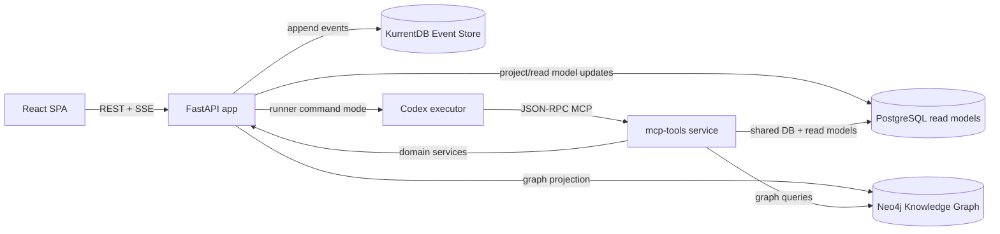

# m4tr1x Task Management Platform

Active documentation for the project, based on the current codebase snapshot (2026-02-18).

m4tr1x is a task/project platform that combines:
- `CQRS + Event Sourcing` for the write path and auditability.
- SQL read models for fast UI queries and filtering.
- `Neo4j` knowledge graph for relation-aware context and GraphRAG flows.
- `MCP` tools plus Codex automation for AI-assisted execution.

## Documentation
- `docs/01-business-overview.md` - business architecture, value model, KPI framework.
- `docs/02-technical-architecture.md` - technical architecture, command flow, projection model.
- `docs/03-domain-model-and-workflows.md` - domain model, lifecycle logic, key workflows.
- `docs/04-api-and-mcp-map.md` - REST surface, SSE behavior, MCP tools map.
- `docs/05-operations-runbook.md` - deployment, env config, observability, troubleshooting.
- `docs/08-cqrs-consistency-guardrails.md` - CQRS consistency rules, allowlist policy, and guardrail enforcement.
- `docs/12-macos-m4-licensing-and-distribution-plan.md` - cross-platform runtime, licensing, and distribution roadmap.

## System At A Glance


## Core Capabilities
- Multi-project task management with custom statuses and board/list views.
- Specification-driven workflow: specifications linked to tasks and notes.
- Notes and project rules as long-lived project memory.
- Scheduled instruction tasks (one-shot and recurring).
- AI automation loop: request -> queued -> runner -> completion/failure events.
- Real-time notifications over SSE (`notification`, `task_event`, `ping`) with commit-driven push wakeups.
- Knowledge graph endpoints and MCP tools for dependency-aware context.
- Command idempotency via `X-Command-Id` and `command_executions`.
- Licensing status endpoint and write-lock enforcement (`HTTP 402` on mutations when license is expired and enforcement is enabled).
- Activation-code licensing flow with control-plane seat limits (for example up to 3 devices per customer).
- Per-customer deployment tokens for control-plane access (`LICENSE_SERVER_TOKEN` scoped per customer).

## Quick Start
1. Start the stack:
```bash
./scripts/deploy.sh
```
`deploy.sh` supports:
- `DEPLOY_TARGET=auto|base|ubuntu-gpu|macos-m4` (default: `auto`)
- `DEPLOY_SOURCE=local|ghcr` (default: `local`)
- `GHCR_IMAGE_PREFIX` (default: `constructos`)

Examples:
```bash
# Ubuntu with local GPU-backed Ollama container
DEPLOY_TARGET=ubuntu-gpu ./scripts/deploy.sh

# macOS M4 with host-native Ollama (run `ollama serve` on host first)
DEPLOY_TARGET=macos-m4 ./scripts/deploy.sh

# pull private images from GHCR (no local build on client host)
DEPLOY_SOURCE=ghcr IMAGE_TAG=v0.1.227 ./scripts/deploy.sh
```
`deploy.sh` deploys app services only (no local `license-control-plane`).
Deploy local control-plane separately:
```bash
./scripts/deploy-control-plane.sh up
```
This also starts `license-control-plane-backup`, which creates SQLite backups every hour.
Default backup retention is 7 days in Docker volume `license-control-plane-backups`.

Optional backup tuning:
```bash
export LCP_BACKUP_INTERVAL_SECONDS='3600'
export LCP_BACKUP_RETENTION_HOURS='168'
./scripts/deploy-control-plane.sh restart
```

Restore latest backup:
```bash
docker compose -f docker-compose.license-control-plane.yml down
docker run --rm \
  -v task-management_license-control-plane-backups:/backups \
  -v task-management_license-control-plane-data:/data \
  alpine:3.20 \
  sh -lc 'cp "$(ls -1t /backups/license-control-plane-*.sqlite3 | head -n 1)" /data/license-control-plane.db'
./scripts/deploy-control-plane.sh up
```

Optional control-plane email test setup (Resend):
```bash
export LCP_EMAIL_RESEND_API_KEY='re_xxx'
export LCP_EMAIL_FROM='ConstructOS Onboarding <onboarding@constructos.dev>'
export LCP_EMAIL_REPLY_TO='support@constructos.dev'
export LCP_CUSTOMER_REF_SECRET='replace-with-long-random-secret'
export LCP_ONBOARDING_IMAGE_TAG='main'
export LCP_ONBOARDING_INSTALL_SCRIPT_URL='https://raw.githubusercontent.com/nirm3l/constructos/main/install.sh'
export LCP_ONBOARDING_SUPPORT_EMAIL='support@constructos.dev'
./scripts/deploy-control-plane.sh restart
```
Then open control-plane UI and use:
- **Onboarding Package** for one-step email -> customer_ref/token/activation generation + branded onboarding mail
- **Email Delivery Test** for generic smoke tests

Client deployment assets are maintained in a separate repository:
`https://github.com/nirm3l/constructos`

Client one-liner installer:
```bash
curl -fsSL https://raw.githubusercontent.com/nirm3l/constructos/main/install.sh | ACTIVATION_CODE=ACT-XXXX-XXXX-XXXX-XXXX-XXXX IMAGE_TAG=main AUTO_DEPLOY=1 bash
```
For signed entitlement enforcement, configure:
- `LCP_SIGNING_PRIVATE_KEY_PEM` on control-plane
- matching `LICENSE_PUBLIC_KEY` on app services

Optional encrypted runtime bundle (PoC only, not strong IP protection):
```bash
export APP_BUNDLE_PASSWORD='bundle-secret-segment'

docker build \
  -f app/Dockerfile \
  --build-arg APP_BUNDLE_ENCRYPT=true \
  --build-arg APP_BUNDLE_PASSWORD="${APP_BUNDLE_PASSWORD}" \
  -t ghcr.io/nirm3l/constructos-task-app:encrypted-poc \
  ./app
```
Runtime env for decrypt-on-start:
- `APP_ENCRYPTED_BUNDLE_ENABLED=true`
- `APP_BUNDLE_TOKEN_SEGMENT_INDEX=2` (0-based token segment; for `a.b.c`, this uses `c`)
- `LICENSE_SERVER_TOKEN=<token-containing-bundle-secret-segment>`
- Control-plane token generator can embed the same secret segment when `LCP_CLIENT_TOKEN_BUNDLE_PASSWORD` is set.
  `docker-compose.license-control-plane.yml` maps this from `APP_BUNDLE_PASSWORD` by default, so one `.env` value can drive both build-time encryption and issued token format.

The image can still be reverse-engineered by a host operator. Treat this as obfuscation, not a security boundary.

2. Check health:
```bash
curl -sS http://localhost:8080/api/health
```
3. Open app and APIs:
- App/API: `http://localhost:8080`
- Version: `http://localhost:8080/api/version`
- License status: `http://localhost:8080/api/license/status`
- Optional local control-plane admin UI: `http://localhost:8092`
- Optional local control-plane health: `http://localhost:8092/api/health`
- MCP endpoint (docker): `http://localhost:8091/mcp`
- KurrentDB UI (event browser): `http://localhost:2113/web/index.html`
- KurrentDB all-events feed (JSON): `http://localhost:2113/streams/%24all/head/backward/50?embed=body`

## Optional: Jira MCP (Separate Compose)
1. Create local env file:
```bash
cp .env.jira-mcp.example .env.jira-mcp
```
2. Edit `.env.jira-mcp` and set your Jira Cloud credentials.
`JIRA_API_TOKEN` is added in this file.
3. Start Jira MCP:
```bash
docker compose -f docker-compose.jira-mcp.yml up -d
```
4. Register server in Codex:
```bash
codex mcp add jira --url http://localhost:9010/mcp
```
5. Verify:
```bash
codex mcp list
```

## Development Commands
```bash
# Full clean redeploy (DB + volumes reset)
./scripts/recreate_from_zero.sh

# Backend tests
docker compose run --rm --build task-app pytest
```

## Technology Stack
- Backend: FastAPI, SQLAlchemy, Pydantic.
- Eventing: KurrentDB/EventStore + persistent subscription projection workers.
- Datastores: PostgreSQL (read), KurrentDB (event source), Neo4j (graph).
- Frontend: React + TypeScript + TanStack Query.
- AI integration: FastMCP server + Codex command adapter.

## Repository Layout
- `app/main.py` - app bootstrap, lifecycle, router wiring.
- `app/features/*` - vertical slices (tasks, projects, specs, notes, rules, agents...).
- `app/shared/*` - eventing, projections, models, settings, bootstrap, graph.
- `app/frontend/*` - SPA and UI state management.
- `marketing-site/*` - static marketing website served by dedicated Nginx container.
- `license_control_plane/*` - standalone licensing control-plane service (register/heartbeat/admin subscription update + activation code issuance + seat limits).
- `scripts/*` - deploy, reset, and helper scripts.
