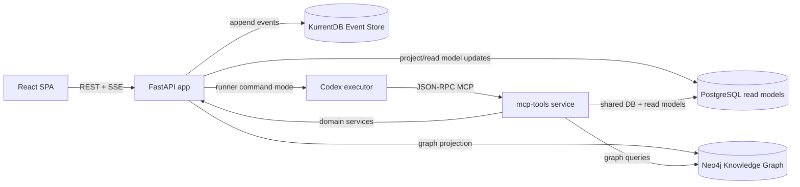

# m4tr1x Task Management Platform

Active documentation for the project, based on the current codebase snapshot (2026-02-18).

m4tr1x is a task/project platform that combines:
- `CQRS + Event Sourcing` for the write path and auditability.
- SQL read models for fast UI queries and filtering.
- `Neo4j` knowledge graph for relation-aware context and GraphRAG flows.
- `MCP` tools plus Codex automation for AI-assisted execution.

## Documentation
- `docs/01-business-overview.md` - business architecture, value model, KPI framework.
- `docs/02-technical-architecture.md` - technical architecture, command flow, projection model.
- `docs/03-domain-model-and-workflows.md` - domain model, lifecycle logic, key workflows.
- `docs/04-api-and-mcp-map.md` - REST surface, SSE behavior, MCP tools map.
- `docs/05-operations-runbook.md` - deployment, env config, observability, troubleshooting.

## System At A Glance


## Core Capabilities
- Multi-project task management with custom statuses and board/list views.
- Specification-driven workflow: specifications linked to tasks and notes.
- Notes and project rules as long-lived project memory.
- Scheduled instruction tasks (one-shot and recurring).
- AI automation loop: request -> queued -> runner -> completion/failure events.
- Real-time notifications over SSE (`notification`, `task_event`, `ping`) with commit-driven push wakeups.
- Knowledge graph endpoints and MCP tools for dependency-aware context.
- Command idempotency via `X-Command-Id` and `command_executions`.

## Quick Start
1. Start the stack:
```bash
./scripts/deploy.sh
```
2. Check health:
```bash
curl -sS http://localhost:8080/api/health
```
3. Open app and APIs:
- App/API: `http://localhost:8080`
- Version: `http://localhost:8080/api/version`
- MCP endpoint (docker): `http://localhost:8091/mcp`
- KurrentDB UI (event browser): `http://localhost:2113/web/index.html`
- KurrentDB all-events feed (JSON): `http://localhost:2113/streams/%24all/head/backward/50?embed=body`

## Development Commands
```bash
# Full clean redeploy (DB + volumes reset)
./scripts/recreate_from_zero.sh

# Backend tests
docker compose run --rm --build task-app pytest
```

## Technology Stack
- Backend: FastAPI, SQLAlchemy, Pydantic.
- Eventing: KurrentDB/EventStore + persistent subscription projection workers.
- Datastores: PostgreSQL (read), KurrentDB (event source), Neo4j (graph).
- Frontend: React + TypeScript + TanStack Query.
- AI integration: FastMCP server + Codex command adapter.

## Repository Layout
- `app/main.py` - app bootstrap, lifecycle, router wiring.
- `app/features/*` - vertical slices (tasks, projects, specs, notes, rules, agents...).
- `app/shared/*` - eventing, projections, models, settings, bootstrap, graph.
- `app/frontend/*` - SPA and UI state management.
- `scripts/*` - deploy, reset, and helper scripts.
