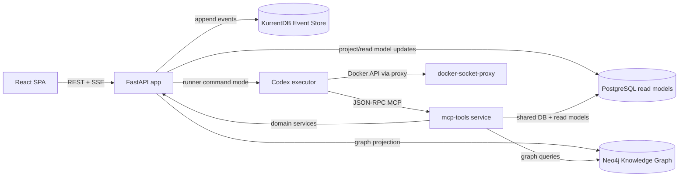

# m4tr1x Task Management Platform

Active documentation for the project, based on the current codebase snapshot (2026-02-18).

m4tr1x is a task/project platform that combines:
- `CQRS + Event Sourcing` for the write path and auditability.
- SQL read models for fast UI queries and filtering.
- `Neo4j` knowledge graph for relation-aware context and GraphRAG flows.
- `MCP` tools plus Codex automation for AI-assisted execution.

## Documentation
Project documentation is being rewritten and is temporarily unavailable in this repository.

Testing policy source of truth:
- `docs/testing-source-of-truth.md`

## System At A Glance


## Core Capabilities
- Multi-project task management with custom statuses and board/list views.
- Specification-driven workflow: specifications linked to tasks and notes.
- Notes and project rules as long-lived project memory.
- Scheduled instruction tasks (one-shot and recurring).
- AI automation loop: request -> queued -> runner -> completion/failure events.
- Real-time notifications over SSE (`notification`, `task_event`, `ping`) with commit-driven push wakeups.
- Knowledge graph endpoints and MCP tools for dependency-aware context.
- Command idempotency via `X-Command-Id` and `command_executions`.

## Quick Start
1. Start the stack:
```bash
./scripts/deploy.sh
```
`deploy.sh` supports:
- `DEPLOY_TARGET=auto|base|ubuntu-gpu|macos-m4` (default: `auto`)
- `DEPLOY_SOURCE=local|ghcr` (default: `local`)
- `GHCR_IMAGE_PREFIX` (default: `constructos`)
- `CODEX_CONFIG_FILE` (default: `./codex.config.toml`)
- `CODEX_AUTH_FILE` (default: `${HOME}/.codex/auth.json`)
- `OLLAMA_MODELS_MOUNT` (optional; host path or volume name)

Ollama model storage behavior on Linux deploy targets:
- If `OLLAMA_MODELS_MOUNT` is set, that value is used.
- If not set and host `~/.ollama` exists, deploy auto-binds it into the container.
- Otherwise, deploy uses named volume `ollama-data` (default container-managed storage).

Examples:
```bash
# Ubuntu with local GPU-backed Ollama container
DEPLOY_TARGET=ubuntu-gpu ./scripts/deploy.sh

# macOS M4 with host-native Ollama (run `ollama serve` on host first)
DEPLOY_TARGET=macos-m4 ./scripts/deploy.sh

# pull private images from GHCR (no local build on client host)
DEPLOY_SOURCE=ghcr IMAGE_TAG=v0.1.227 ./scripts/deploy.sh
```

Client deployment assets are maintained in a separate repository:
`https://github.com/nirm3l/constructos`

Client one-liner installer:
```bash
curl -fsSL https://raw.githubusercontent.com/nirm3l/constructos/main/install.sh | ACTIVATION_CODE=ACT-XXXX-XXXX-XXXX-XXXX-XXXX IMAGE_TAG=main INSTALL_COS=true AUTO_DEPLOY=1 bash
```

Optional encrypted runtime bundle (PoC only, not strong IP protection):
```bash
export APP_BUNDLE_PASSWORD='bundle-secret-segment'

docker build \
  -f app/Dockerfile \
  --build-arg APP_BUNDLE_ENCRYPT=true \
  --build-arg APP_BUNDLE_PASSWORD="${APP_BUNDLE_PASSWORD}" \
  -t ghcr.io/nirm3l/constructos-task-app:encrypted-poc \
  ./app
```
Runtime env for decrypt-on-start:
- `APP_ENCRYPTED_BUNDLE_ENABLED=true`
- `APP_BUNDLE_TOKEN_SEGMENT_INDEX=2` (0-based token segment; for `a.b.c`, this uses `c`)

The image can still be reverse-engineered by a host operator. Treat this as obfuscation, not a security boundary.

2. Check health:
```bash
curl -sS http://localhost:1102/api/health
```
3. Open app and APIs:
- App/API: `http://localhost:1102`
- Version: `http://localhost:1102/api/version`
- MCP endpoint (docker): `http://localhost:8091/mcp`
- KurrentDB UI (event browser): `http://localhost:2113/web/index.html`
- KurrentDB all-events feed (JSON): `http://localhost:2113/streams/%24all/head/backward/50?embed=body`

Optional for Codex git push from `task-app` container:
- set `GITHUB_PAT` in `.env` to a GitHub token with repository write access.
- runtime maps `GITHUB_PAT` to `GITHUB_TOKEN` when `GITHUB_TOKEN` is not already set.

Optional: map Codex workspace to a host folder
- By default, Codex uses container path `/home/app/workspace` mapped to host path `/workspace`.
- To see generated code directly on host, set bind mount source via env:
```bash
mkdir -p ./codex-workspace
export AGENT_CODEX_WORKSPACE_MOUNT="$PWD/codex-workspace"
./scripts/deploy.sh
```
- After deploy, files created by Codex in `/home/app/workspace` are visible in `./codex-workspace` on host.

Docker access from `task-app` (safe proxy path)
- `task-app` does not export `DOCKER_HOST` globally to the agent process.
- Docker CLI wrapper uses `AGENT_DOCKER_PROXY_URL=tcp://docker-socket-proxy:2375` and injects `DOCKER_HOST` only when executing allowed Docker commands.
- Direct Docker socket is mounted only in `docker-socket-proxy`, not in `task-app`.
- This keeps Docker daemon exposure narrower than mounting `/var/run/docker.sock` directly into `task-app`.
- Soft isolation is enabled by default inside `task-app` Docker CLI wrapper:
  - `AGENT_DOCKER_SOFT_ISOLATION=true`
  - `AGENT_DOCKER_PROJECT_NAME=constructos-ws-default`
  - `AGENT_DOCKER_ALLOWED_PROJECT_PREFIX=constructos-ws-`
- Runtime hardening rewires `/usr/bin/docker` and `/usr/bin/docker-compose` to wrapper entrypoints so absolute-path CLI bypass is blocked.
- With soft isolation enabled, allowed commands are limited to:
  - `docker compose` (forced to the configured project)
  - `docker ps` and `docker container ls` (auto-filtered to the configured project)
  - `docker info|version|context`
- Important: this is still an application-level guardrail, not a full network security boundary. Any process with raw TCP access to the proxy endpoint can still attempt direct Docker API calls.

## Optional: Jira MCP (Separate Compose)
1. Create local env file:
```bash
cp .env.jira-mcp.example .env.jira-mcp
```
2. Edit `.env.jira-mcp` and set your Jira Cloud credentials.
`JIRA_API_TOKEN` is added in this file.
3. Start Jira MCP:
```bash
docker compose -p constructos-jira-mcp -f docker-compose.jira-mcp.yml up -d
```
4. Register server in Codex:
```bash
codex mcp add jira --url http://localhost:9010/mcp
```
5. Verify:
```bash
codex mcp list
```

## Development Commands
```bash
# Full clean redeploy (DB + volumes reset)
./scripts/recreate_from_zero.sh

# Backend tests
docker compose -p constructos-app -f docker-compose.yml run --rm --build task-app pytest

# Critical bounded-context suite (default pytest collection, 150-200 target)
docker compose -p constructos-app -f docker-compose.yml run --rm --build task-app pytest app/tests/core
```

## COS Wrapper CLI
`cos` (package: `constructos-cli`) is maintained in this private repository and distributed as release artifacts.

Install from release artifact:
```bash
COS_CLI_VERSION=0.1.2
pipx install --force "https://github.com/nirm3l/constructos/releases/download/cos-v${COS_CLI_VERSION}/constructos_cli-${COS_CLI_VERSION}-py3-none-any.whl"
```

Repository and docs:
- `https://github.com/nirm3l/m4tr1x`
- `tools/cos/README.md`

## Technology Stack
- Backend: FastAPI, SQLAlchemy, Pydantic.
- Eventing: KurrentDB/EventStore + persistent subscription projection workers.
- Datastores: PostgreSQL (read), KurrentDB (event source), Neo4j (graph).
- Frontend: React + TypeScript + TanStack Query.
- AI integration: FastMCP server + Codex command adapter.

## Repository Layout
- `app/main.py` - app bootstrap, lifecycle, router wiring.
- `app/features/*` - vertical slices (tasks, projects, specs, notes, rules, agents...).
- `app/shared/*` - eventing, projections, models, settings, bootstrap, graph.
- `app/frontend/*` - SPA and UI state management.
- `scripts/*` - deploy, reset, and helper scripts.
