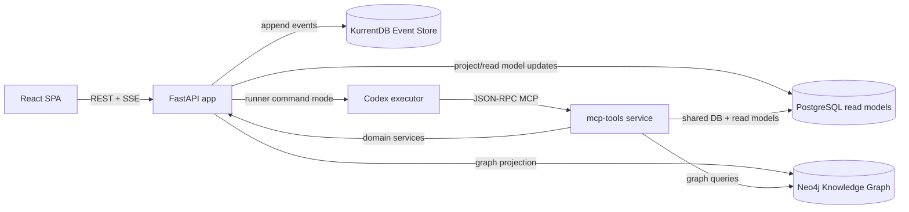

# m4tr1x Task Management Platform

Aktivna dokumentacija za projekat bazirana na trenutnom kodu (snapshot: 2026-02-18).

m4tr1x je task/project sistem koji kombinuje:
- `CQRS + Event Sourcing` za write tok i auditabilnost,
- SQL read modele za brz UI i filtriranje,
- `Neo4j` knowledge graph za kontekst i GraphRAG,
- `MCP` sloj i Codex automatizaciju za AI-assisted execution.

## Dokumentacija
- `docs/01-business-overview.md` - biznis arhitektura, value model, KPI okvir.
- `docs/02-technical-architecture.md` - tehnicka arhitektura, tok komandi i projekcija.
- `docs/03-domain-model-and-workflows.md` - domen, lifecycle modeli i glavna pravila.
- `docs/04-api-and-mcp-map.md` - REST povrsina, SSE i MCP alati.
- `docs/05-operations-runbook.md` - deploy, env varijable, observability i troubleshooting.

## Sistem Na Jednoj Strani


## Kljucne Funkcionalnosti
- Multi-project task management sa custom statusima i board/list prikazom.
- Specification-driven rad: specifikacije povezane sa taskovima i notes.
- Notes i project rules kao trajna projektna memorija.
- Scheduled instruction taskovi (jednokratni i recurring).
- AI automation loop: request -> queued -> runner -> completion/failure eventi.
- Real-time notifikacije preko SSE (`notification`, `task_event`, `ping`).
- Knowledge graph endpointi + MCP alati za dependency-aware kontekst.
- Command idempotency preko `X-Command-Id` i `command_executions` read modela.

## Brzi Start
1. Pokreni stack:
```bash
./scripts/deploy.sh
```
2. Proveri health:
```bash
curl -sS http://localhost:8080/api/health
```
3. Otvori UI i API:
- UI/API: `http://localhost:8080`
- Version: `http://localhost:8080/api/version`
- MCP endpoint (docker): `http://localhost:8091/mcp`

## Development Komande
```bash
# clean redeploy od nule (db + volumes reset)
./scripts/recreate_from_zero.sh

# backend testovi
docker compose run --rm --build task-app pytest
```

## Tehnoloski Stack
- Backend: FastAPI, SQLAlchemy, Pydantic.
- Eventing: KurrentDB/EventStore, custom projection worker-i.
- Datastores: PostgreSQL (read), KurrentDB (source of truth), Neo4j (graph).
- Frontend: React + TypeScript + TanStack Query.
- AI integracija: FastMCP server + Codex command adapter.

## Repo Mapa
- `app/main.py` - app bootstrap, lifecycle i router wiring.
- `app/features/*` - vertical slices (tasks, projects, specs, notes, rules, agents...).
- `app/shared/*` - eventing, projekcije, modeli, settings, bootstrap, graph.
- `app/frontend/*` - SPA i UI state management.
- `scripts/*` - deploy, reset i seed utility skripte.
