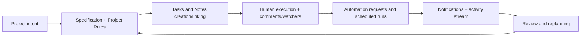

# 01 Business Overview

## 1. Kontekst i Produktna Teza
Projekat je fokusiran na "operational memory + execution engine" za timove koji rade knowledge-work i development delivery.

Inferirano iz koda i API surface-a:
- Platforma nije samo TODO lista, vec sistem koji povezuje `Project -> Specification -> Task -> Note -> Rule`.
- Product design favorizuje auditabilnost (event sourcing), kolaboraciju (roles, comments, watchers), i AI augmentaciju (agent runner + MCP).
- Knowledge graph je implementiran kao first-class capability, ne kao eksperimentalni addon.

## 2. Koji Biznis Problem Resava
Klasicni task alati cesto razdvajaju:
- planiranje (spec/rules),
- execution (tasks),
- context (notes/decisions),
- i AI asistenciju.

m4tr1x sve to drzi u istom modelu i smanjuje:
- context switching,
- gubitak institucionalnog znanja,
- i dupliranje rada tokom automatizacije.

## 3. Personae i Primarni Use-case-ovi
| Persona | Potreba | Kako sistem odgovara |
|---|---|---|
| Team lead / PM | Kontrola scope-a i statusa po projektu | Project board, custom statuses, project activity, tags |
| Engineer / contributor | Brz prelaz od specifikacije do zadataka | Spec-linked task/note flow, comments, attachments |
| Ops / automation owner | Pouzdana AI asistencija bez gubitka kontrole | Command idempotency, automation status, role checks, allowlist-e |
| AI agent (Codex) | Deterministican alat za mutacije i analizu | MCP tools, command_id policy, graph context pack |

## 4. Business Capability Mapa
| Capability | Trenutna zrelost | Napomena |
|---|---|---|
| Planning (project/spec/rules) | Visoka | Coverage kroz dedicated feature-e + API + testove |
| Execution (task lifecycle) | Visoka | Archive/reopen/complete/reorder/bulk + recurring schedule |
| Knowledge retention | Srednje-visoka | Notes + refs + graph relacije + activity log |
| Real-time awareness | Visoka | SSE stream za notifications i workspace activity |
| AI-assisted operations | Visoka | MCP + runner + chat endpoint + mutation guardrail-i |
| Enterprise controls | Srednja | Token/allowlist postoji, ali nema SSO/RBAC granularity po projektu van role modela |

## 5. End-to-End Value Flow

## 6. Poslovne Metrike (Predlog)
Metrike koje su direktno mapirane na postojeci model:
- Delivery throughput: broj zavrsenih taskova po projektu/vremenu.
- Cycle time: od `TaskCreated` do `TaskCompleted`.
- Rework indicator: broj `TaskReopened` eventa.
- Spec adoption: procenat taskova sa `specification_id`.
- Automation effectiveness:
  - queued -> completed ratio,
  - failed runs,
  - stale running recoveries.
- Context quality:
  - broj taskova sa comments/notes/rules referencama,
  - graph context request/failure odnos.

## 7. Komercijalna/Operativna Pozicija
Ako se proizvod plasira kao SaaS ili internal platform capability, najjaci diferencijatori su:
- event-sourced audit trail,
- specification-driven execution,
- i practical AI control plane kroz MCP.

To ga pozicionira blize "execution OS" nego standardnom kanban alatu.

## 8. Biznis Rizici i Prioriteti
Glavni rizici:
- kompleksnost setup-a (vise datastore-ova + runner + MCP),
- oslanjanje na jasan command_id disciplinu za bezbedne mutacije,
- i potreba za governance pravilima kada AI mutacije rastu.

Prioriteti za sledecu fazu:
1. Jasniji KPI dashboard na nivou proizvoda.
2. Workspace onboarding koji minimizira operativni overhead.
3. Policy layer za AI mutacije (npr. project-level mutation policy).
