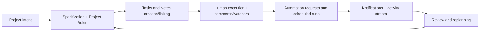

# 01 Business Overview

## 1. Product Thesis
The project acts as an "operational memory + execution engine" for teams that deliver software and other knowledge work.

Observed from the code and API surface:
- This is not a simple TODO app; it links `Project -> Specification -> Task -> Note -> Rule` in one model.
- Product behavior favors auditability (event sourcing), collaboration (roles, comments, watchers), and AI augmentation (runner + MCP).
- The knowledge graph is implemented as a core capability, not as an optional prototype.

## 2. Business Problem It Solves
Many task systems split:
- planning artifacts,
- execution artifacts,
- context/memory artifacts,
- and AI operations.

m4tr1x keeps these in one coherent model, reducing:
- context switching,
- institutional memory loss,
- duplicate effort during automation.

## 3. Personas and Primary Use Cases
| Persona | Need | System response |
|---|---|---|
| Team lead / PM | Scope and status control by project | Project board, custom statuses, project activity, tags |
| Engineer / contributor | Fast path from specification to execution | Spec-linked tasks/notes, comments, attachments |
| Ops / automation owner | Reliable AI assistance with guardrails | Command idempotency, automation status, role checks, allowlists |
| AI agent (Codex) | Deterministic action interface | MCP tools, command_id policy, graph context pack |

## 4. Business Capability Map
| Capability | Maturity | Notes |
|---|---|---|
| Planning (projects/specs/rules) | High | Dedicated feature slices + API + tests |
| Execution (task lifecycle) | High | Complete/reopen/archive/reorder/bulk + recurring schedules |
| Knowledge retention | Medium-high | Notes + refs + graph relationships + activity log |
| Real-time awareness | High | SSE stream for notifications and workspace activity |
| AI-assisted operations | High | MCP + runner + chat endpoint + mutation guardrails |
| Enterprise controls | Medium | Token/allowlist controls exist; no advanced enterprise IAM yet |

## 5. End-to-End Value Flow

## 6. Suggested Business KPI Framework
Directly mappable to current domain events/read models:
- Delivery throughput: number of completed tasks over time.
- Cycle time: from `TaskCreated` to `TaskCompleted`.
- Rework ratio: frequency of `TaskReopened`.
- Specification adoption: percentage of tasks with `specification_id`.
- Automation effectiveness:
  - queued -> completed ratio,
  - failure ratio,
  - stale-run recoveries.
- Context quality:
  - tasks with comments/notes/rule references,
  - graph context request/failure ratio.

## 7. Product Positioning
As an internal platform or SaaS product, key differentiators are:
- event-sourced audit trail,
- specification-driven delivery,
- practical AI control plane through MCP.

That positions it closer to an execution operating system than a standard kanban tool.

## 8. Business Risks and Priorities
Main risks:
- setup complexity (multiple datastores + runner + MCP),
- dependency on command_id discipline for safe retried mutations,
- need for stronger governance as AI-driven mutations scale.

Near-term priorities:
1. KPI dashboarding at product level.
2. Reduced onboarding/operations overhead.
3. Policy layer for AI mutations (for example project-level mutation policy).
