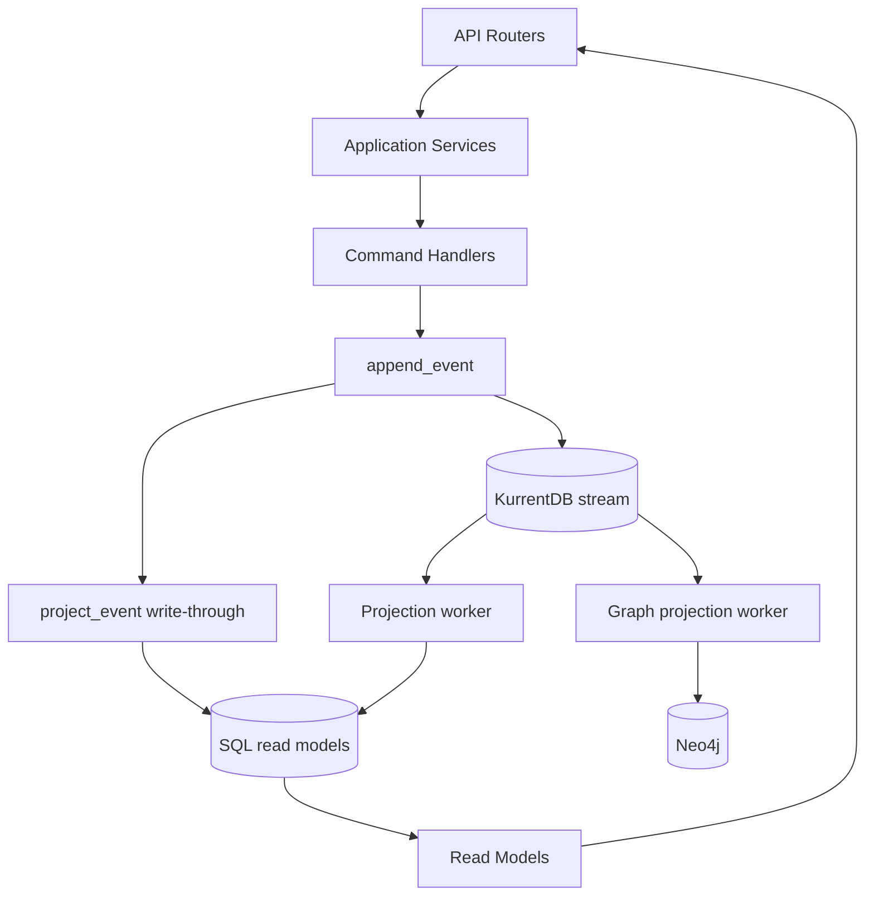

# 02 Technical Architecture

## 1. Architectural Style
The system combines:
- Vertical Slice organization (`app/features/*`).
- CQRS pattern (commands via handlers, queries via read models).
- Event sourcing on the write side (KurrentDB as event source when enabled).
- Dedicated projection workers for SQL read models and Neo4j graph models.

## 2. Layering

## 3. Command Flow (Write Path)

## 4. Projection Model and Consistency
There are two asynchronous projection pipelines:
- `read-model` checkpoint -> SQL read side.
- `knowledge-graph` checkpoint -> Neo4j read side.

`append_event()` also performs write-through SQL projection so UI reads remain fresh even when background projection lag exists.

Consistency by store:
- Event store: append-only, optimistic concurrency per stream version.
- SQL read model: eventual consistency + write-through shortcut.
- Neo4j graph: eventual consistency via dedicated graph worker.

## 5. Datastore Responsibilities
| Store | Responsibility | Key modules |
|---|---|---|
| KurrentDB/EventStore | Event source of truth | `shared/eventing_store.py`, `shared/eventing.py` |
| PostgreSQL | Read models, command replay log, checkpoints | `shared/models.py`, `shared/eventing_rebuild.py` |
| Neo4j | Knowledge graph and context retrieval | `shared/eventing_graph.py`, `shared/knowledge_graph.py` |
| Filesystem uploads | Attachment object storage | `features/attachments/api.py` |

## 6. Notable Technical Properties
- Concurrency control: `expected_version` and retry/backoff (`run_command_with_retry`).
- Idempotency:
  - explicit: `X-Command-Id`,
  - implicit: deterministic aggregate IDs for create flows (project/task/note/spec).
- Audit trail: activity log per projected event with `_event_key` dedupe marker.
- Schema evolution: event metadata `schema_version` + upcaster hook (`event_upcasters.py`).
- Multi-runtime domain reuse: same core services exposed via REST and MCP.

## 7. Security and Access Model
- User context from HTTP-only auth session cookie (`/api/auth/login` -> `m4tr1x_session`).
- Workspace role checks (`Owner/Admin/Member/Guest`) on read/write flows.
- MCP controls:
  - optional token (`MCP_AUTH_TOKEN`),
  - workspace/project allowlists,
  - dedicated actor user (`MCP_ACTOR_USER_ID`).
- Email tool enforces recipient/domain allowlists when configured.

## 8. Reliability and Failure Handling
- Projection workers run catch-up + subscription loops with retry behavior.
- Graph failures degrade gracefully (graph endpoints may return 503; core system keeps running).
- Agent runner has stale-run recovery and explicit failed-state events.
- Notification emission uses lookback windows and duplicate suppression.

## 9. Technical Risk Areas
- Operational complexity from multi-store architecture + workers + runner.
- Safe retries depend on strong command_id discipline.
- SSE and long-running worker lifecycles require reliable infra timeouts/restarts.

## 10. Architecture Strengths
- Clean write/read separation.
- Single event model powering API, automation, and graph projections.
- Strong foundation for explainable AI actions because all mutations are evented.

## 11. CQRS Guardrails
- Repository check: `scripts/check_cqrs_guardrails.py`.
- Scope: `app/features/**/api.py`, `app/features/**/application.py`, `app/features/**/command_handlers.py`.
- Blocked patterns: direct `db.add`, `db.delete`, and direct SQL `insert/update/delete` execution in feature write slices.
- Temporary exceptions are explicitly tracked in `scripts/cqrs_guardrails_allowlist.json`.
