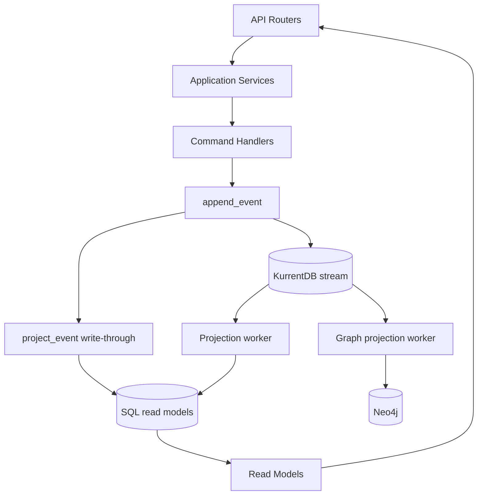
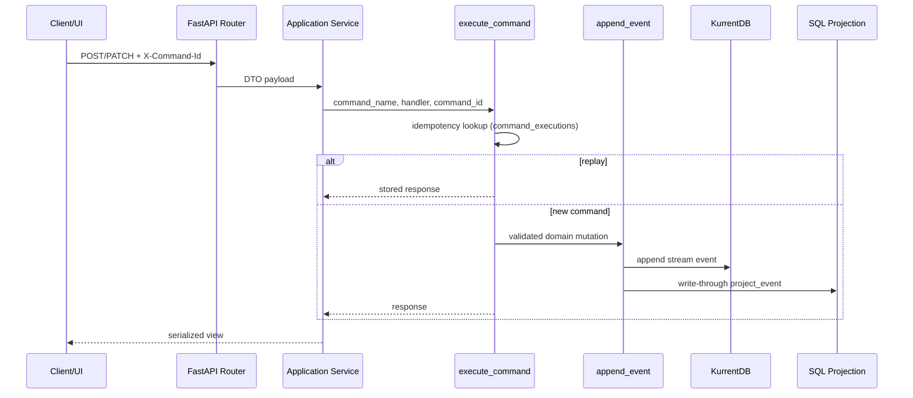

# 02 Technical Architecture

## 1. Arhitekturni Stil
Sistem koristi kombinaciju:
- Vertical Slice organizacije (`app/features/*`).
- CQRS obrasca (command handler-i + odvojeni read modeli).
- Event sourcing write modela (KurrentDB kao source of truth kada je ukljucen).
- Projekcionih worker-a za SQL i Neo4j read strane.

## 2. Layering

## 3. Command Tok (Write Path)

## 4. Projection Model i Konzistentnost
Postoje 2 asinhrona projection pipeline-a:
- `read-model` checkpoint -> SQL read strane.
- `knowledge-graph` checkpoint -> Neo4j.

Write-through projekcija u `append_event()` drzi SQL read model sveze i kada background checkpoint zaostaje.

Konzistentnost po store-u:
- Event store: append-only, optimistic concurrency po stream version.
- SQL read model: eventual consistency + write-through shortcut.
- Neo4j graph: eventual consistency kroz poseban worker.

## 5. Data Store Uloge
| Store | Uloga | Kriticni moduli |
|---|---|---|
| KurrentDB/EventStore | Event source of truth | `shared/eventing_store.py`, `shared/eventing.py` |
| PostgreSQL | Read modeli, command replay log, checkpoints | `shared/models.py`, `shared/eventing_rebuild.py` |
| Neo4j | Knowledge graph i context retrieval | `shared/eventing_graph.py`, `shared/knowledge_graph.py` |
| Filesystem uploads | Attachments blob storage | `features/attachments/api.py` |

## 6. Glavne Tehnicke Karakteristike
- Concurrency: `expected_version` + retry/backoff (`run_command_with_retry`).
- Idempotency:
  - explicitno: `X-Command-Id`,
  - implicitno: deterministic aggregate IDs za create (project/task/note/spec po normalized title/name).
- Audit trail: activity log zapis po event-u sa `_event_key` dedupe signalom.
- Schema evolution: `schema_version` metadata + upcaster hook (`event_upcasters.py`).
- Multi-runtime: isti core domenski kod izlozen kroz REST i MCP server.

## 7. Security i Access Model
- User context preko `X-User-Id` (ili query fallback).
- Workspace role checks (`Owner/Admin/Member/Guest`) na read i write endpointima.
- MCP zaštita:
  - optional token (`MCP_AUTH_TOKEN`),
  - workspace/project allowlist,
  - dedicated actor user (`MCP_ACTOR_USER_ID`).
- Email tool ima recipient/domain allowlist mehanizam.

## 8. Reliability i Failure Behavior
- Projection worker-i rade catch-up + subscribe loop i retry na error.
- Graph pipeline degradira "soft" (API vraca 503 za graph endpoint-e, ostatak sistema radi).
- Agent runner ima stale recovery logiku i failed state evente.
- Notification emit logic koristi lookback i dedupe semantiku.

## 9. Tehnicki Rizici
- Operational complexity zbog 3 datastore-a + 2 worker-a + runner-a.
- Potreban je oprez kod manualnih mutacija bez command_id discipline.
- SSE i long-running worker-i zahtevaju stabilan deployment setup (timeouts, restart policy).

## 10. Snage Arhitekture
- Cist separation write/read concerns.
- Jedinstven event model za API, automation i graph.
- Dobar temelj za "explainable AI actions" jer mutacije ostaju event-ovane.
