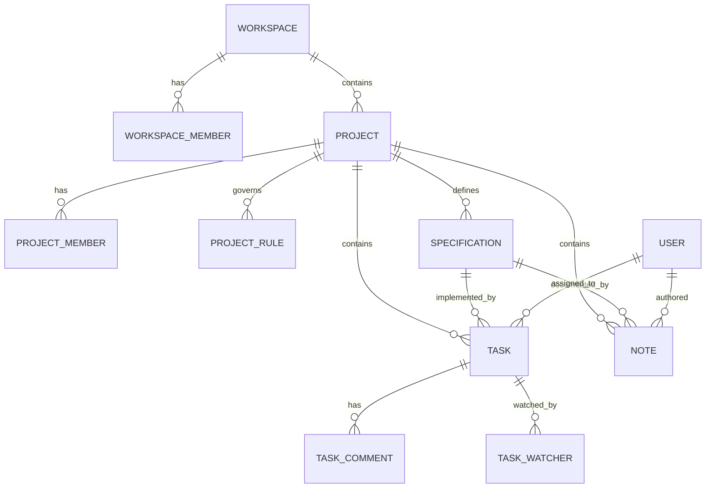
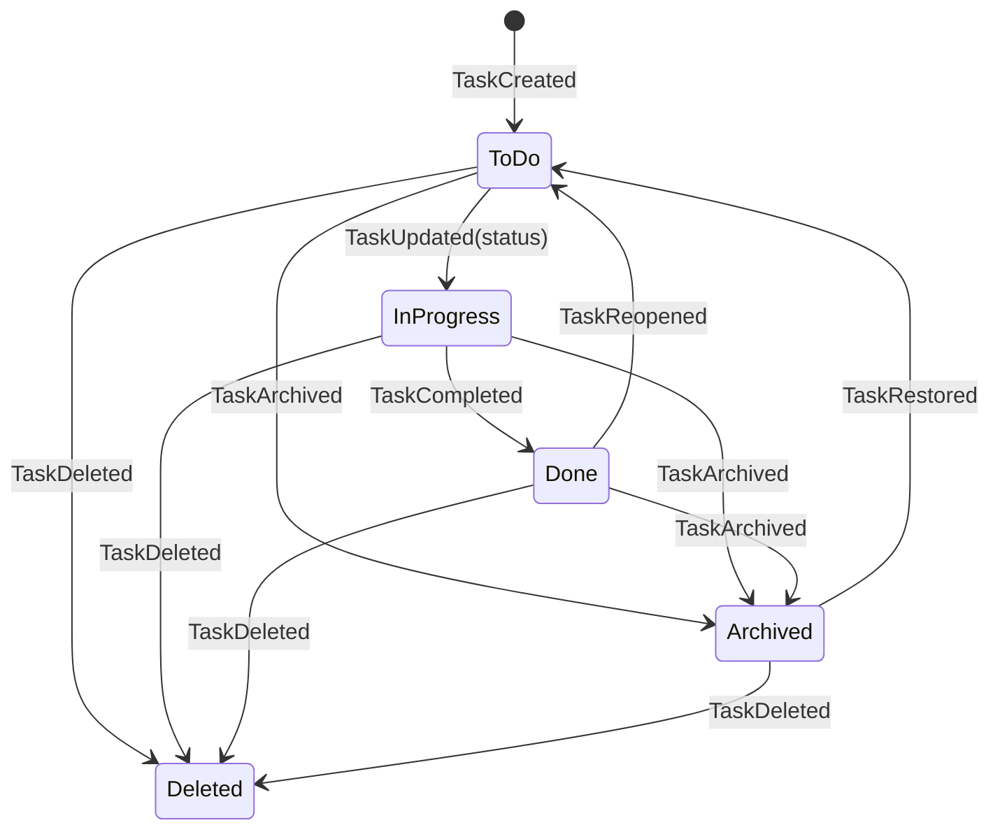
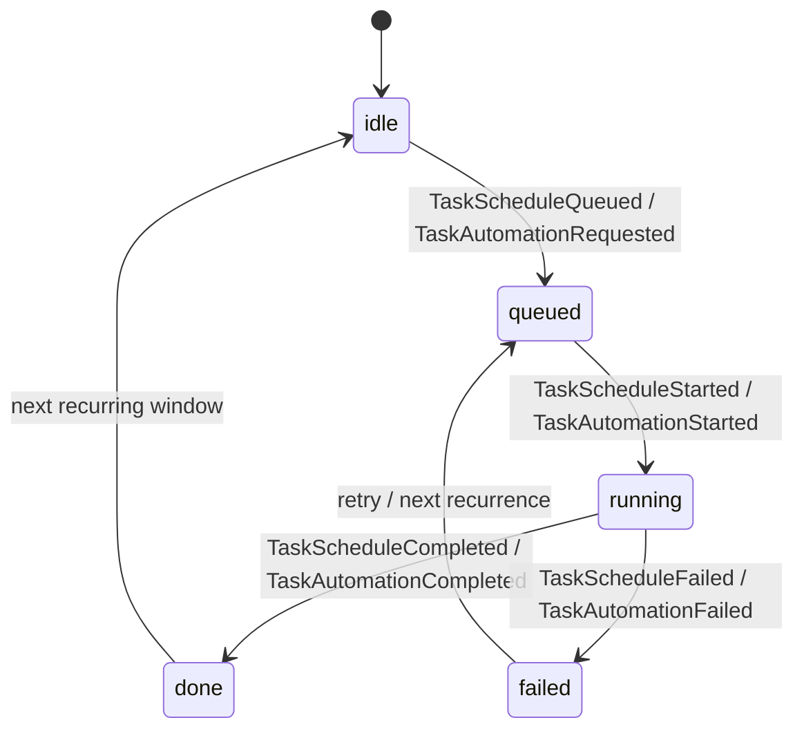
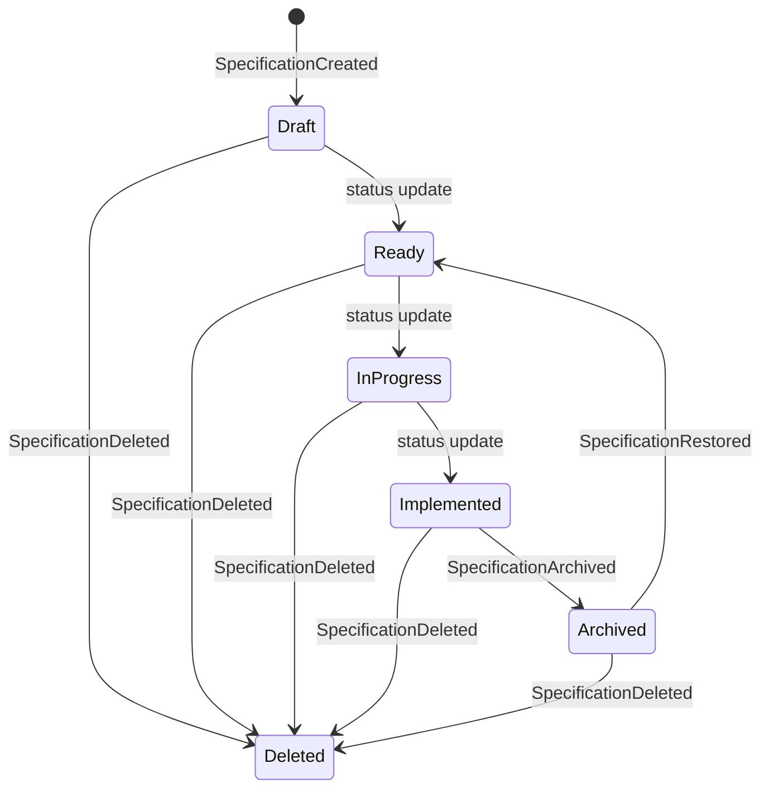
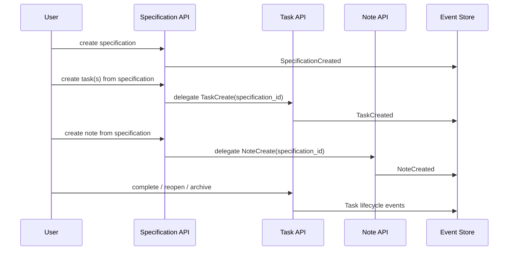
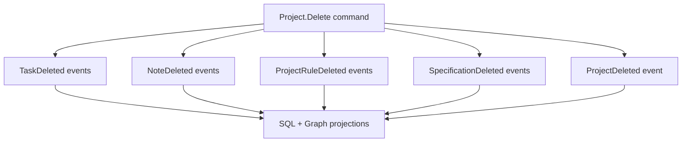

# 03 Domain Model and Workflows

## 1. Glavni Entiteti i Relacije

## 2. Task Lifecycle

## 3. Scheduled Task i Automation Substates

## 4. Specification Lifecycle

## 5. Kljucna Domenska Pravila
- Task, Note i Specification create su case-insensitive idempotent po title/name unutar projekt scope-a.
- Cross-project linking nije dozvoljen (`task/spec/note` moraju deliti workspace + project).
- Ako je task ili note vezan za specification, project change je ogranicen dok se link ne razresi.
- Scheduled instruction task zahteva:
  - `task_type=scheduled_instruction`,
  - `scheduled_instruction`,
  - `scheduled_at_utc`.
- `Project.Delete` kaskadno soft-delete-uje taskove, notes, rules i specifications.

## 6. End-to-End Workflow: Specification -> Execution

## 7. Project Deletion Cascade

## 8. Domen + Graph Perspektiva
Neo4j projekcija pravi relacije tipa:
- `IN_WORKSPACE`, `IN_PROJECT`
- `IMPLEMENTS` (Task -> Specification)
- `ABOUT_TASK`, `ABOUT_SPECIFICATION` (Note links)
- `ASSIGNED_TO`, `WATCHED_BY`, `COMMENTED_BY`
- `TAGGED_WITH`

Ovo omogucava context pack i dependency-aware pretragu bez menjanja write modela.
