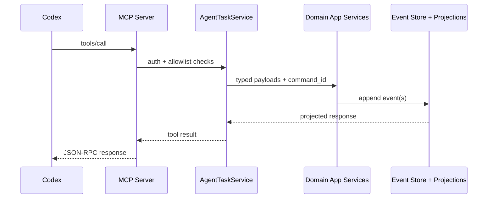

# 04 API and MCP Map

## 1. REST API Grupe

### 1.1 Bootstrap i Meta
- `GET /`
- `GET /api/health`
- `GET /api/version`
- `GET /api/bootstrap`

### 1.2 Tasks
- `GET /api/tasks`
- `POST /api/tasks`
- `PATCH /api/tasks/{task_id}`
- `POST /api/tasks/{task_id}/complete`
- `POST /api/tasks/{task_id}/reopen`
- `POST /api/tasks/{task_id}/archive`
- `POST /api/tasks/{task_id}/restore`
- `POST /api/tasks/bulk`
- `POST /api/tasks/reorder`
- `GET /api/tasks/{task_id}/comments`
- `POST /api/tasks/{task_id}/comments`
- `POST /api/tasks/{task_id}/comments/{comment_id}/delete`
- `POST /api/tasks/{task_id}/watch`
- `GET /api/tasks/{task_id}/activity`
- `POST /api/tasks/{task_id}/automation/run`
- `GET /api/tasks/{task_id}/automation`
- `GET /api/calendar`
- `GET /api/export`

### 1.3 Projects
- `POST /api/projects`
- `PATCH /api/projects/{project_id}`
- `DELETE /api/projects/{project_id}`
- `GET /api/projects/{project_id}/board`
- `GET /api/projects/{project_id}/activity`
- `GET /api/projects/{project_id}/tags`
- `GET /api/projects/{project_id}/members`
- `POST /api/projects/{project_id}/members`
- `POST /api/projects/{project_id}/members/{member_user_id}/remove`
- `GET /api/projects/{project_id}/knowledge-graph/overview`
- `GET /api/projects/{project_id}/knowledge-graph/context-pack`
- `GET /api/projects/{project_id}/knowledge-graph/subgraph`

### 1.4 Specifications
- `GET /api/specifications`
- `POST /api/specifications`
- `GET /api/specifications/{specification_id}`
- `PATCH /api/specifications/{specification_id}`
- `POST /api/specifications/{specification_id}/tasks`
- `POST /api/specifications/{specification_id}/tasks/bulk`
- `POST /api/specifications/{specification_id}/notes`
- `POST /api/specifications/{specification_id}/tasks/{task_id}/link`
- `POST /api/specifications/{specification_id}/tasks/{task_id}/unlink`
- `POST /api/specifications/{specification_id}/notes/{note_id}/link`
- `POST /api/specifications/{specification_id}/notes/{note_id}/unlink`
- `POST /api/specifications/{specification_id}/archive`
- `POST /api/specifications/{specification_id}/restore`
- `POST /api/specifications/{specification_id}/delete`

### 1.5 Notes, Rules, Views, Users
- `GET/POST/PATCH` + archive/restore/pin/unpin/delete za notes (`/api/notes*`).
- `GET/POST/PATCH/delete` za project rules (`/api/project-rules*`).
- `POST /api/saved-views`.
- `PATCH /api/me/preferences`.

### 1.6 Notifications i Realtime
- `GET /api/notifications`
- `POST /api/notifications/{notification_id}/read`
- `GET /api/notifications/stream` (SSE)

SSE event tipovi:
- `notification`
- `task_event`
- `ping`

### 1.7 Attachments
- `POST /api/attachments/upload`
- `GET /api/attachments/download`
- `POST /api/attachments/delete`

### 1.8 Debug
- `GET /api/events/{aggregate_type}/{aggregate_id}`
- `GET /api/metrics`

## 2. API Konvencije
- Auth context: `X-User-Id` header.
- Idempotency za mutacije: `X-Command-Id`.
- Query endpoint-i su read-only i ne append-uju evente.

Primer mutacije sa command_id:
```bash
curl -X POST http://localhost:8080/api/tasks \
  -H 'Content-Type: application/json' \
  -H 'X-User-Id: 00000000-0000-0000-0000-000000000001' \
  -H 'X-Command-Id: demo-task-create-001' \
  -d '{"workspace_id":"10000000-0000-0000-0000-000000000001","project_id":"20000000-0000-0000-0000-000000000001","title":"Prepare release notes"}'
```

## 3. MCP Tool Surface (FastMCP)
MCP server (`features/agents/mcp_server.py`) izlaže read i write alate nad istim domenom.

Tool grupe:
- Read: `list_*`, `get_*`, `graph_*`.
- Mutacije: `create_*`, `update_*`, `archive_*`, `restore_*`, `delete_*`, `bulk_task_action`.
- Spec linking: `link_*_to_spec`, `unlink_*_from_spec`, `create_tasks_from_spec`.
- Automation: `run_task_with_codex`, `get_task_automation_status`.
- Utility: `send_email` (SMTP).

## 4. Integracioni Tok (Codex -> MCP -> Domain)


## 5. Guardrail-i u MCP sloju
- Optional token enforcement (`MCP_AUTH_TOKEN`).
- Workspace/project allowlist (`MCP_ALLOWED_*`).
- Auto fallback command_id za create mutacije kada nije eksplicitno prosledjen.
- Workspace inference iz project/task scope-a za bezbedniji create flow.
- SMTP allowlist za email tool.

## 6. Frontend API Potrosnja
Frontend (`app/frontend/src/api.ts`) koristi:
- `fetch` wrapper sa automatskim `X-Command-Id` za non-GET pozive.
- TanStack Query za cache i invalidation.
- URL query state za tab/project/task/specification deep-linking.
