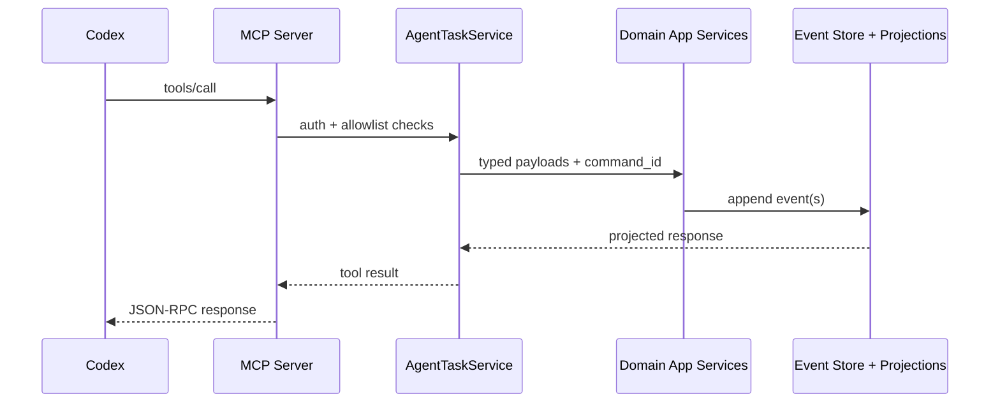

# 04 API and MCP Map

## 1. REST API Groups

### 1.1 Bootstrap and Meta
- `GET /`
- `GET /api/health`
- `GET /api/version`
- `GET /api/bootstrap`

### 1.2 Tasks
- `GET /api/tasks`
- `POST /api/tasks`
- `PATCH /api/tasks/{task_id}`
- `POST /api/tasks/{task_id}/complete`
- `POST /api/tasks/{task_id}/reopen`
- `POST /api/tasks/{task_id}/archive`
- `POST /api/tasks/{task_id}/restore`
- `POST /api/tasks/bulk`
- `POST /api/tasks/reorder`
- `GET /api/tasks/{task_id}/comments`
- `POST /api/tasks/{task_id}/comments`
- `POST /api/tasks/{task_id}/comments/{comment_id}/delete`
- `POST /api/tasks/{task_id}/watch`
- `GET /api/tasks/{task_id}/activity`
- `POST /api/tasks/{task_id}/automation/run`
- `GET /api/tasks/{task_id}/automation`
- `GET /api/calendar`
- `GET /api/export`

### 1.3 Projects
- `POST /api/projects`
- `POST /api/projects/from-template`
- `POST /api/projects/from-template/preview`
- `PATCH /api/projects/{project_id}`
- `DELETE /api/projects/{project_id}`
- `GET /api/projects/{project_id}/board`
- `GET /api/projects/{project_id}/activity`
- `GET /api/projects/{project_id}/tags`
- `GET /api/projects/{project_id}/members`
- `POST /api/projects/{project_id}/members`
- `POST /api/projects/{project_id}/members/{member_user_id}/remove`
- `GET /api/projects/{project_id}/knowledge-graph/overview`
- `GET /api/projects/{project_id}/knowledge-graph/context-pack`
- `GET /api/projects/{project_id}/knowledge-graph/subgraph`
- `GET /api/projects/{project_id}/knowledge/search`

### 1.4 Project Templates
- `GET /api/project-templates`
- `GET /api/project-templates/{template_key}`

### 1.5 Specifications
- `GET /api/specifications`
- `POST /api/specifications`
- `GET /api/specifications/{specification_id}`
- `PATCH /api/specifications/{specification_id}`
- `POST /api/specifications/{specification_id}/tasks`
- `POST /api/specifications/{specification_id}/tasks/bulk`
- `POST /api/specifications/{specification_id}/notes`
- `POST /api/specifications/{specification_id}/tasks/{task_id}/link`
- `POST /api/specifications/{specification_id}/tasks/{task_id}/unlink`
- `POST /api/specifications/{specification_id}/notes/{note_id}/link`
- `POST /api/specifications/{specification_id}/notes/{note_id}/unlink`
- `POST /api/specifications/{specification_id}/archive`
- `POST /api/specifications/{specification_id}/restore`
- `POST /api/specifications/{specification_id}/delete`

### 1.6 Notes, Rules, Views, Users
- `GET/POST/PATCH` plus archive/restore/pin/unpin/delete for notes (`/api/notes*`).
- `GET/POST/PATCH/delete` for project rules (`/api/project-rules*`).
- `POST /api/saved-views`.
- `PATCH /api/me/preferences`.

### 1.7 Notifications and Realtime
- `GET /api/notifications`
- `POST /api/notifications/{notification_id}/read`
- `GET /api/notifications/stream` (SSE)

SSE event types:
- `notification`
- `task_event`
- `ping`

### 1.8 Attachments
- `POST /api/attachments/upload`
- `GET /api/attachments/download`
- `POST /api/attachments/delete`

### 1.9 Debug
- `GET /api/events/{aggregate_type}/{aggregate_id}`
- `GET /api/metrics`

## 2. API Conventions
- Auth context: HTTP-only session cookie from `/api/auth/login`.
- Idempotency for mutations: `X-Command-Id`.
- Query endpoints are read-only and do not append events.
- Bootstrap project payloads include optional `template_binding` when a project was created from a template:
  - `template_key`
  - `template_version`
  - `applied_by`
  - `applied_at`

Example mutation with `command_id`:
```bash
# first login and store cookie
curl -X POST http://localhost:8080/api/auth/login \
  -H 'Content-Type: application/json' \
  -c cookie.txt \
  -d '{"username":"m4tr1x","password":"testtest"}'

# then call mutation with cookie + command id
curl -X POST http://localhost:8080/api/tasks \
  -H 'Content-Type: application/json' \
  -H 'X-Command-Id: demo-task-create-001' \
  -b cookie.txt \
  -d '{"workspace_id":"10000000-0000-0000-0000-000000000001","project_id":"20000000-0000-0000-0000-000000000001","title":"Prepare release notes"}'
```

## 3. MCP Tool Surface (FastMCP)
MCP server (`features/agents/mcp_server.py`) exposes both read and write tools over the same domain model.

Tool categories:
- Read: `list_*`, `get_*`, `graph_*`.
- Mutations: `create_*`, `update_*`, `archive_*`, `restore_*`, `delete_*`, `bulk_task_action`.
- Specification linking: `link_*_to_spec`, `unlink_*_from_spec`, `create_tasks_from_spec`.
- Automation: `run_task_with_codex`, `get_task_automation_status`.
- Utility: `send_email` (SMTP).
- Templates:
  - `list_project_templates`
  - `get_project_template`
  - `preview_project_from_template`
  - `create_project_from_template`
- Knowledge search:
  - `search_project_knowledge`

## 4. Integration Flow (Codex -> MCP -> Domain)


## 5. MCP Guardrails
- Optional token enforcement (`MCP_AUTH_TOKEN`).
- Workspace/project allowlists (`MCP_ALLOWED_*`).
- Automatic fallback command_id generation for create mutations.
- Workspace inference from project/task scope for safer create flows.
- SMTP allowlist controls for email sending.

## 6. Frontend API Consumption
Frontend (`app/frontend/src/api.ts`) uses:
- a `fetch` wrapper that auto-attaches `X-Command-Id` on non-GET requests,
- TanStack Query for cache and invalidation,
- URL query state for tab/project/task/specification deep links.
