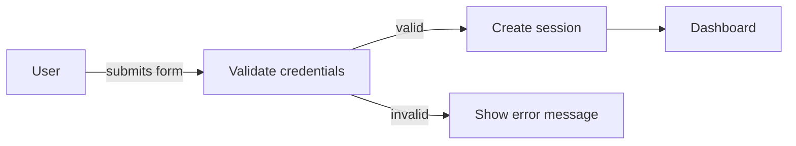

# Specifications

A **specification** is a markdown document that defines what a feature should do — written before work starts. It's the single source of truth for acceptance criteria and design decisions.

---

## Why write a spec first

Without a spec, "done" means different things to different people. With a spec:

- **The team** has a shared definition of done before a single line of code is written.
- **The AI agent** has a complete brief and can execute without guessing.
- **Future you** has a record of what was decided and why — months after the task is closed.

> **The rule:** if a task would take more than a day or involves more than one person, it should have a spec.

---

## Creating a specification

Go to **Specifications** in the project sidebar → **+ New Spec**.

Give it a meaningful title (e.g. "User authentication flow" rather than "Login"), set a status, and write the body.

### Spec statuses

| Status | When to use it |
|---|---|
| **Draft** | Still being written or reviewed — not ready to act on |
| **Ready** | Approved — tasks can be linked and execution can begin |
| **Archived** | Superseded or no longer relevant |

---

## Anatomy of a good spec

Here's a template you can copy and fill in:

```markdown
## Problem
What user need or business goal does this address?
Who is affected and why does it matter?

## Scope
**In scope:**
- Feature A
- Feature B

**Out of scope:**
- Feature C (tracked separately)

## Acceptance criteria
- [ ] User can log in with email and password
- [ ] Invalid credentials show a clear error message
- [ ] Session persists across page reloads
- [ ] Logout clears the session immediately

## Open questions
- [ ] Should we support SSO in v1? (Owner: @alice, Due: Friday)
```

A spec doesn't need to be long — a few clear acceptance criteria beats a 10-page document that nobody reads.

---

## Mermaid diagrams

Specs render Mermaid diagrams inline. Use them to visualise flows, state machines, or sequences:



---

## Linking specs to tasks

Open any task and set the **Specification** field. From that point:

- The spec body appears in the task detail panel.
- The AI agent reads the spec as part of its brief when running the task.
- A single spec can be linked to multiple tasks — useful when a large feature is broken into smaller implementation tasks that all share the same acceptance criteria.

---

## Linking specs to notes

Notes can be linked to a spec too. Use this pattern to group related context around a spec:

| Note type | Example |
|---|---|
| Implementation journal | "Decided to use JWT over sessions because…" |
| Design decisions | "We went with approach B after testing A" |
| Release notes | "Shipped to production on March 15, no incidents" |

---

*Next: [Notes →](constructos-notes.md)*
