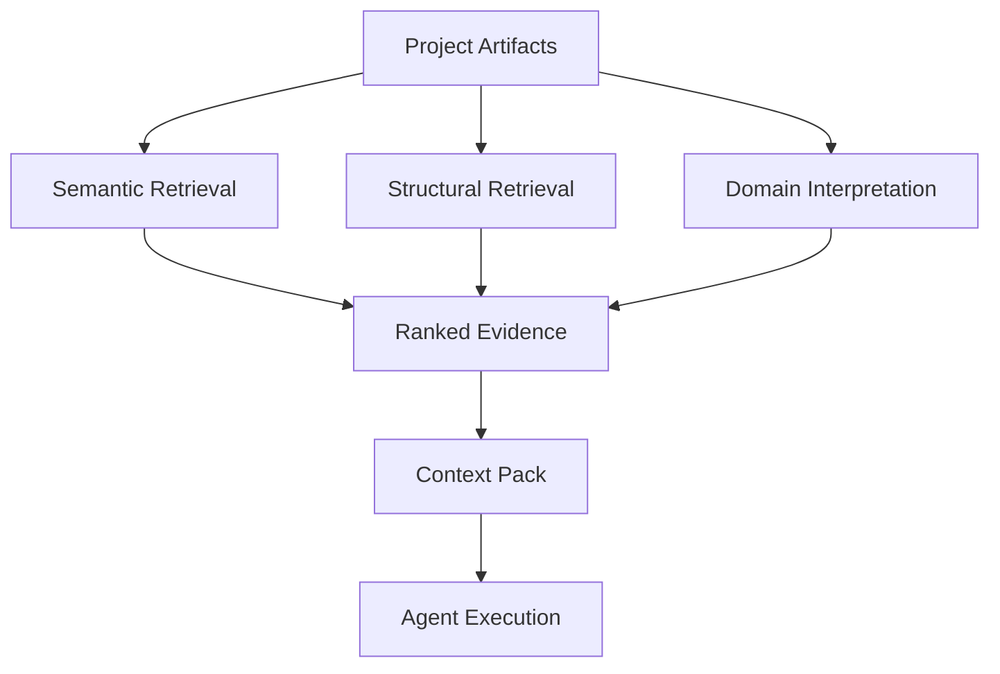
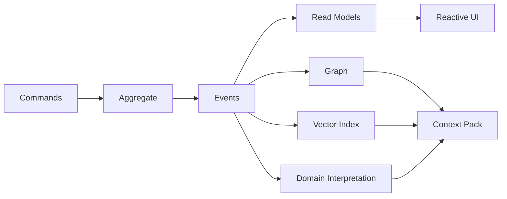

# Context Over Models
## What I Learned Building an AI-First System in 30 Days

Focused talk draft.

- Audience: engineering / product
- Duration: 30-40 minutes
- Tone: technical, reflective, non-marketing
- Format: slide-by-slide Markdown outline with speaker notes
- Positioning: lessons learned first, product details second

---

## Slide 1 - Title

**Context Over Models**  
**What I Learned Building an AI-First System in 30 Days**

Subtitle:
- What actually mattered when building an AI-first system quickly

Speaker notes:
- This is a lessons-learned talk, not a feature walkthrough.
- The product is just the case study I used to learn what matters in practice.

---

## Slide 2 - The Thesis

**Main takeaway**

- Once models are good enough, context becomes the bigger differentiator
- The model provides reasoning
- The system determines whether that reasoning is useful

Speaker notes:
- This is the shortest version of the talk.
- Most practical gains came from improving context quality and execution discipline, not from switching models.

---

## Slide 3 - What I Thought I Was Building

**The initial idea looked simple**

- a task management app
- MCP tools for agent access
- a structured way to let AI act on work

Speaker notes:
- At the beginning, this looked like a tooling problem.
- I thought useful AI would mostly come from giving a model tasks and the right tools.

---

## Slide 4 - What I Was Actually Building

**The problem changed shape**

- tasks alone were not enough
- notes were needed for memory
- specifications were needed for explicit intent
- rules were needed for durable guidance
- history and workflow state were needed for trust

Speaker notes:
- The system gradually stopped being task software with AI attached.
- It started becoming a context system for AI execution.

---

## Slide 5 - Why Prompt-Only Systems Break Down

**The failure mode was obvious in practice**

- free-form chat is too ambiguous for real execution
- similar text is not the same as relevant context
- current state alone is not enough
- history, constraints, and relationships matter

Speaker notes:
- A lot of what looked like model weakness was really system weakness.
- The system was failing to tell the model what matters, what is connected, and what is allowed.

---

## Slide 6 - What Context Actually Means

**Context is not one prompt**

Useful context includes:

- current task intent
- linked specification
- supporting notes
- project rules
- workflow state
- execution history
- structural domain information
- relevant tools and actions

Speaker notes:
- The key shift is from prompt engineering to context composition.
- Context is assembled from multiple layers, not typed into one big box.

---

## Slide 7 - The Three Layers That Mattered

**What ended up improving results**

1. **semantic retrieval**
   - what sounds related
2. **structural retrieval**
   - what is actually connected
3. **domain-aware interpretation**
   - what the artifacts mean in system terms

Speaker notes:
- No single layer was enough.
- Semantic retrieval improved recall.
- Structure improved precision.
- Domain interpretation improved meaning.

---

## Slide 8 - The More Realistic Context Claim

**I would not claim fake accuracy gains**

The more defensible claim is that context improved in three ways:

- **broader coverage**
  - more of the relevant project state participates in retrieval
- **better grounding**
  - retrieval is constrained by structure and domain signals
- **better freshness**
  - context updates as work evolves instead of going stale

Speaker notes:
- I would avoid saying something like "context improved by 281%" unless I had a real benchmark.
- The honest claim is that context became broader, more connected, and more current over time.

---

## Slide 9 - The 80/20 Lesson

**This cannot work as a mostly prompt-driven system**

- My strongest lesson was this:
  - roughly `80%` of the system needs deterministic checks, gates, and validation
  - only around `20%` should rely on prompts, skills, and open-ended model behavior
- Skills help
- Prompts help
- Better instructions help
- But without deterministic validation, quality collapses

Speaker notes:
- This is not a lab metric. It is an engineering lesson from trying to make the system reliable.
- Skills may improve output quality noticeably, but they do not replace enforcement.
- The system needs hard checks for state, routing, dependency satisfaction, review policy, deploy readiness, and safety.

---

## Slide 10 - What Deterministic Gates Actually Protect

**Where quality really came from**

- task readiness
- dependency satisfaction
- workflow transitions
- review requirements
- delivery preconditions
- runtime health
- deployment safety

Speaker notes:
- If these things are left mostly to prompting, the system becomes inconsistent very quickly.
- The model is good at generating and adapting.
- It is not a substitute for system-level enforcement.

---

## Slide 11 - Where Prompts and Skills Still Help

**The softer 20% still matters**

- prompts shape behavior
- project rules shape tone and expectations
- skills add domain or tool-specific capability
- classifiers improve routing and interpretation

Speaker notes:
- I do not want to sound anti-prompt or anti-skill.
- They matter.
- My rough framing is that they add useful uplift, but they only work well when deterministic gates define the safe operating envelope.

---

## Slide 12 - One Slide on Architecture

**Why CQRS and event sourcing helped**

- write-side truth stayed explicit
- history was preserved
- projections became natural
- async execution fit the model
- the UI could react through SSE as state changed

Speaker notes:
- Architecture was not the point of the project, but it helped a lot once context became projection-heavy.
- This was useful mainly because the system needed multiple derived views of the same evolving truth.

---

## Slide 13 - What Changed Once Execution Moved Inside

**Embedding the agent changed the design space**

- execution became visible
- context became first-class
- workflow state became part of runtime behavior
- UI and CLI became interfaces over the same execution substrate
- safety and review stopped being optional concerns

Speaker notes:
- There is a big difference between exposing tools to an agent and embedding agent execution into the product.
- Once execution lives inside the system, everything around quality and trust gets much more serious.

---

## Slide 14 - What Actually Improved

**The practical gains**

- better relevance
- better consistency
- better reuse of prior work
- better explainability
- better traceability
- better user trust

Speaker notes:
- The outputs did not just sound better.
- They became easier to inspect, easier to trust, and easier to operationalize.

---

## Slide 15 - Final Lesson

**The real shift**

- I thought I was building AI features around a work system
- In practice, I was building a context system with an execution layer on top

Final line:

**AI-first systems are not mainly prompt systems. They are context systems, and most of their quality comes from structure, gates, and execution discipline.**

Speaker notes:
- That is the single biggest lesson I would keep if I started again.
- Better models matter, but without context quality and deterministic discipline, they do not produce reliable systems.

---

## Suggested Timing

- Slides 1-5: 10 min
- Slides 6-11: 14 min
- Slides 12-15: 8-10 min

Total: 32-34 min

---

## Optional Anchors

If you want to add 1-2 concrete examples during delivery without turning this into a product talk:

- use tasks + specs + notes + rules as an example of context composition
- use graph + vector + domain extraction as an example of retrieval layering
- use gates + review + deploy health as an example of deterministic quality control

---

## Short Version of the Thesis

If you need a one-line summary for the intro or ending:

**The biggest lesson from building an AI-first system quickly was that model quality matters, but context quality and deterministic execution discipline matter more.**
