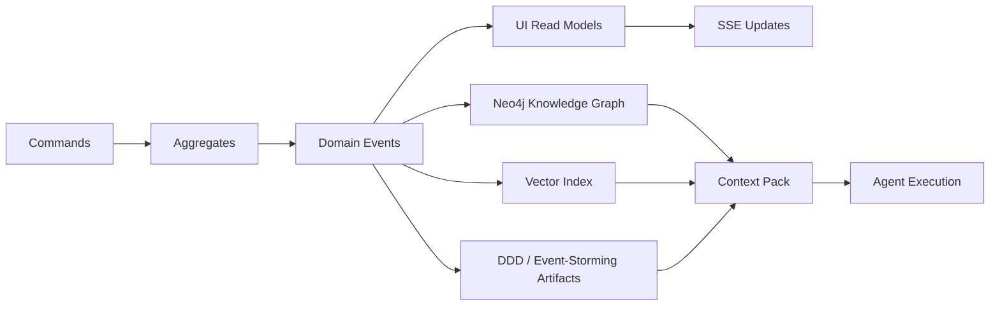
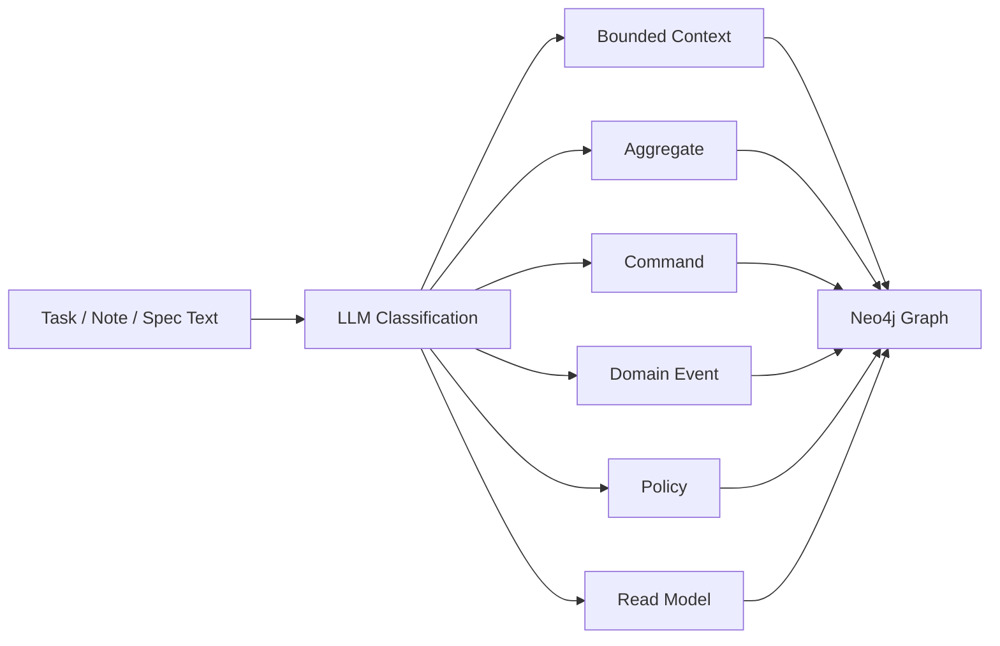
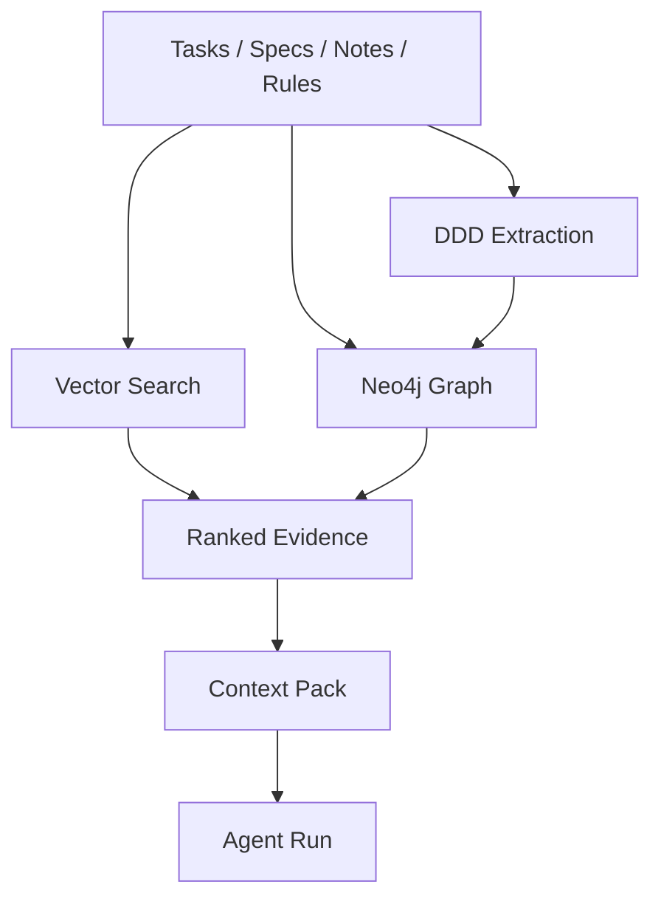
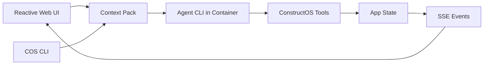
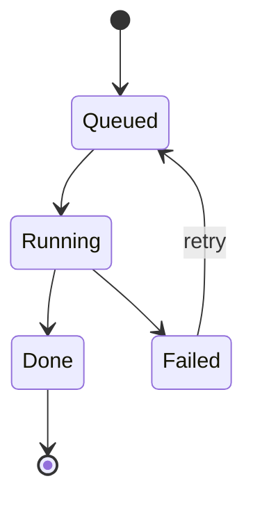

# Context Over Models
## What I Learned Building an AI-First System in 30 Days

Internal talk draft for ConstructOS.

- Audience: internal engineering/product team
- Duration: 45 minutes
- Tone: technical, reflective, non-marketing
- Format: slide-by-slide Markdown outline with Mermaid diagrams and speaker notes

---

## Slide 1 - Title

**Context Over Models**  
**What I Learned Building an AI-First System in 30 Days**

Subtitle:
- ConstructOS as a case study in building context, execution, and delivery around AI

Speaker notes:
- This is not a talk about model benchmarks or prompt tricks.
- It is a reflection on how a fairly ordinary software product evolved into an AI-first execution system.

---

## Slide 2 - What I Wanted To Test

**The original questions**

- Can AI become more useful when it operates inside structured work instead of free-form chat?
- What happens when context is treated as a system concern rather than a prompt concern?
- Can AI execution be observable, traceable, and safe enough to use for real delivery work?

Speaker notes:
- I was not trying to build another chatbot wrapper.
- I wanted to see whether AI gets materially better when it lives inside tasks, specs, notes, rules, workflow state, and delivery tooling.

---

## Slide 3 - Where It Actually Started

**It started as a task management app**

- The first version was a task management application
- It exposed MCP tools through FastMCP
- The initial idea was simple:
  - keep work in the app
  - let external agents use app tools
  - make task state machine-readable

Speaker notes:
- At that stage, the product was still basically a structured operational surface for AI.
- The important early idea was not "AI chat", but "tool-backed work objects".

---

## Slide 4 - The First Evolution

**Tasks were not enough**

- Notes were added as persistent project memory
- Specifications were added as explicit implementation contracts
- The app started moving from task tracking toward spec-driven development
- A useful unit of work became:
  - task intent
  - linked specification
  - supporting notes

Speaker notes:
- This was the first real turning point.
- A task alone is weak context.
- A task with a spec and supporting notes is much closer to something an agent can implement correctly.

---

## Slide 5 - The Product Started Becoming Context-Aware

**Projects, workspaces, rules, and skills**

- Workspaces and projects were introduced to scope work and memory
- Projects gained:
  - name and description
  - project rules
  - project-scoped context
- Project rules became the base of a context pack
- Internal and external skills were later attached through project context
- Skills also became the bridge to external MCP-backed systems such as:
  - JIRA for task synchronization
  - Confluence for notes and documentation context
  - GitHub for repository and delivery context

Speaker notes:
- This is where the system stopped being a collection of records and started becoming a context system.
- Project rules and skills gave the system long-lived guidance rather than one-off prompting.
- They also made it possible to extend project context with external systems without turning those integrations into hardcoded product features.

---

## Slide 6 - The Core Thesis

**Main takeaway**

- Once models are good enough, context becomes the bigger differentiator
- Better output came less from switching models and more from improving:
  - what the system knows
  - how that knowledge is structured
  - how it is retrieved
  - how it is turned into action

Speaker notes:
- The model is the reasoning engine.
- The surrounding system determines whether that reasoning is useful.

---

## Slide 7 - Why Prompt-Only Systems Break Down

**What I learned very quickly**

- Prompt engineering helps, but only up to a point
- Free-form chat is too ambiguous for real execution
- Similar text is not the same as relevant context
- Current state is not enough; history, topology, and policy matter
- Trust drops fast when the system cannot explain why it used certain context

Speaker notes:
- Many apparent AI quality problems were actually context quality problems.
- The missing piece was not better phrasing. It was better state, structure, and retrieval.

---

## Slide 8 - One Slide on CQRS and Event Sourcing

**Why this architecture fit the problem**

- The app stopped being simple CRUD and became a context-building and execution system
- CQRS separated write-side truth from query-side convenience
- Event sourcing preserved workflow history and system transitions
- Projections became natural:
  - UI read models
  - knowledge graph
  - vector index
  - event-storming artifacts
  - agent context packs
- SSE made the UI react to the same evolving state

Speaker notes:
- I did not choose CQRS and event sourcing because AI requires them.
- I chose them because once context and projections became first-class, they fit the problem unusually well.

---

## Slide 9 - The Context System That Emerged

**Context is not one blob of text**

In ConstructOS, useful context includes:

- task intent
- linked specifications
- notes and prior decisions
- project rules
- project skills
- dependency paths
- workflow state
- execution history
- structural domain information
- semantic evidence
- available tools and actions

Speaker notes:
- Context is composed, not pasted.
- The quality came from layering these signals together rather than relying on a single retrieval trick.

---

## Slide 10 - The Generic Knowledge Layer

**From documents to reusable structure**

- A generic knowledge graph was built from tasks, notes, and specifications
- The graph is stored in Neo4j
- It became a shared structural layer for:
  - retrieval
  - explainability
  - dependency traversal
  - context inspection

Speaker notes:
- This was not a gameplay graph or a project-specific ontology.
- The important design choice was to build a generic knowledge layer that could keep evolving with the product.

---

## Slide 11 - DDD Extraction Made the Graph More Useful

**LLM classifiers added domain meaning**

- Chat was enriched with LLM-based intent classification
- The same classification approach was reused to detect DDD-style entities from tasks, notes, and specifications
- Extracted entities included:
  - bounded contexts
  - aggregates
  - commands
  - domain events
  - policies
  - read models
- Those entities were linked back into the existing graph

Speaker notes:
- Without this, the graph is mostly document and relationship structure.
- With this, the graph starts becoming domain-aware rather than just document-aware.

---

## Slide 12 - Retrieval Became Multi-Layer

**The real context pipeline**

1. **Vector search**
   - semantic relevance using Ollama embeddings
2. **Knowledge graph**
   - structural relevance and dependency paths
3. **DDD-aware extraction**
   - domain interpretation and relation enrichment

Then:
- ranking combines semantic similarity, graph relevance, workflow state, and project hints
- the output becomes a context pack rather than a search result list

Speaker notes:
- Vector search improved recall.
- The graph improved precision and explainability.
- DDD extraction gave the system business meaning.

---

## Slide 13 - Proxy Metrics for Richer Context

**These are proxy metrics, not a controlled benchmark**

Example snapshot from a live project with `KG_AND_VECTOR` retrieval and event storming enabled:

- **A more realistic way to say it**
  - context moved from single-artifact retrieval toward a `3-signal` context system:
    - vector similarity
    - graph relevance
    - DDD-aware enrichment
  - the important gain is not "281% smarter"
  - the more defensible claim is:
    - broader context coverage
    - better structural grounding
    - better context freshness over time

| Metric | Snapshot | Why it matters |
| --- | --- | --- |
| Source artifacts | 36 (`33` tasks, `1` note, `2` specifications) | the base material available for context |
| Retrieval layers | `3` layers | vector + graph + DDD enrichment instead of single-signal retrieval |
| Vector coverage | `38` indexed entities, `79` chunks | improves semantic recall beyond keyword matching |
| DDD coverage in graph | `101 / 137` entities (`~74%`) | most graph context is domain-aware, not just raw document structure |
| Structural density | `572` key relations | gives the system navigable links instead of isolated text snippets |
| Ranking signals | `7` signals blended | vector similarity, graph relevance, lexical overlap, freshness, entity priority, source priority, starter alignment |
| Refresh fan-out | `1` committed change updates SQL, graph, vector, and DDD projections, then wakes the UI via SSE | context stays current as work evolves |

**Why this improves precision**

- Retrieval is hybrid, not single-signal
- Current ranking weights are roughly:
  - `42%` vector similarity
  - `14%` graph relevance
  - `16%` lexical overlap
  - `12%` freshness
  - `16%` entity/source/starter priors combined

Speaker notes:
- I would present these as system health and context quality proxies, not as marketing metrics.
- I would avoid claiming a fake "accuracy increased by N%" number unless there is a controlled benchmark.
- The more realistic story is that context became broader, more connected, and more refreshable over time.
- That richer layer then feeds later task execution, so newer tasks benefit from earlier work rather than starting from scratch.

---

## Slide 14 - The Agent Moved Inside the Product

**The next step was embedding execution, not just exposing tools**

- At first, the app mainly exposed tools to external agent flows
- Then agent support moved inside the product itself
- General chat was added using Codex CLI
- The agent still used ConstructOS tools, but now from inside the app's own execution model
- The app became both:
  - an operational system
  - an agent host

Speaker notes:
- This was another major shift.
- Instead of treating the app as a passive MCP server, the app became the place where AI execution actually lives.

---

## Slide 15 - Two Context-Aware Interfaces

**UI and COS CLI became parallel front doors**

- The web UI is one context-aware surface
- `cos` CLI is another
- `cos` talks to agent CLIs inside containers in a way that mirrors how the UI-driven chat works
- Both surfaces can operate with project context, rules, skills, and app tools
- This meant the same system could support:
  - interactive UI workflows
  - terminal-first workflows
  - the same context model in both

Speaker notes:
- I wanted the app and the CLI to feel like two interfaces over the same execution substrate.
- That is important because real engineering workflows are split between UI and terminal use.

---

## Slide 16 - Why the UI Started Feeling Different

**The frontend became reactive process UI**

- The UI updates through SSE
- Agent responses also stream through SSE events
- Chat is rendered as rich working output, not plain text:
  - Markdown
  - Mermaid diagrams
  - context views
  - graph-oriented displays
- The UI can show what is actually participating in context

Speaker notes:
- This made the frontend feel less like a CRUD app and more like a live process view.
- Context visibility also improved trust because the system could show why a response was grounded the way it was.

---

## Slide 17 - Automation Went Beyond Chat

**Scheduled execution changed the role of the system**

- Scheduled tasks were introduced
- A scheduled task can trigger an instruction through agent execution
- This moved the system from "AI assistant" toward "AI-backed workflow engine"
- Async execution lifecycle stayed visible and traceable

Speaker notes:
- Chat is useful, but scheduled execution is where the platform starts behaving like infrastructure.
- The key lesson was that execution state matters as much as model output.

---

## Slide 18 - Team Mode Turned It Into a Delivery System

**Implementation became multi-agent and reviewable**

- Team mode introduced multiple delivery roles:
  - developers
  - lead
  - QA
- It combines deterministic checks with LLM instructions
- Git worktrees allow safe parallel work for multiple developers
- The lead resolves coordination issues
- QA validates deployed runtime behavior
- UI supports branch-aware code browsing and diff-based review
- Delivery can run in two modes:
  - mandatory human review
  - automatic merge after implementation

Speaker notes:
- This is where the app stopped being just an execution shell and became a delivery orchestration system.
- The interesting part is that structure and automation remained visible, not hidden behind a single "run agent" button.

---

## Slide 19 - Agent-Agnostic by Design

**The system should not depend on one coding agent**

- Codex support came first
- Later the app added Claude Code CLI and OpenCode CLI support
- Different tasks inside the same project can use different agent types
- That made the system agent-agnostic at the task execution layer

Speaker notes:
- This mattered strategically and architecturally.
- I did not want the product to collapse into a thin wrapper around one provider.

---

## Slide 20 - Safety and Operations Became First-Class

**Execution power required operational constraints**

- Agent CLIs run inside Docker containers
- Execution is sandboxed away from unrestricted host file access
- Deployments run through Docker Compose
- Docker proxy restrictions reduce overly broad Docker control
- Monitoring of deployed applications is visible through the UI
- Because the app itself is Docker-based, it runs consistently across:
  - Linux
  - macOS
  - Windows

Speaker notes:
- Cross-platform consistency turned out to matter more than I expected.
- When the whole agent and delivery stack runs the same way on every platform, the system is easier to trust and support.

---

## Slide 21 - What Actually Improved

**Practical improvements**

- Better recall of relevant project knowledge
- Better precision than vector search alone
- Better grounding in project structure and history
- Better reuse of prior decisions through rules, notes, and graph links
- Better explainability of why context was selected
- Better trust because execution, delivery, and review are visible
- Better portability because UI and CLI use the same containerized execution model

Speaker notes:
- The biggest gains were not that the model sounded smarter.
- The gains were that outputs became more relevant, more stable, more inspectable, and more operationally useful.

---

## Slide 22 - What Was Hard

**The difficult parts**

- Context assembly is harder than retrieval demos make it look
- Semantic similarity often returns plausible but irrelevant evidence
- Graph quality depends on entity and relation discipline
- DDD extraction must stay conservative to avoid hallucinated structure
- Multi-agent delivery introduces real operational concerns:
  - retries
  - idempotency
  - stale projections
  - partial failures
  - review policy
  - deployment safety

Speaker notes:
- The hard part was not calling a model.
- The hard part was making the whole system coherent enough that model reasoning could actually be trusted.

---

## Slide 23 - Final Lessons

**What I learned in 30 days**

- Context quality beats prompt cleverness
- Tasks alone are not enough; specs, notes, rules, and history matter
- Vector search is useful, but not sufficient
- Structure matters as much as similarity
- Embedding the agent in the product changed the design space
- UI and CLI should share the same context-aware execution substrate
- AI-first systems are really context systems with execution and delivery layers on top

Speaker notes:
- The product started as task management with MCP tools.
- It ended up becoming a context-aware, spec-driven, agentic delivery system.

---

## Slide 24 - Closing

**Closing thought**

- The model provides reasoning
- The system determines whether that reasoning is usable
- In this project, the leverage came from:
  - structured work objects
  - evolving context layers
  - projections and history
  - embedded execution
  - delivery orchestration

Final line:

**I did not spend 30 days building an AI feature. I spent 30 days building a context system that an AI could operate inside.**

---

## Suggested Timing

- Slides 1-5: 10 min
- Slides 6-13: 13 min
- Slides 14-20: 13 min
- Slides 21-24: 9 min

Total: 45 min

---

## Optional Demo

If you want a short demo, insert it after Slide 15 for 4-5 minutes:

- open a project
- show a task, linked specification, notes, and project rules
- show context view and graph context
- trigger a chat or task execution from the UI
- show the same kind of execution flow through `cos`
- show SSE updates, rendered Markdown, and Mermaid output

---

## Short Version of the Thesis

If you need a one-line summary for the intro or ending:

**The model provides reasoning, but context determines whether that reasoning is useful. In ConstructOS, that context emerged from structured work objects, multi-layer retrieval, domain-aware graph enrichment, embedded agent execution, and a delivery system built around the same state.**
