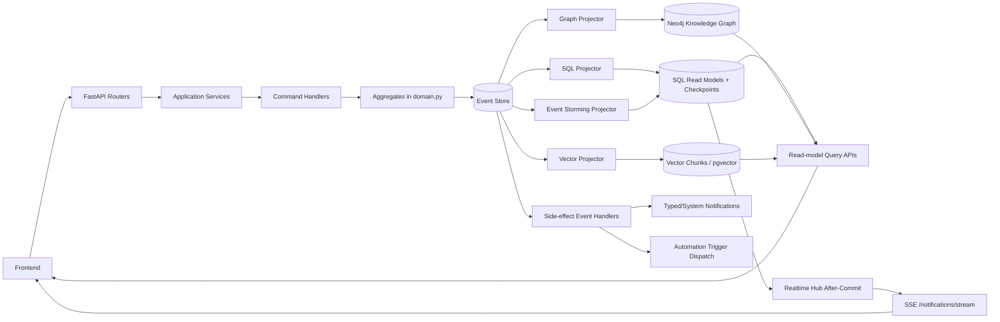

# CQRS + Event Sourcing Architecture Source of Truth

## Purpose
This document defines the backend architecture standard that must be followed across the application, including areas that are still in migration.

For a detailed aggregate-by-aggregate inventory (commands, events, and current implementation status), see:
- `docs/cqrs-event-sourcing-inventory.md`

## Scope
Applies to the backend under:
- `app/features/*`
- `app/shared/*`

It excludes the separate `license_control_plane` service.

## Core Principles
1. Separate writes and reads (CQRS).
2. Treat domain events as the source of truth for mutable business entities (Event Sourcing).
3. Route write operations through application services and command handlers.
4. Keep projection handlers idempotent and replay-safe.
5. Prefer explicit conflict handling with optimistic concurrency over implicit last-write-wins.
6. Do not use heuristic fallback for ambiguous workflow/classification decisions; use structured LLM classification or return unknown/safe-negative.

## Canonical Write Path
Standard write flow:
1. API route validates input and authorization.
2. API calls application service in `features/*/application.py`.
3. Application service calls `shared.commanding.execute_command(...)`.
4. `execute_command(...)` applies command idempotency via `CommandExecution` (`command_id`).
5. Command handler in `features/*/command_handlers.py` loads aggregate state via `AggregateEventRepository.load_with_class(...)`.
6. Handler invokes aggregate method(s) (`@event(...)` methods in `features/*/domain.py`).
7. Handler persists pending events via `AggregateEventRepository.persist(...)`.
8. `shared.eventing.append_event(...)` appends to event store and triggers projections and side-effect subscribers.

## Where Handlers Live
Command handlers:
- `app/features/*/command_handlers.py`

Aggregate event methods (domain-level event handlers that mutate aggregate state):
- `app/features/*/domain.py` (`@event(...)` methods)

Projection handlers (read-model event handlers):
- `app/shared/eventing_rebuild.py` (`apply_*_event(...)`, `project_event(...)`)

Reactive side-effect event handlers:
- `app/shared/eventing_notification_triggers.py`
- `app/shared/eventing_task_automation_triggers.py`
- `app/shared/eventing_notifications.py`

Runtime task automation note:
- Task runtime mutation paths (runner dispatch lifecycle, task automation stream progress/state, and status-change trigger side-effects) should use Task internal command handlers instead of direct event append.
- Direct append fallbacks are transitional safety rails only and should be removed once handler availability is guaranteed in all runtime contexts.

Specialized projection workers:
- SQL read-model worker: `app/shared/eventing_projections.py`
- Knowledge graph worker: `app/shared/eventing_graph.py`
- Vector index worker: `app/shared/eventing_vector.py`
- Event-storming worker: `app/shared/eventing_event_storming.py`

## Aggregate Coverage (Current Domain Aggregates)
- `TaskAggregate`
- `ProjectAggregate`
- `NoteAggregate`
- `TaskGroupAggregate`
- `NoteGroupAggregate`
- `ProjectRuleAggregate`
- `SpecificationAggregate`
- `ChatSessionAggregate`
- `NotificationAggregate`
- `UserAggregate`
- `SavedViewAggregate`

The authoritative command/event mapping for each aggregate remains in `docs/cqrs-event-sourcing-inventory.md`.

## Libraries and Platform Components
Primary libraries currently used:
- `eventsourcing`
- `eventsourcing-kurrentdb`
- `kurrentdbclient`
- `FastAPI`
- `SQLAlchemy`
- `Pydantic`
- `psycopg`
- `neo4j`
- `httpx`

Storage/runtime components:
- Event store backend:
  - KurrentDB when configured (`EVENTSTORE_URI`), or
  - SQL fallback (`stored_events`) when KurrentDB is unavailable.
- Primary SQL database for read models and application state (`DATABASE_URL`).
- Optional Neo4j graph database for knowledge graph projections.
- Optional pgvector-backed storage (`vector_chunks`) for embedding projections.

## Eventual Consistency Model (How It Is Handled Here)
The system uses a hybrid consistency strategy:
1. Write-time projection:
   - `append_event(...)` projects the event immediately (`project_event(...)`) in the same request path.
   - In Kurrent mode, write-through projection keeps SQL read models aligned even if background checkpoints lag.
2. Background catch-up:
   - Persistent subscription workers consume all-stream events and replay projections from checkpoints.
3. Idempotent projection behavior:
   - Duplicate projection writes are tolerated and treated as idempotent races (unique constraint handling).
4. Commit-based realtime fanout:
   - Realtime channels are enqueued during the transaction and published only after commit.

Result: read models are usually near-immediate, with replay workers guaranteeing convergence after restarts, lag, or transient failures.

## Concurrency and Event Conflict Handling (Generic Rule)
Generic optimistic concurrency flow:
1. Handler determines expected stream version (explicit `expected_version` for strict operations, or implicit from aggregate pending events).
2. `append_event(...)` compares expected version with current stream version.
3. On mismatch, it raises `ConcurrencyConflictError`.
4. `run_command_with_retry(...)` retries conflict errors with bounded exponential backoff.
5. If still conflicting, API returns HTTP `409`.

This is the standard conflict policy for command handlers across aggregates.

## Command Handler Return Contract
Target standard (must be followed for new/refactored handlers):
1. Create command:
   - Return only created resource identifier(s), for example `{ "id": "<resource_id>" }`.
2. Mutation command:
   - Return minimal acknowledgement (`{ "ok": true }`) and optional version metadata only when required.
3. Errors:
   - Raise typed HTTP/domain errors (validation, authorization, not found, conflict), not ad-hoc success payloads.

Current state:
- Some handlers still return full read-model payloads (for example Task/Project create and patch paths).
- This is accepted as transitional behavior, but the target contract above is the standard to converge to.

Batch reorder rule:
- Collection reorder commands (for example task groups and note groups) should execute as one command/transaction per request.
- Task reorder commands should follow the same batch-per-request transaction discipline.
- Duplicate IDs in reorder payloads should be normalized (first occurrence wins).
- No-op reorder operations should not emit new reorder events.

Bulk action rule:
- Fan-out bulk commands should normalize duplicate target IDs before dispatch.
- Bulk action keys should be normalized to a canonical lowercase action token before command-name selection and command-id payload hashing.
- No-op mutations (for example setting a field to its current value) should be acknowledged without emitting new domain events.
- Prefer one bulk command execution/transaction per request over per-target command loops.

Command replay rule:
- Public mutation entrypoints that accept `command_id` must route through `execute_command(...)` even when normalized target sets become empty at runtime.
- Do not return early before command execution in those paths, or replay/idempotency semantics become inconsistent.
- `command_id` is globally unique in `command_executions` (not scoped by `command_name`), so clients must not reuse the same `command_id` across different mutation intents.
- `execute_command(...)` should reject reusing the same `command_id` for a different `command_name` or actor user (`409` conflict), instead of replaying stale response data.
- Any exceptional/manual `CommandExecution` path (outside `execute_command(...)`) must enforce the same `command_name + user_id` scope check and return the same `409` conflict contract.
- Child command identifiers should be derived deterministically from a parent `command_id` with overflow-safe suffix hashing (instead of ad-hoc string slicing) to keep replay stable without risking 64-character key collisions.
- This applies to API services and background orchestration paths (for example runner/doctor/team-mode orchestration), not only request handlers.
- Shared helper module: `app/shared/command_ids.py` (`derive_child_command_id`, `derive_scoped_command_id`).

## Projection Stores: Count and Behavior
There are 4 logical projection pipelines:
1. SQL read-model projection (`read-model` checkpoint).
2. Knowledge graph projection (`knowledge-graph` checkpoint).
3. Vector projection (`vector-store` checkpoint).
4. Event-storming projection (`event-storming` checkpoint).

Physical projection stores:
1. Primary SQL database (always):
   - Main read models and projection checkpoints.
   - Event-storming analysis tables.
2. Neo4j (optional):
   - Knowledge graph projection target.
3. Vector store in SQL via pgvector (optional):
   - `vector_chunks` table (PostgreSQL + vector extension required).

So, operationally:
- Minimum deployed projection store count is `1` (SQL only).
- Maximum deployed projection store count is `3` (SQL + Neo4j + pgvector-backed vector indexing).

## Frontend Reactivity Model
Primary UI reactivity channel:
- SSE endpoint: `/api/notifications/stream`
  - Carries notification events, workspace activity refresh signals, license refresh signals, and auth refresh signals.
  - Uses commit-triggered realtime hub + timeout ping fallback for resilience.

Other streaming channels:
- Some features use dedicated streaming endpoints with feature-specific protocols (for example NDJSON streams for agent/chat/task automation flows).
- These are not a single generic SSE protocol today.

Standardization status:
- Realtime signaling backbone is shared (`shared/realtime.py`).
- Payload protocol is not yet fully uniform across all stream endpoints.

## Event Storming Diagram (System-Level)

## Migration Rule of Thumb
When touching legacy or mixed paths, move toward:
1. API -> Application Service -> `execute_command` -> Command Handler -> Aggregate -> Event append.
2. Minimal command responses.
3. Replay-safe projectors and centralized conflict handling.

## Current Exception Boundaries
These exceptions are allowed temporarily and should not be expanded:
1. Bootstrap/seed initialization (`app/shared/bootstrap.py`) can append events directly to construct initial aggregate streams.
2. Side-effect notification emission can append `NotificationCreated` events from event-trigger modules (event-to-event relay).
3. Runtime trigger modules may keep guarded fallback append behavior only when internal handler import/actor resolution fails; handler-first path is the required default.

## Automated Guardrails
Repository tests enforce append-event boundaries:
1. `app/tests/test_cqrs_guardrails.py::test_features_do_not_call_append_event_directly`
2. `app/tests/test_cqrs_guardrails.py::test_shared_append_event_calls_are_limited_to_eventing_and_bootstrap`
3. `app/tests/test_cqrs_guardrails.py::test_features_do_not_mutate_aggregate_read_models_via_sqlalchemy_dml`
4. `app/tests/test_cqrs_guardrails.py::test_application_services_do_not_reuse_literal_command_names_across_methods`
5. `app/tests/test_cqrs_guardrails.py::test_feature_modules_do_not_build_child_command_ids_with_parent_fstrings`
6. `app/tests/test_cqrs_guardrails.py::test_feature_modules_do_not_slice_command_ids_directly`

These tests are intended to prevent CQRS drift in future changes.
