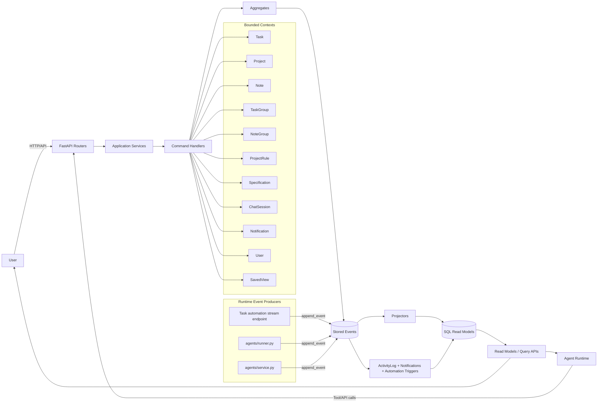

# Backend CQRS and Event Sourcing Inventory

## Scope
This document inventories the backend in `app/` (feature modules under `app/features/*` plus shared eventing infrastructure in `app/shared/*`).

It focuses on:
- Aggregate roots
- Commands and command handlers
- Domain events
- Projection/read-model implementation
- Gaps versus the intended CQRS + Event Sourcing style

Note: `license_control_plane/` is a separate service and is not included in this inventory.

## Current CQRS + ES Baseline
The current baseline pattern is:
1. API layer calls application service (`features/*/application.py`).
2. Application service executes commands via `shared.commanding.execute_command(...)` for idempotency by `command_id`.
3. Handler (`features/*/command_handlers.py`) loads aggregate via `AggregateEventRepository.load_with_class(...)`, applies domain method(s), and persists events via `AggregateEventRepository.persist(...)`.
4. `shared.eventing.append_event(...)` stores events and immediately projects read models (`shared.eventing_rebuild.project_event(...)`).

Core infrastructure:
- `app/shared/aggregates.py`
- `app/shared/commanding.py`
- `app/shared/eventing.py`
- `app/shared/eventing_rebuild.py`
- `app/shared/eventing_projections.py`

## Aggregate Inventory

### 1) `Task` Aggregate
- Domain: `app/features/tasks/domain.py`
- Command entry points: `app/features/tasks/application.py`
- Handler implementation: `app/features/tasks/command_handlers.py`
- Commands:
  - `Task.Create`
  - `Task.Patch`
  - `Task.Complete`
  - `Task.ReviewDecision`
  - `Task.Reopen`
  - `Task.Archive`
  - `Task.Restore`
  - `Task.Bulk.*` (fan-out per task)
  - `Task.Reorder`
  - `Task.CommentAdd`
  - `Task.CommentDelete`
  - `Task.ToggleWatch`
  - `Task.Automation.RequestRun`
  - `Task.Automation.RequestInternal` (runner/system-facing lifecycle queueing)
  - `Task.PatchInternalFields` (runner/system-facing metadata mutations via internal handler)
  - `Task.CompleteInternal` (runner/system-facing completion emit through aggregate)
  - `Task.CommentAddInternal` (runner/system-facing comment emit through aggregate)
  - `Task.ScheduleQueuedInternal`, `Task.ScheduleStartedInternal`, `Task.ScheduleCompletedInternal`, `Task.ScheduleFailedInternal`
  - `Task.AutomationStream` (special API path, command-id replay envelope + progress/state updates routed through `TaskApplicationService` internal command handlers)
- Events:
  - `TaskCreated`, `TaskUpdated`, `TaskReordered`, `TaskCompleted`, `TaskReopened`
  - `TaskArchived`, `TaskRestored`, `TaskDeleted`, `TaskMovedToInbox`
  - `TaskCommentAdded`, `TaskCommentDeleted`, `TaskWatchToggled`
  - `TaskAutomationRequested`, `TaskAutomationStarted`, `TaskAutomationCompleted`, `TaskAutomationFailed`
  - `TaskScheduleConfigured`, `TaskScheduleQueued`, `TaskScheduleStarted`, `TaskScheduleCompleted`, `TaskScheduleFailed`, `TaskScheduleDisabled`
- Handler style:
  - Mostly aggregate-first command handlers with event persistence through `AggregateEventRepository`.
  - Runner/runtime lifecycle and progress/state updates are routed through internal handlers (`Task.PatchInternalFields`, `Task.Automation.RequestInternal`, and schedule/comment/complete internal handlers).
  - `Task.Reorder` now executes as one batch command/transaction per request with duplicate ID normalization and no-op reorder-event suppression.
  - `Task.Bulk.*` executes as one command/transaction per request, normalizes duplicate task IDs, and suppresses no-op `set_status` updates.
  - Agent-side `archive_all_tasks` orchestration now always passes through one `Task.Bulk.archive` command execution (no pre-executor early return), preserving replay semantics for repeated `command_id`.

### 2) `Project` Aggregate
- Domain: `app/features/projects/domain.py`
- Command entry points: `app/features/projects/application.py`
- Handler implementation: `app/features/projects/command_handlers.py`
- Commands:
  - `Project.Create`
  - `Project.Delete`
  - `Project.Patch`
  - `Project.MemberAdd`
  - `Project.MemberRemove`
- Events:
  - `ProjectCreated`, `ProjectDeleted`, `ProjectUpdated`, `ProjectMemberUpserted`, `ProjectMemberRemoved`
- Handler style:
  - Aggregate-first command handlers.
  - Agent-side `archive_all_notes` uses one batch command execution (`Note.Archive` with batch handler) and keeps replay semantics by routing through `execute_command(...)` even when later calls see an empty active-note set.
  - `DeleteProjectHandler` cascades through multiple aggregates (tasks, notes, rules, specs) by emitting delete events for each.

### 3) `Note` Aggregate
- Domain: `app/features/notes/domain.py`
- Command entry points: `app/features/notes/application.py`
- Handler implementation: `app/features/notes/command_handlers.py`
- Commands:
  - `Note.Create`, `Note.Patch`, `Note.Archive`, `Note.Restore`, `Note.Pin`, `Note.Unpin`, `Note.Delete`
- Events:
  - `NoteCreated`, `NoteUpdated`, `NoteArchived`, `NoteRestored`, `NotePinned`, `NoteUnpinned`, `NoteDeleted`
- Handler style:
  - Aggregate-first command handlers.

### 4) `TaskGroup` Aggregate
- Domain: `app/features/task_groups/domain.py`
- Command entry points: `app/features/task_groups/application.py`
- Handler implementation: `app/features/task_groups/command_handlers.py`
- Commands:
  - `TaskGroup.Create`, `TaskGroup.Patch`, `TaskGroup.Delete`, `TaskGroup.Reorder`
- Events:
  - `TaskGroupCreated`, `TaskGroupUpdated`, `TaskGroupReordered`, `TaskGroupDeleted`
- Handler style:
  - Aggregate-first command handlers, reorder implemented as one batch command/transaction (single idempotent command execution per request).
  - Reorder batch normalizes duplicate `ordered_ids` entries (first occurrence wins) to avoid redundant reorder events.
  - Reorder batch skips no-op reorder event emission when `order_index` is unchanged.
  - Task-create side effect that reorders groups by first-task-created timestamp is now emitted as `TaskGroupReordered` events (no direct SQL `TaskGroup` row mutation in task handlers).

### 5) `NoteGroup` Aggregate
- Domain: `app/features/note_groups/domain.py`
- Command entry points: `app/features/note_groups/application.py`
- Handler implementation: `app/features/note_groups/command_handlers.py`
- Commands:
  - `NoteGroup.Create`, `NoteGroup.Patch`, `NoteGroup.Delete`, `NoteGroup.Reorder`
- Events:
  - `NoteGroupCreated`, `NoteGroupUpdated`, `NoteGroupReordered`, `NoteGroupDeleted`
- Handler style:
  - Aggregate-first command handlers, reorder implemented as one batch command/transaction (single idempotent command execution per request).
  - Reorder batch normalizes duplicate `ordered_ids` entries (first occurrence wins) to avoid redundant reorder events.
  - Reorder batch skips no-op reorder event emission when `order_index` is unchanged.

### 6) `ProjectRule` Aggregate
- Domain: `app/features/rules/domain.py`
- Command entry points: `app/features/rules/application.py`
- Handler implementation: `app/features/rules/command_handlers.py`
- Commands:
  - `ProjectRule.Create`, `ProjectRule.Patch`, `ProjectRule.Delete`
- Events:
  - `ProjectRuleCreated`, `ProjectRuleUpdated`, `ProjectRuleDeleted`
- Handler style:
  - Aggregate-first command handlers.

### 7) `Specification` Aggregate
- Domain: `app/features/specifications/domain.py`
- Command entry points: `app/features/specifications/application.py`
- Handler implementation: `app/features/specifications/command_handlers.py`
- Commands:
  - `Specification.Create`, `Specification.Patch`, `Specification.Archive`, `Specification.Restore`, `Specification.Delete`
  - `Specification.TaskCreate`, `Specification.TaskCreateBatch`, `Specification.NoteCreate` (wrapper orchestration envelopes)
  - Orchestration methods in app service that delegate to `TaskApplicationService` and `NoteApplicationService`.
- Events:
  - `SpecificationCreated`, `SpecificationUpdated`, `SpecificationArchived`, `SpecificationRestored`, `SpecificationDeleted`
- Handler style:
  - Aggregate-first command handlers.
  - Wrapper task/note creation orchestration is now executed through dedicated specification command handlers (`Specification.TaskCreate`, `Specification.TaskCreateBatch`, `Specification.NoteCreate`) under `execute_command(...)`.
  - `create_tasks_from_specification` executes as one idempotent command envelope (`Specification.TaskCreateBatch`) instead of per-item child command-id fan-out.
  - Canonical specification status string for active work is `In progress` (aliases like `in_progress`, `inprogress`, and `wip` normalize to this value).
  - Specification mutation API routes now call `SpecificationApplicationService` directly (read routes may still use gateway/read-model wrappers).

### 8) `ChatSession` Aggregate
- Domain: `app/features/chat/domain.py`
- Command entry points: `app/features/chat/application.py`
- Handler implementation: `app/features/chat/command_handlers.py`
- Commands:
  - `ChatSession.AppendUserMessage`
  - `ChatSession.AppendAssistantMessage`
  - `ChatSession.UpdateContext`
  - `ChatSession.Archive`
  - `ChatSession.LinkMessageResource`
- Events:
  - `ChatSessionStarted`, `ChatSessionRenamed`, `ChatSessionArchived`, `ChatSessionContextUpdated`
  - `ChatSessionUserMessageAppended`, `ChatSessionAssistantMessageAppended`, `ChatSessionAssistantMessageUpdated`
  - `ChatSessionMessageDeleted`, `ChatSessionAttachmentLinked`, `ChatSessionMessageResourceLinked`
- Handler style:
  - Aggregate-first command handlers with explicit load-or-create logic for session stream.

### 9) `Notification` Aggregate
- Domain: `app/features/notifications/domain.py`
- Command entry points: `app/features/notifications/application.py`
- Handler implementation: `app/features/notifications/command_handlers.py`
- Commands:
  - `Notification.MarkRead`, `Notification.MarkUnread`, `Notification.MarkAllRead`
- Events:
  - `NotificationCreated`, `NotificationMarkedRead`, `NotificationMarkedUnread`
- Handler style:
  - Aggregate-first command handlers.
  - Creation is generally event-driven from other flows, not from notification command handlers.

### 10) `User` Aggregate
- Domain: `app/features/users/domain.py`
- Command entry points: `app/features/users/application.py`
- Handler implementation: `app/features/users/command_handlers.py`
- Commands:
  - `User.PreferencesPatch`
  - `User.PasswordChange`
  - `User.WorkspaceCreate`
  - `User.WorkspaceResetPassword`
  - `User.WorkspaceRoleSet`
  - `User.WorkspaceDeactivate`
- Events:
  - `UserCreated`, `UserPreferencesUpdated`, `UserPasswordChanged`, `UserPasswordReset`, `UserWorkspaceRoleSet`, `UserDeactivated`
- Handler style:
  - Aggregate-first command handlers with admin/member policy checks.

### 11) `SavedView` Aggregate
- Domain: `app/features/views/domain.py`
- Command entry points: `app/features/views/application.py`
- Handler implementation: `app/features/views/command_handlers.py`
- Commands:
  - `SavedView.Create`
- Events:
  - `SavedViewCreated`
- Handler style:
  - Aggregate-first command handler for create only.

## Projection Coverage
`project_event(...)` in `app/shared/eventing_rebuild.py` projects event streams into SQL read models for:
- Task, Project, Note, TaskGroup, NoteGroup, ProjectRule, Specification, ChatSession
- Notification, SavedView, User
- ActivityLog side effects

`rebuild_state(...)` currently has aggregate-specific state rebuild branches for:
- Task, Project, Note, TaskGroup, NoteGroup, ProjectRule, Specification, ChatSession
- Notification, SavedView, User

## Handler Implementation Patterns

### Pattern A: Full CQRS + ES command path
Used by most business aggregates.
- API -> Application service -> `execute_command` idempotency -> command handler -> aggregate method -> `repo.persist` -> projection.

### Pattern B: ES append outside aggregate handler
Used only in bootstrapping/seed setup and controlled fallback paths when task internal handlers are unavailable.
- Runtime mutation paths in features now prefer handler-first internal command routes.

### Pattern C: Read model / service-oriented modules without aggregate roots
Modules centered on orchestration, integrations, retrieval, or admin flows, not aggregate command models.
- `features/project_skills`
- `features/project_starters`
- `features/licensing` (constants + read/sync style)
- `features/support`
- `features/attachments`
- `features/doctor`
- `features/debug`

## Gaps Against Target Style
1. Rebuild support mismatch.
- Resolved: `rebuild_state(...)` now supports `User`, `Notification`, and `SavedView`.

2. Parallel command path for Task automation stream.
- `Task.AutomationStream` now persists progress/state via `Task.PatchInternalFields`.
- Lifecycle state transitions have dedicated internal handlers and are routed through command handlers.
- Runner metadata patches and lifecycle emits (dispatch/deploy-lock/team-mode transition payload updates, retry/deferred stream state, task completion, task comments, and schedule queued/started/completed/failed) use internal handler paths.

3. Event emission spread across runtime modules.
- Runtime modules now route Task mutation events through internal handlers by default (`tasks/api.py`, `agents/runner.py`, `shared/eventing_task_automation_triggers.py`).
- `AutomationStarted` claim keeps optimistic concurrency semantics through handler support for `expected_version`.

4. Mixed consistency model.
- Core CRUD flows are aggregate-driven.
- Operational/runtime flows are event-driven but not always aggregate-centric.

## Recommended Refactor Direction
1. Continue shrinking direct runtime event emission by migrating remaining runner/service mutation paths to dedicated handlers.
1. Keep runtime mutation paths handler-first and remove remaining legacy fallback append paths where safe.
2. Keep `AutomationStarted` claim semantics concurrency-safe (`expected_version`) through the aggregate-backed handler path.
3. Keep `execute_command` idempotency at all public mutation entry points.
4. Preserve high-throughput append-only progress paths only where strictly needed, but route state transitions through domain command facades.

## Mermaid Event Storming Diagram

## Quick Mapping Summary
- Strong CQRS/ES coverage: `tasks`, `projects`, `notes`, `task_groups`, `note_groups`, `rules`, `specifications`, `chat`, `users`, `notifications`, `views`.
- Hybrid areas needing cleanup: runtime/task automation paths that emit events directly.
- Service-style (non-aggregate) contexts: integrations, starters, skills, support, and utility/admin modules.
