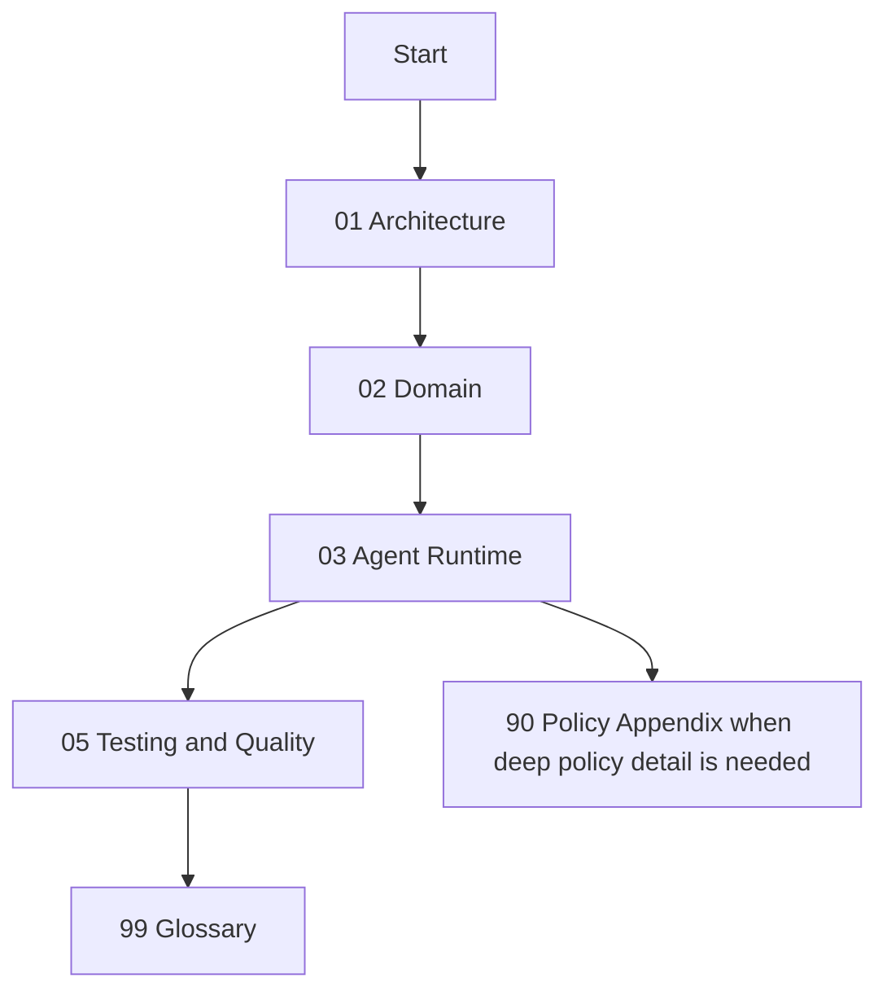

# ConstructOS Internal Documentation Index

This folder is the internal technical documentation set for engineers and agents.

It is organized as a single reading path, with each document containing:

- `Normative Policy (Source of Truth)`
- `Implementation Reality`
- `Known Drift / Transitional Risk`
- `Agent Checklist`

## Recommended Reading Order

1. `00-index.md` (this file)
2. `01-architecture.md`
3. `02-domain-and-bounded-contexts.md`
4. `03-agent-runtime-and-automation.md`
5. `05-testing-and-quality.md`
6. `99-glossary.md`

Use `90-policy-appendix.md` when you need full legacy policy details.

## Document Ownership Map

| Area | Primary document | Integrated policy domain |
| --- | --- | --- |
| Runtime topology, CQRS/ES boundaries | `01-architecture.md` | CQRS/event-sourcing architecture policy |
| Domain aggregates, contexts, data model | `02-domain-and-bounded-contexts.md` | CQRS + Team Mode + Starters policy |
| Team Mode, setup orchestration, automation execution | `03-agent-runtime-and-automation.md` | Team Mode v2 + project setup orchestration policy |
| Test structure and enforcement | `05-testing-and-quality.md` | testing and quality policy |

## Non-Negotiable Boundaries

- App stack Compose project name: `constructos-app`.
- Do not run broad/unscoped Compose teardown commands that might affect both stacks.

## Fast Agent Start Checklist

- Load the target project context (`project rules`, `skills`, `plugin config`, `setup profile`) before changes.
- Confirm Team Mode and delivery workflow constraints before mutating workflow logic.
- Treat policy sections as normative; treat implementation sections as current operational shape.

## Notes On Appendix

`90-policy-appendix.md` contains full legacy Source-of-Truth bodies preserved for traceability and deep reference. Operational work should start from documents `01` to `05` first, then consult the appendix only when needed.
