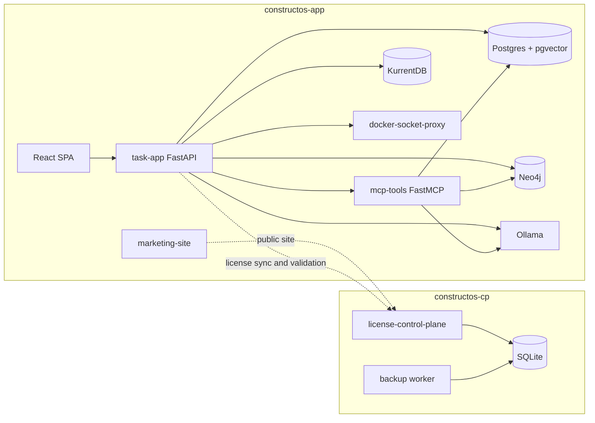
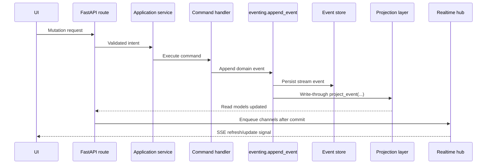

# Architecture Overview

## Normative Policy (Source of Truth)

- Write-side mutations must flow through command handlers and domain events, not direct read-model writes.
- Event-sourced aggregates are the canonical write authority; SQL/graph/vector stores are projections.
- Eventual consistency is expected and must be handled through idempotent projection/rebuild paths.
- No heuristic fallback is allowed for ambiguous product/workflow classification; return safe unknown/negative on classifier failure.

## Implementation Reality

- Main product runtime is `constructos-app` (task-app, mcp-tools, postgres, kurrentdb, neo4j, ollama, docker-socket-proxy).
- Licensing control plane is a separate stack `constructos-cp`.
- `shared/bootstrap.py` seeds base workspace/project data and internal docs content from `docs/internal/`.

## Known Drift / Transitional Risk

- Some areas still keep mixed event-sourced + direct SQL compatibility behavior during migrations.
- Legacy policy wording referenced a missing event inventory file; practical event inventory lives in `app/features/*/domain.py` and `app/features/*/command_handlers.py`.

## Agent Checklist

- Confirm whether change touches command path, projection path, or both.
- Validate idempotency and replay behavior when changing projection handlers.
- Avoid read-model direct writes in feature code unless explicitly covered by platform bootstrap/migration constraints.

## System Boundary

The repository contains two distinct backend systems plus two frontend surfaces:

- Main product application in `app/`
- Separate license control plane in `license_control_plane/`
- Main React SPA in `app/frontend/`
- Control-plane React SPA in `license_control_plane/frontend/`

The main application is the core product. The control plane handles licensing, onboarding, seat limits, tokens, and installation administration.

## Runtime Topology

The default main stack in `docker-compose.yml` is named `constructos-app`.

It contains:

- `task-app`: FastAPI application server
- `mcp-tools`: FastMCP server exposing product tools
- `postgres`: SQL read models and pgvector-backed vector chunks
- `kurrentdb`: event store backend when enabled
- `neo4j`: knowledge graph projection store
- `ollama`: embedding and GraphRAG support model runtime
- `docker-socket-proxy`: constrained Docker access for automation
- `marketing-site`: separate public marketing container

The control-plane stack in `docker-compose.license-control-plane.yml` is named `constructos-cp`.

It contains:

- `license-control-plane`: FastAPI licensing/admin service
- `license-control-plane-backup`: scheduled SQLite backup worker

## Main Application Startup Model

`app/main.py` defines the FastAPI lifespan and starts several background processes during startup:

- bootstrap and schema/data safety setup
- license startup check
- persistent subscriptions for event replay
- SQL projection worker
- graph projection worker
- vector projection worker
- event-storming projection worker
- license sync worker
- system notifications worker
- automation runner when `AGENT_RUNNER_ENABLED=true`

That startup sequence matters because the application is not just an HTTP API. It is an API plus several projection and automation subsystems.

## Bootstrap And Seeded State

`app/shared/bootstrap.py` is more than migration glue. It also seeds and normalizes important baseline state such as:

- system users for agent providers
- workspace and membership defaults
- workspace skill catalog seeds
- demo/project tour content
- schema drift repairs and table-column backfills

Agents debugging surprising default data should check bootstrap code before assuming the data was created manually.

## Write Path

The intended write model follows the canonical CQRS/event-sourcing document.

High-level path:

1. FastAPI route validates auth and payload.
2. Feature application service handles use-case-level logic.
3. Command execution enforces idempotency using `command_id` when present.
4. Command handler loads aggregate state.
5. Domain aggregate emits event(s).
6. `app/shared/eventing.py` appends the event.
7. Projections update SQL, graph, vector, and event-storming views.
8. Realtime channels are queued and only published after commit.

## Storage Model

The main application is polyglot by design.

### SQL

`Postgres` is the primary operational store for:

- read models used by the UI
- projection checkpoints
- vector chunk rows
- configuration state such as plugin configs and setup profiles
- sessions, notifications, activity logs, and support state

### Event Store

`KurrentDB` is the preferred event store for mutable domain history when configured via `EVENTSTORE_URI`.

There is also an SQL `stored_events` fallback in `app/shared/models.py` for environments where Kurrent is not available.

### Knowledge Graph

`Neo4j` is the graph projection target used by knowledge graph APIs and GraphRAG support in `app/shared/knowledge_graph.py`.

### Vector Store

Vector chunks live in SQL via `vector_chunks`. The implementation expects PostgreSQL with the `vector` extension for full retrieval support.

### Control Plane Storage

The control plane is separate and uses SQLite by default. That separation is deliberate operationally and conceptually.

## Consistency Model

This system is neither fully synchronous CRUD nor purely eventual.

The practical model is hybrid:

- event append is the write source of truth
- SQL read models are updated write-through in the request path
- background workers catch up or replay from checkpoints
- duplicate projection application is tolerated and treated as an idempotent race where possible
- realtime publication is after-commit, not pre-commit

This gives the UI near-immediate reads while keeping replay and recovery support.

## Realtime Model

`app/shared/realtime.py` provides a subscription hub used by the main SSE stream at `/api/notifications/stream`.

Important properties:

- subscriptions are channel-based
- signals are published after DB commit
- queues are bounded
- overflow drops older signals instead of blocking the system

That means SSE is a wakeup and refresh mechanism, not a complete event-sourcing protocol for the frontend.

## Graph And Retrieval Model

The main app supports three context-retrieval layers:

- SQL read models for standard UI reads
- Neo4j graph traversal for structural context
- vector chunk retrieval for semantic evidence

`app/shared/knowledge_graph.py` combines graph and vector retrieval into GraphRAG-style context packs when enabled.

## Licensing Boundary

Main app writes are guarded by license status through middleware in `app/main.py` and helpers in `app/shared/deps.py`.

The rule is simple:

- reads stay online
- blocked writes return HTTP `402`
- certain auth and license endpoints stay exempt so the system can recover from expired licensing state

## Architecture Summary

The easiest way to think about the main application is:

- FastAPI is the synchronous command/query shell
- domain events are the authoritative mutation history
- SQL is the operational read model and config plane
- graph and vector stores are secondary context systems
- the agent runner is a background orchestration engine layered on top of project/task state
