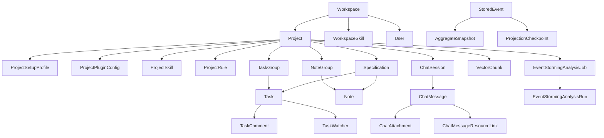

# Domain Model And Bounded Contexts

## Normative Policy (Source of Truth)

- Keep bounded-context ownership explicit; API/application/domain/read-model layers should stay cohesive per context.
- Team Mode task state must be represented through structured fields (`status`, `assigned_agent_code`, `assignee_id`) and allowed labels, not ad-hoc title/tag encoding.
- Project starter setup must be resolved through structured extraction + orchestration, not keyword-only heuristics.

## Implementation Reality

- Vertical-slice organization is implemented under `app/features/<context>/`.
- Core aggregate-centric contexts: projects, tasks, notes, specifications, rules, task groups, note groups.

## Known Drift / Transitional Risk

- Some workflows still bridge older labels/tags semantics while migrating toward stricter structured fields.
- Cross-context coupling exists in automation and plugin flows; changes often require updates across `agents`, `projects`, and `tasks`.

## Agent Checklist

- Identify the owning bounded context before editing.
- If changing task lifecycle semantics, verify Team Mode and UI expectations together.
- For starter/setup changes, verify extraction, orchestration, persisted setup profile, and resulting plugin state.

## Vertical Slice Pattern

Most of the main product backend follows a consistent feature layout under `app/features/<context>/`:

- `api.py`: FastAPI routes
- `application.py`: use-case orchestration
- `command_handlers.py`: command-side mutation logic
- `domain.py`: aggregate/domain event definitions
- `read_models.py`: query/read-model logic

This pattern is strongest in work-item and project contexts.

## Core Bounded Contexts

| Context | Main concern | Primary files |
| --- | --- | --- |
| `projects` | project lifecycle, members, plugin config access, graph/runtime queries | `app/features/projects/*` |
| `tasks` | task lifecycle, automation, scheduling, comments, watchers, delivery metadata | `app/features/tasks/*` |
| `specifications` | specification records and task/note linkage | `app/features/specifications/*` |
| `notes` | long-lived notes and task/spec linked note content | `app/features/notes/*` |
| `rules` | project rules used as durable operational guidance | `app/features/rules/*` |
| `task_groups` | board/list grouping for tasks | `app/features/task_groups/*` |
| `note_groups` | structured note grouping inside projects | `app/features/note_groups/*` |
| `notifications` | user notification lifecycle and read/unread state | `app/features/notifications/*` |
| `users` | auth, admin user management, preferences, runtime selection | `app/features/users/*` |
| `views` | saved views and filter persistence | `app/features/views/*` |
| `chat` | persisted chat sessions, messages, attachments, resource links | `app/features/chat/*` |
| `agents` | chat execution, MCP gateway, provider auth, runner, setup orchestration | `app/features/agents/*` |
| `project_starters` | starter catalog and setup profile access | `app/features/project_starters/*` |
| `project_skills` | workspace skill catalog and project skill attachment/import | `app/features/project_skills/*` |
| `doctor` | workspace diagnostics, fixture seeding, verification workflows | `app/features/doctor/*` |
| `support` | waitlist, contact requests, in-product feedback | `app/features/support/*` |
| `attachments` | upload, download, delete for attachment storage | `app/features/attachments/*` |
| `bootstrap` | root app bootstrap payload and health/version endpoints | `app/features/bootstrap/*` |
| `debug` | event, metric, and prompt-segment inspection endpoints | `app/features/debug/*` |

## Primary HTTP Route Families

The main app route surface is broad, but it clusters into stable families:

| Route family | Owning module |
| --- | --- |
| `/api/auth/*`, `/api/admin/users*`, `/api/me/preferences` | `app/features/users/api.py` |
| `/api/projects*` and project graph/runtime endpoints | `app/features/projects/api.py` |
| `/api/tasks*`, `/api/calendar`, `/api/export` | `app/features/tasks/api.py` |
| `/api/specifications*` | `app/features/specifications/api.py` |
| `/api/notes*` and `/api/note-groups*` | `app/features/notes/api.py`, `app/features/note_groups/api.py` |
| `/api/project-rules*`, `/api/project-skills*`, `/api/workspace-skills*` | `app/features/rules/api.py`, `app/features/project_skills/api.py` |
| `/api/task-groups*`, `/api/saved-views` | `app/features/task_groups/api.py`, `app/features/views/api.py` |
| `/api/notifications*` | `app/features/notifications/api.py` |
| `/api/agents/*` and `/api/chat/*` | `app/features/agents/api.py`, `app/features/chat/api.py` |
| `/api/project-starters*`, `/api/projects/{project_id}/setup-profile` | `app/features/project_starters/api.py` |
| `/api/workspaces/{workspace_id}/doctor*` | `app/features/doctor/api.py` |
| `/api/public/*`, `/api/support/*` | `app/features/support/api.py` |
| `/api/attachments/*` | `app/features/attachments/api.py` |
| `/api/health`, `/api/version`, `/api/bootstrap` | `app/features/bootstrap/api.py` |
| `/api/events/*`, `/api/metrics*` | `app/features/debug/api.py` |

## Canonical Event-Sourced Aggregates

The CQRS source-of-truth document names these current domain aggregates:

- `TaskAggregate`
- `ProjectAggregate`
- `NoteAggregate`
- `TaskGroupAggregate`
- `NoteGroupAggregate`
- `ProjectRuleAggregate`
- `SpecificationAggregate`
- `ChatSessionAggregate`
- `NotificationAggregate`
- `UserAggregate`
- `SavedViewAggregate`

In practice, agents should confirm the exact command/event contract in the local `domain.py` and `command_handlers.py` files for the context they are changing.

## Key SQL Models

The SQL schema under `app/shared/models.py` carries most of the operational state agents need to understand.

### Project And Setup Layer

- `Project`: top-level project record and operational toggles
- `ProjectMember`: project membership
- `ProjectSetupProfile`: persisted starter selection, facets, resolved setup inputs, retrieval hints
- `ProjectSkill`: project-attached skill definitions and generated rule linkage
- `ProjectPluginConfig`: plugin enablement plus validated/compiled config JSON
- `WorkspaceSkill`: workspace-wide skill catalog

### Work Items

- `TaskGroup`
- `Task`
- `TaskWatcher`
- `TaskComment`
- `Note`
- `NoteGroup`
- `ProjectRule`
- `Specification`
- `SavedView`

### Automation And Projection Infrastructure

- `StoredEvent`
- `AggregateSnapshot`
- `ProjectionCheckpoint`
- `CommandExecution`
- `EventStormingAnalysisJob`
- `EventStormingAnalysisRun`
- `ContextSessionState`
- `VectorChunk`

### Interaction And User State

- `Notification`
- `ActivityLog`
- `AuthSession`
- `ChatSession`
- `ChatMessage`
- `ChatAttachment`
- `ChatMessageResourceLink`

### App-Side Licensing State

- `LicenseInstallation`
- `LicenseEntitlement`
- `LicenseValidationLog`

## Work Item Model In Practice

`Task` is the single richest operational record in the system.

It carries:

- assignment state
- project and group linkage
- status and priority
- attachments and external refs
- automation instruction text
- execution triggers
- task relationships
- delivery mode
- schedule configuration and schedule run state
- archival/completion/order metadata

That is why automation, Team Mode, delivery, and scheduling all converge on the task model.

## Project Context Layer

A project is not just a name and description. Agents should think of a project as the combination of:

- `Project`
- `ProjectSetupProfile`
- `ProjectPluginConfig` rows
- `ProjectRule` records
- `ProjectSkill` records
- project membership
- related work items and chat history
- optional repository context and deploy/runtime evidence

That combined state is what defines how automation should behave for a given project.

## Relationship Map

## Where Truth Lives By Concern

| Concern | Primary truth |
| --- | --- |
| Mutable business lifecycle | domain events plus aggregate state |
| UI queries and filters | SQL read models |
| plugin behavior | `ProjectPluginConfig` and plugin evaluators |
| starter-driven project identity | `ProjectSetupProfile` plus starter catalog |
| long-lived human/agent guidance | `ProjectRule`, `ProjectSkill`, `WorkspaceSkill` |
| graph context | Neo4j projection |
| semantic retrieval | `VectorChunk` rows and embedding runtime |
| automation replay/idempotency | `CommandExecution`, event store, task state |

## Important Modeling Distinctions

### Plugin config is not the same thing as a project skill

`ProjectPluginConfig` stores runtime capability config for things like Team Mode, Git Delivery, and Docker Compose.

`ProjectSkill` stores imported or linked guidance artifacts that may generate or connect to project rules.

Those systems interact, but they are not interchangeable.

### Starter profile is not the same thing as project metadata

The starter profile records how a project was initially framed and what retrieval hints or setup facts were extracted.

That makes it an important context source for agents, even after the project already exists.

### Refs and notes are evidence, not always state

Tasks, notes, and projects carry `external_refs` and `attachment_refs`. Those often provide runtime evidence for delivery and QA, but they are not the sole source of workflow truth. For Team Mode and plugin automation, structured config and task state win over ad hoc evidence text.

## Domain Summary

Agents should model the repository as a project/work-item platform with four overlapping planes:

- event-sourced mutation plane
- SQL operational/query plane
- automation/plugin policy plane
- retrieval/context plane

A change that touches only one of those planes is usually straightforward. A change that crosses all four needs extra care.
