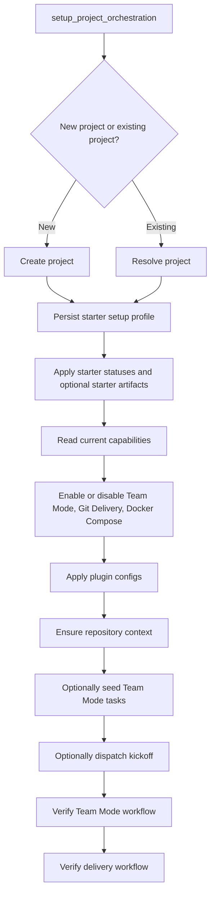
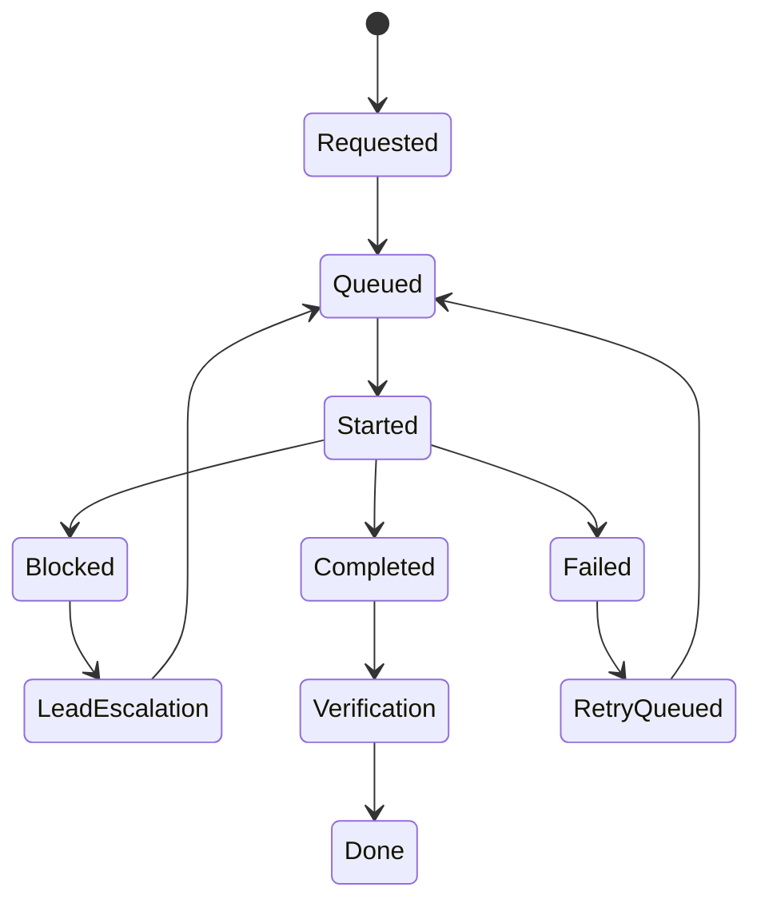

# Agent Runtime And Automation

## Normative Policy (Source of Truth)

- Team Mode role semantics and lifecycle gates are authoritative and must not be bypassed by implicit shortcuts.
- Automation routing must use structured assignment fields (`assigned_agent_code`, `assignee_id`) and configured agent slots.
- Project setup is chat-first and enforced through orchestration primitives; avoid heuristic fallback for ambiguous classification.
- Delivery verification must use explicit evidence checks (Git contract + QA artifacts + deploy evidence).

## Implementation Reality

- Runtime surfaces live under `features/agents/*`, plugin implementations under `app/plugins/*`.
- MCP server exposes product operations used by chat agents and automation runners.
- `setup_project_orchestration` is the enforcement entry point for starter-driven setup and plugin wiring.

## Known Drift / Transitional Risk

- Some legacy task labels and older role conventions may still exist in persisted projects.
- Runtime behavior can differ by plugin enablement state and project-specific config strictness.

## Agent Checklist

- Read project capabilities, plugin config, and setup profile before automation changes.
- For Team Mode changes, verify workflow topology via verification tools.
- For delivery changes, verify both wiring and evidence contracts.

## Why This Matters

The repository is explicitly built to support agent-assisted execution. Future agents should understand this layer before changing workflow logic, setup logic, or delivery behavior.

The main integration surface lives in:

- `app/features/agents/api.py`
- `app/features/agents/service.py`
- `app/features/agents/mcp_server.py`
- `app/features/agents/mcp_registry.py`
- `app/features/agents/executor.py`
- `app/features/agents/runner.py`
- `app/plugins/*`

## Execution Providers

The main app supports multiple execution providers and auth flows:

- Codex
- Claude
- OpenCode

Provider defaults and runtime selection live in `app/shared/settings.py` and user/workspace runtime state.

The main practical rule is that provider auth and provider selection are explicit system state, not an assumption. Agents should not assume Codex is always the active or available executor.

## Chat Surface

There are two closely related but distinct systems:

- `features/chat`: persistent session/message model
- `features/agents`: execution-facing chat orchestration, streaming, tool access, provider auth, stop/resume behavior

The frontend uses the agents API for live chat execution and the chat context models for persistence and history.

## MCP Server Model

`app/features/agents/mcp_server.py` exposes a large FastMCP tool surface over product capabilities.

Important characteristics:

- it mirrors core project/task/note/spec APIs into MCP tools
- it exposes higher-level orchestration tools such as `setup_project_orchestration`
- it includes verification tools for Team Mode and delivery workflows
- it defaults the main product MCP URL from `AGENT_MCP_URL`

`app/features/agents/mcp_registry.py` discovers configured MCP servers from Codex config and `codex mcp list --json`, then normalizes/filter them.

Important consequence:

- MCP server selection is dynamic
- the core ConstructOS server is always important
- plugin state can filter which MCP servers are allowed for a project

## Workflow Plugins

The plugin registry in `app/plugins/registry.py` currently loads:

- `team_mode`
- `git_delivery`
- `github_delivery`
- `doctor`

These plugins act as workflow policy and validation layers. They are not just cosmetic feature flags.

### Team Mode

Team Mode is the most important plugin because it changes runtime task semantics.

The canonical policy is the Team Mode V2 source-of-truth document.

Key runtime ideas:

- one implementation task can move across authority roles
- roles are project-level/team-level semantics, not hardcoded task types
- status meaning should come from semantic status mapping, not string guessing
- structured lifecycle fields should be treated as more authoritative than visible labels

### Git Delivery

Git Delivery is the delivery evidence contract. It checks for repository context and evidence such as task branches and commit references.

### Docker Compose

Docker Compose is modeled as a plugin-backed deployment capability. It depends on Git Delivery, not the other way around.

## Project Setup Orchestration

`AgentService.setup_project_orchestration(...)` is the main high-level setup entrypoint.

What it does:

- creates or resolves the project
- validates missing required setup inputs
- persists starter setup profile
- applies starter-seeded statuses/artifacts when appropriate
- enables/disables workflow plugins
- applies validated plugin configs
- ensures default repository context for delivery projects
- optionally seeds Team Mode starter tasks
- optionally dispatches Team Mode kickoff
- verifies Team Mode and delivery wiring at the end

A key contract for agents:

- if required setup inputs are missing, the service returns HTTP `422`
- the error includes `missing_inputs`, `next_question`, `resolved_inputs`, and `setup_path`
- agents should ask only the next missing question, not restart setup from scratch

## Automation Runner

The background automation runner in `app/features/agents/runner.py` is the execution engine for task automation.

It is responsible for:

- polling queued automation requests
- applying plugin-aware preflight rules
- dispatching task execution
- recording started/completed/failed state transitions
- performing Team Mode routing and lifecycle transitions
- validating delivery/deploy evidence
- handling schedule triggers and status-change triggers

The runner is not just a job queue. It is the operational workflow machine for agent execution.

## Team Mode Runtime Rules Agents Must Respect

The canonical Team Mode document is normative. The practical runtime implications are:

- do not encode agent identity into task titles
- do not rely on `tm.agent:*` labels
- prefer structured routing fields such as `assignee_id` and `assigned_agent_code`
- ensure required semantic statuses exist for Team Mode projects
- treat Lead as a project-level controller and escalation authority
- treat Developer and QA work as lifecycle phases on the same task rather than separate role-tasks

## Delivery Verification Model

Delivery success is not only “the agent finished”. The system can verify:

- repository context exists
- Git evidence is present
- QA artifacts are present when required
- deploy execution evidence exists when required
- runtime deploy health checks pass when configured

Agents should use verification APIs or tools before claiming that setup or delivery is correct.

## Agent Context Loading Strategy

Before making meaningful project changes, an agent should load context in this order:

1. project capabilities
2. starter setup profile
3. plugin config rows for enabled plugins
4. project rules
5. project skills and workspace skills
6. current tasks/specs/notes relevant to the change
7. project chat context or graph context when needed

This is the best way to avoid breaking workflow assumptions that are not visible from a single task.

## Safe Defaults For Future Agents

- Prefer `setup_project_orchestration` over hand-assembling a new project from many small calls.
- Prefer verification tools after setup instead of assuming plugin wiring is correct.
- Prefer structured classification over heuristics for ambiguous routing/setup decisions.
- Prefer plugin config and setup profile truth over loose tag/status interpretation.
- Prefer stable command-id aware mutation paths over direct low-level state edits.

## Transitional Caveats

Two caveats matter for refactoring work:

- Some runtime code still carries legacy Team Mode assumptions even though Team Mode V2 is the intended model.
- The runner and service layers contain orchestration shortcuts and compatibility behavior; changes there should be backed by verification and tests, not only by local reasoning.
