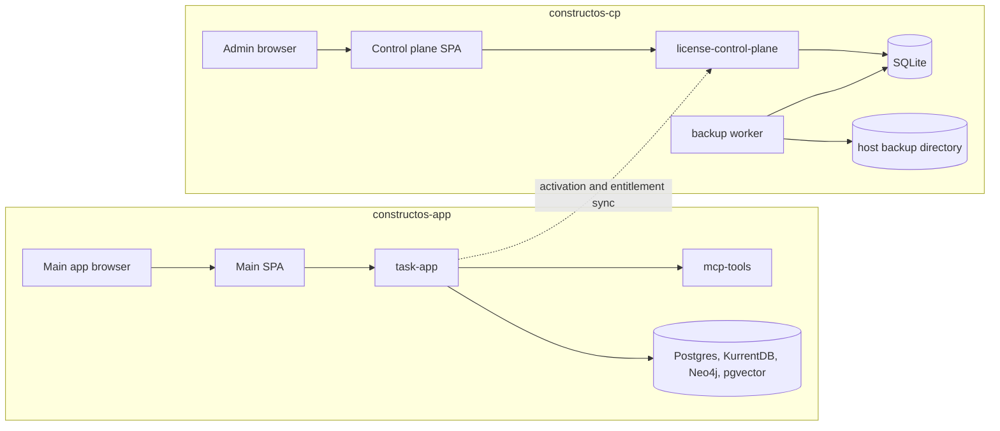

# Frontend, Control Plane, And Operations

## Normative Policy (Source of Truth)

- Treat `license-control-plane` and `license-control-plane-backup` as protected services.
- Scope app-stack operations to Compose project `constructos-app`; never run unscoped cleanup commands that can hit both stacks.
- Preserve control-plane separation: app runtime and licensing admin runtime are distinct deployment boundaries.

## Implementation Reality

- Main frontend is under `app/frontend/`; control-plane frontend is under `license_control_plane/frontend/`.
- App-side operational scripts (`scripts/deploy.sh`, `scripts/recreate_from_zero.sh`) manage app stack lifecycle.
- Local deployments map docs into containers for internal docs seeding; GHCR deployments disable internal-only seeding.

## Known Drift / Transitional Risk

- Operator environments may vary in compose overlays and local mounts, especially GPU/macOS profiles.
- Frontend behavior often depends on backend plugin/config state and can appear inconsistent when project wiring is incomplete.

## Agent Checklist

- Before operational commands, verify stack scope and Compose project name.
- Before frontend workflow changes, confirm corresponding backend contract and plugin constraints.
- Before licensing-related changes, verify whether target behavior belongs to app stack or control-plane stack.

## Main Frontend

The main frontend lives in `app/frontend/` and is a React + Vite application.

Important characteristics:

- single exported entrypoint through `src/App.tsx` -> `src/app/AppShell.tsx`
- React Query for data fetching and mutation coordination
- markdown rendering plus Mermaid rendering in the UI
- task, note, project, and agent/chat concerns are composed in one large application shell
- realtime refresh behavior is tied to the backend SSE stream

This is not a multi-frontend workspace. It is one integrated SPA with many hooks under `src/app/` and shared utilities under `src/utils/`.

## Main Frontend Responsibilities

The frontend is responsible for:

- authentication and admin user flows
- project/task/note/spec editing
- Team Mode and plugin-related forms
- agent chat and execution streaming
- rendering markdown and Mermaid diagrams
- reacting to SSE wakeup signals and refetching relevant state

## Control Plane Frontend

The control-plane frontend lives in `license_control_plane/frontend/`.

It is also a React + Vite app, but much smaller in scope. It primarily supports:

- activation/admin workflows
- onboarding and token provisioning
- installation and subscription management
- app notification campaigns
- waitlist/contact/support administration

## Control Plane Backend Surface

`license_control_plane/main.py` contains a separate FastAPI app.

Important route families include:

- `/api/health`
- `/v1/installations/*`
- `/v1/install/*`
- `/v1/admin/activation-codes*`
- `/v1/admin/client-tokens*`
- `/v1/admin/installations*`
- `/v1/admin/app-notifications*`
- `/v1/public/waitlist`
- `/v1/public/contact-requests`
- `/v1/support/feedback`
- `/v1/support/bug-reports`

Key persisted models include:

- installations
- activation codes
- client tokens
- waitlist entries
- contact requests
- app notification campaigns

## Operational Separation

The control plane is intentionally isolated from the main application.

Reasons:

- licensing and seat limits must survive app-stack churn
- backups are managed independently
- admin/token operations are distinct from project/task operations
- app-stack resets should not destroy entitlement state

## Compose And Deployment Safety

Compose project names are fixed and meaningful:

- main stack: `constructos-app`
- control-plane stack: `constructos-cp`

Agents must preserve these boundaries.

### Safe operational interpretation

- app-stack actions should use `docker compose -p constructos-app ...`
- control-plane actions are protected and require explicit user direction
- unscoped cleanup commands are unsafe because they can cross stack boundaries

### Protected services

Never stop, remove, or recreate these unless the user explicitly asks:

- `license-control-plane`
- `license-control-plane-backup`

## Licensing And Write Safety

The main app can remain online in read-only mode when licensing is invalid.

Practical effect:

- users can still reach auth and licensing recovery endpoints
- writes to normal API paths are blocked by middleware when enforcement is active
- agents must distinguish “system reachable” from “writes currently allowed”

## Testing Policy

The canonical testing policy is [`05-testing-and-quality.md`](05-testing-and-quality.md).

Current backend testing rules:

- canonical suite root: `app/tests/core/`
- default pytest collection is pinned there through `pyproject.toml`
- tests are organized by bounded context
- additions should protect high-value behavior rather than inflate volume

Observed context folders currently include:

- `app/tests/core/contexts/agents/`
- `app/tests/core/contexts/platform/`
- `app/tests/core/contexts/projects/`
- `app/tests/core/contexts/work_items/`
- `app/tests/core/support/`

## Useful Operational Entry Points

- main health: `/api/health`
- version: `/api/version`
- bootstrap payload: `/api/bootstrap`
- main license status: `/api/license/status`
- main notification stream: `/api/notifications/stream`
- control-plane health: `/api/health` on the control-plane service

## Practical Advice For Future Agents

- Treat the control plane as infrastructure-adjacent, not as just another feature module.
- When debugging delivery or runtime health, check plugin config and repository context before blaming the frontend.
- When debugging stale UI state, follow the chain: mutation -> event append -> projection -> after-commit realtime signal -> frontend refetch.
- When changing setup or workflow behavior, update docs and tests together because automation behavior spans backend, frontend, and MCP tooling.

## Summary

From an operator or agent point of view, this repository is one product with two service planes:

- the main collaboration/automation platform
- the protected entitlement/control plane

Understanding that boundary is the difference between a safe change and an outage-inducing one.
