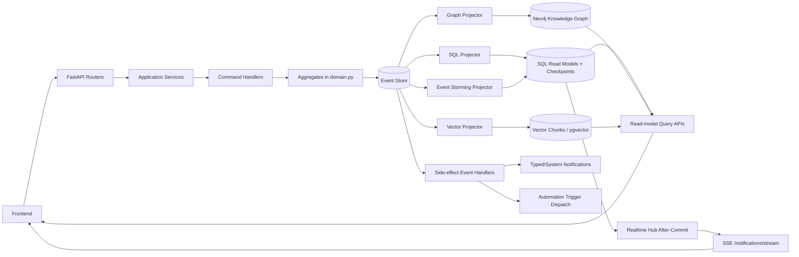

# Policy Appendix (Legacy Full Bodies)

This appendix preserves full legacy Source-of-Truth content in one organized document.

Primary operational guidance should come from files `01` to `05`.
Use this appendix for deep policy audits, historical wording, or migration traceability.

---

## Appendix A: CQRS + Event Sourcing Architecture (Legacy Full Body)

# CQRS + Event Sourcing Architecture Source of Truth

## Purpose
This document defines the backend architecture standard that must be followed across the application, including areas that are still in migration.

For a detailed aggregate-by-aggregate inventory (commands, events, and current implementation status), see:
- `docs/cqrs-event-sourcing-inventory.md`

## Scope
Applies to the backend under:
- `app/features/*`
- `app/shared/*`


## Core Principles
1. Separate writes and reads (CQRS).
2. Treat domain events as the source of truth for mutable business entities (Event Sourcing).
3. Route write operations through application services and command handlers.
4. Keep projection handlers idempotent and replay-safe.
5. Prefer explicit conflict handling with optimistic concurrency over implicit last-write-wins.
6. Do not use heuristic fallback for ambiguous workflow/classification decisions; use structured LLM classification or return unknown/safe-negative.

## Canonical Write Path
Standard write flow:
1. API route validates input and authorization.
2. API calls application service in `features/*/application.py`.
3. Application service calls `shared.commanding.execute_command(...)`.
4. `execute_command(...)` applies command idempotency via `CommandExecution` (`command_id`).
5. Command handler in `features/*/command_handlers.py` loads aggregate state via `AggregateEventRepository.load_with_class(...)`.
6. Handler invokes aggregate method(s) (`@event(...)` methods in `features/*/domain.py`).
7. Handler persists pending events via `AggregateEventRepository.persist(...)`.
8. `shared.eventing.append_event(...)` appends to event store and triggers projections and side-effect subscribers.

## Where Handlers Live
Command handlers:
- `app/features/*/command_handlers.py`

Aggregate event methods (domain-level event handlers that mutate aggregate state):
- `app/features/*/domain.py` (`@event(...)` methods)

Projection handlers (read-model event handlers):
- `app/shared/eventing_rebuild.py` (`apply_*_event(...)`, `project_event(...)`)

Reactive side-effect event handlers:
- `app/shared/eventing_notification_triggers.py`
- `app/shared/eventing_task_automation_triggers.py`
- `app/shared/eventing_notifications.py`

Runtime task automation note:
- Task runtime mutation paths (runner dispatch lifecycle, task automation stream progress/state, and status-change trigger side-effects) should use Task internal command handlers instead of direct event append.
- Direct append fallbacks are transitional safety rails only and should be removed once handler availability is guaranteed in all runtime contexts.

Specialized projection workers:
- SQL read-model worker: `app/shared/eventing_projections.py`
- Knowledge graph worker: `app/shared/eventing_graph.py`
- Vector index worker: `app/shared/eventing_vector.py`
- Event-storming worker: `app/shared/eventing_event_storming.py`

## Aggregate Coverage (Current Domain Aggregates)
- `TaskAggregate`
- `ProjectAggregate`
- `NoteAggregate`
- `TaskGroupAggregate`
- `NoteGroupAggregate`
- `ProjectRuleAggregate`
- `SpecificationAggregate`
- `ChatSessionAggregate`
- `NotificationAggregate`
- `UserAggregate`
- `SavedViewAggregate`

The authoritative command/event mapping for each aggregate remains in `docs/cqrs-event-sourcing-inventory.md`.

## Libraries and Platform Components
Primary libraries currently used:
- `eventsourcing`
- `eventsourcing-kurrentdb`
- `kurrentdbclient`
- `FastAPI`
- `SQLAlchemy`
- `Pydantic`
- `psycopg`
- `neo4j`
- `httpx`

Storage/runtime components:
- Event store backend:
  - KurrentDB when configured (`EVENTSTORE_URI`), or
  - SQL fallback (`stored_events`) when KurrentDB is unavailable.
- Primary SQL database for read models and application state (`DATABASE_URL`).
- Optional Neo4j graph database for knowledge graph projections.
- Optional pgvector-backed storage (`vector_chunks`) for embedding projections.

## Eventual Consistency Model (How It Is Handled Here)
The system uses a hybrid consistency strategy:
1. Write-time projection:
   - `append_event(...)` projects the event immediately (`project_event(...)`) in the same request path.
   - In Kurrent mode, write-through projection keeps SQL read models aligned even if background checkpoints lag.
2. Background catch-up:
   - Persistent subscription workers consume all-stream events and replay projections from checkpoints.
3. Idempotent projection behavior:
   - Duplicate projection writes are tolerated and treated as idempotent races (unique constraint handling).
4. Commit-based realtime fanout:
   - Realtime channels are enqueued during the transaction and published only after commit.

Result: read models are usually near-immediate, with replay workers guaranteeing convergence after restarts, lag, or transient failures.

## Concurrency and Event Conflict Handling (Generic Rule)
Generic optimistic concurrency flow:
1. Handler determines expected stream version (explicit `expected_version` for strict operations, or implicit from aggregate pending events).
2. `append_event(...)` compares expected version with current stream version.
3. On mismatch, it raises `ConcurrencyConflictError`.
4. `run_command_with_retry(...)` retries conflict errors with bounded exponential backoff.
5. If still conflicting, API returns HTTP `409`.

This is the standard conflict policy for command handlers across aggregates.

## Command Handler Return Contract
Target standard (must be followed for new/refactored handlers):
1. Create command:
   - Return only created resource identifier(s), for example `{ "id": "<resource_id>" }`.
2. Mutation command:
   - Return minimal acknowledgement (`{ "ok": true }`) and optional version metadata only when required.
3. Errors:
   - Raise typed HTTP/domain errors (validation, authorization, not found, conflict), not ad-hoc success payloads.

Current state:
- Some handlers still return full read-model payloads (for example Task/Project create and patch paths).
- This is accepted as transitional behavior, but the target contract above is the standard to converge to.

Batch reorder rule:
- Collection reorder commands (for example task groups and note groups) should execute as one command/transaction per request.
- Task reorder commands should follow the same batch-per-request transaction discipline.
- Duplicate IDs in reorder payloads should be normalized (first occurrence wins).
- No-op reorder operations should not emit new reorder events.

Bulk action rule:
- Fan-out bulk commands should normalize duplicate target IDs before dispatch.
- Bulk action keys should be normalized to a canonical lowercase action token before command-name selection and command-id payload hashing.
- No-op mutations (for example setting a field to its current value) should be acknowledged without emitting new domain events.
- Prefer one bulk command execution/transaction per request over per-target command loops.

Command replay rule:
- Public mutation entrypoints that accept `command_id` must route through `execute_command(...)` even when normalized target sets become empty at runtime.
- Do not return early before command execution in those paths, or replay/idempotency semantics become inconsistent.
- `command_id` is globally unique in `command_executions` (not scoped by `command_name`), so clients must not reuse the same `command_id` across different mutation intents.
- `execute_command(...)` should reject reusing the same `command_id` for a different `command_name` or actor user (`409` conflict), instead of replaying stale response data.
- Any exceptional/manual `CommandExecution` path (outside `execute_command(...)`) must enforce the same `command_name + user_id` scope check and return the same `409` conflict contract.
- Child command identifiers should be derived deterministically from a parent `command_id` with overflow-safe suffix hashing (instead of ad-hoc string slicing) to keep replay stable without risking 64-character key collisions.
- This applies to API services and background orchestration paths (for example runner/doctor/team-mode orchestration), not only request handlers.
- Shared helper module: `app/shared/command_ids.py` (`derive_child_command_id`, `derive_scoped_command_id`).

## Projection Stores: Count and Behavior
There are 4 logical projection pipelines:
1. SQL read-model projection (`read-model` checkpoint).
2. Knowledge graph projection (`knowledge-graph` checkpoint).
3. Vector projection (`vector-store` checkpoint).
4. Event-storming projection (`event-storming` checkpoint).

Physical projection stores:
1. Primary SQL database (always):
   - Main read models and projection checkpoints.
   - Event-storming analysis tables.
2. Neo4j (optional):
   - Knowledge graph projection target.
3. Vector store in SQL via pgvector (optional):
   - `vector_chunks` table (PostgreSQL + vector extension required).

So, operationally:
- Minimum deployed projection store count is `1` (SQL only).
- Maximum deployed projection store count is `3` (SQL + Neo4j + pgvector-backed vector indexing).

## Frontend Reactivity Model
Primary UI reactivity channel:
- SSE endpoint: `/api/notifications/stream`
  - Uses commit-triggered realtime hub + timeout ping fallback for resilience.

Other streaming channels:
- Some features use dedicated streaming endpoints with feature-specific protocols (for example NDJSON streams for agent/chat/task automation flows).
- These are not a single generic SSE protocol today.

Standardization status:
- Realtime signaling backbone is shared (`shared/realtime.py`).
- Payload protocol is not yet fully uniform across all stream endpoints.

## Event Storming Diagram (System-Level)


## Migration Rule of Thumb
When touching legacy or mixed paths, move toward:
1. API -> Application Service -> `execute_command` -> Command Handler -> Aggregate -> Event append.
2. Minimal command responses.
3. Replay-safe projectors and centralized conflict handling.

## Current Exception Boundaries
These exceptions are allowed temporarily and should not be expanded:
1. Bootstrap/seed initialization (`app/shared/bootstrap.py`) can append events directly to construct initial aggregate streams.
2. Side-effect notification emission can append `NotificationCreated` events from event-trigger modules (event-to-event relay).
3. Runtime trigger modules may keep guarded fallback append behavior only when internal handler import/actor resolution fails; handler-first path is the required default.

## Automated Guardrails
Repository tests enforce append-event boundaries:
1. `app/tests/test_cqrs_guardrails.py::test_features_do_not_call_append_event_directly`
2. `app/tests/test_cqrs_guardrails.py::test_shared_append_event_calls_are_limited_to_eventing_and_bootstrap`
3. `app/tests/test_cqrs_guardrails.py::test_features_do_not_mutate_aggregate_read_models_via_sqlalchemy_dml`
4. `app/tests/test_cqrs_guardrails.py::test_application_services_do_not_reuse_literal_command_names_across_methods`
5. `app/tests/test_cqrs_guardrails.py::test_feature_modules_do_not_build_child_command_ids_with_parent_fstrings`
6. `app/tests/test_cqrs_guardrails.py::test_feature_modules_do_not_slice_command_ids_directly`

These tests are intended to prevent CQRS drift in future changes.

---

## Appendix B: Team Mode V2 (Legacy Full Body)

# Team Mode V2 Source of Truth

## Status
- Authoritative for the next Team Mode rewrite.
- No backward compatibility is required.
- Legacy Team Mode behavior may be removed instead of migrated.
- Target deployment model is recreate-from-zero after implementation is complete.

## Goal
Replace the current role-task workflow (`Dev -> Lead -> QA` as separate task/status phases) with a more natural single-task lifecycle:
- one implementation task moves between agents,
- authority role changes behavior, not task type,
- Developer owns implementation and merge,
- Lead is a project-level controller plus escalation/deploy owner,
- QA validates deployed work on the same task,
- human involvement happens only when Lead cannot resolve a blocker.

## Core Decisions
- Team Mode no longer creates role-specific tasks.
- Team Mode no longer depends on role-specific task statuses.
- Team Mode no longer uses `workflow.transitions` or any generic "allowed transitions" matrix.
- A task's active behavior is determined by the current assignee's authority role.
- There is always exactly one Team Lead agent per Team Mode project.
- Lead oversight is project-scoped, not task-scoped.
- Assignment to an agent is an execution trigger.
- Tags remain visible UX markers, but they must not be the only source of truth for automation decisions.

## Resolved Ambiguities

### Terminal status
Your notes mention both `Done` and `Completed`. This spec standardizes on the semantic terminal state `completed`.

Implementation rule:
- Team Mode must use explicit status semantics instead of hardcoded status names.
- Mandatory standard statuses for new Team Mode projects:
  - `To do`
  - `In Progress`
  - `In Review`
  - `Blocked`
  - `Awaiting decision`
  - `Completed`
- Team Mode may allow additional project-specific statuses, but these mandatory standard statuses must always exist.
- Project-specific statuses must not replace the mandatory Team Mode semantic statuses.
- Team Mode runtime must never infer status meaning heuristically from arbitrary status text.

### "Available agent"
`Available` must be deterministic, not guessed.

Implementation rule:
- Developer and QA auto-assignment use `least_active_then_stable_order`.
- Active means the agent currently owns a non-terminal task in `To do`, `In Progress`, or `Blocked`.
- Stable tie-breaker is the agent order stored in Team Mode config.

### Completion notification ownership
Your notes imply both QA and Lead may notify on project completion. That would create duplicates.

Implementation rule:
- The last successful QA completion emits a `project_completion_candidate` signal.
- The Lead controller performs the authoritative finalization exactly once:
  - send the user notification,
  - create the final report note,
  - update the project external link.
- The finalization path must be idempotent and deduped.

### Tags as workflow state
Plain editable tags are too fragile to be the only automation state.

Implementation rule:
- Team Mode stores structured lifecycle fields in task state.
- Reserved visible tags mirror those lifecycle fields for UX.
- Automation reads structured state first and tags second.

## Team Invariants
- Exactly `1` Lead agent is required.
- At least `1` Developer agent is required.
- At least `1` QA agent is required.
- Every Team Mode project must have one resolved human owner for escalation and completion notifications.
- Each agent has exactly one authority role:
  - `Developer`
  - `QA`
  - `Lead`
- A task does not carry a permanent workflow role.
- Legacy `tm.role:*` task labels are removed as workflow truth.
- Legacy status fallback for role derivation is removed.

## Team Mode Config V2
`team_mode` config must be simplified to role coverage, semantics, assignment policy, optional review gate, and Lead oversight.

Suggested canonical shape:

```json
{
  "team": {
    "agents": [
      { "id": "dev-a", "name": "Developer A", "authority_role": "Developer", "executor_user_id": "..." },
      { "id": "dev-b", "name": "Developer B", "authority_role": "Developer", "executor_user_id": "..." },
      { "id": "qa-a", "name": "QA A", "authority_role": "QA", "executor_user_id": "..." },
      { "id": "lead-a", "name": "Lead", "authority_role": "Lead", "executor_user_id": "..." }
    ]
  },
  "status_semantics": {
    "todo": "To do",
    "active": "In Progress",
    "in_review": "In Review",
    "blocked": "Blocked",
    "awaiting_decision": "Awaiting decision",
    "completed": "Completed"
  },
  "routing": {
    "developer_assignment": "least_active_then_stable_order",
    "qa_assignment": "least_active_then_stable_order"
  },
  "oversight": {
    "reconciliation_interval_seconds": 5,
    "human_owner_user_id": "..."
  },
  "labels": {
    "merged": "merged",
    "deploy_ready": "deploy-ready",
    "deployed": "deployed",
    "tested": "tested"
  }
}
```

Removed from config:
- `workflow.transitions`
- `governance.merge_authority_roles`
- `governance.task_move_authority_roles`
- `automation.lead_recurring_max_minutes`

## Canonical Status Model
Team Mode uses semantic states, not role phases.

Required semantic states:
- `todo`
- `active`
- `in_review`
- `blocked`
- `awaiting_decision`
- `completed`

Rules:
- New implementation tasks start in `todo`.
- Any agent actively working a task moves it to `active`.
- `in_review` means the task is waiting for explicit human review approval.
- `blocked` means an agent cannot continue and requires Lead triage.
- `awaiting_decision` means the task is now owned by a human and Team Mode pauses further agent execution.
- `completed` is terminal and means QA verified the deployed outcome successfully.
- Additional custom project statuses may exist, but Team Mode lifecycle logic must continue to anchor on the mandatory semantic statuses above.

## Reserved Lifecycle Labels
Visible labels must be normalized lowercase and reserved for Team Mode automation.

Canonical labels:
- `merged`
- `deploy-ready`
- `deployed`
- `tested`

Lifecycle rules:
- Developer success adds `merged` and `deploy-ready`.
- Lead successful deploy removes `deploy-ready` and adds `deployed`.
- QA success adds `tested`.
- When a completed or deployed task is reopened for a new fix cycle:
  - remove `merged`,
  - remove `tested`,
  - remove `deployed`,
  - remove `deploy-ready`,
  - clear current-cycle deploy/test/review state,
  - reset the task phase to `implementation`,
  - move the task back to `To do` or `In Progress` as appropriate for the new cycle,
  - preserve immutable audit history and prior notes.

## Structured Task State
Task state must carry authoritative lifecycle fields.

Minimum required fields:
- `team_mode_current_role`
  - derived from current assignee authority role, not user-editable
- `team_mode_phase`
  - `implementation`
  - `in_review`
  - `deploy_ready`
  - `deployment`
  - `qa_validation`
  - `blocked`
  - `awaiting_decision`
  - `completed`
- `last_merged_at`
- `last_merged_commit_sha`
- `last_deploy_cycle_id`
- `last_deployed_at`
- `last_deploy_execution`
- `last_tested_at`
- `last_human_escalated_at`
- `last_review_requested_at`
- `last_review_approved_at`
- `project_completion_finalized_at`

Tags are mirrored from these fields, not the other way around.

## Task Notes by Role
Each Team Mode task may link one or more notes, and notes are the preferred place for phase-specific detail.

Rules:
- Team Mode should support role-based note grouping or typed notes so the task note list does not become unstructured noise.
- Recommended default note groups:
  - `Developer`
  - `Lead`
  - `QA`
  - `Review`
- Developer may write implementation notes, validation notes, and merge evidence notes.
- Lead may write deploy notes, blocker-resolution notes, and finalization notes.
- QA may write validation notes and PASS/FAIL evidence notes.
- Human reviewers may write review notes and approval/rejection notes.
- Structured task state remains authoritative for automation.
- Notes are supporting evidence and human-readable history, not the primary workflow state machine.

## Assignment and Execution Rules

### Universal rule
- Assigning a task to an agent queues execution immediately.
- Assigning a task to a human never auto-queues execution.

### Default task creation
- A newly created Team Mode task is neutral and implementation-scoped.
- It is auto-assigned to a Developer by `least_active_then_stable_order`.
- It starts in `todo`.
- The first Developer run moves it to `active`.

### Reassignment by role
- Developer -> Lead:
  - used for deploy-ready handoff or blocker escalation
- Lead -> QA:
  - used after successful deploy
- QA -> Lead:
  - used when QA cannot continue and needs Lead triage
- Lead -> Human:
  - used for `Awaiting decision`
- Lead -> Developer:
  - used when Lead triages a blocker and returns the task with clarified instructions

## Single-Task Lifecycle

### 1. Creation
- Human or setup flow creates a task with implementation scope.
- Task is assigned to a Developer automatically.
- Status = `todo`.
- Phase = `implementation`.

### 2. Developer execution
- Developer starts work and moves task to `active` if not already there.
- Developer implements on the task branch.
- Developer runs validation required by Git Delivery policy.
- If human code review is disabled:
  - Developer merges the task branch to `main` after successful validation.
- If human code review is enabled:
  - Developer moves the task to `In Review`,
  - review approval is recorded,
  - Developer performs the final merge-to-main after approval.
- Developer records merge evidence on the task.
- Developer adds:
  - `merged`
  - `deploy-ready`
- Developer assigns the task to Lead.
- Status remains `active`.
- Phase becomes `deploy_ready`.

### 3. Lead deployment cycle
- Lead controller sees tasks assigned to Lead with phase `deploy_ready`.
- Deployment runs one task at a time.
- Lead prepares or validates deploy assets.
- Managed deployment is executed by the runner, not by a scheduled Lead task.
- On successful deploy:
  - set `last_deploy_cycle_id`,
  - persist deploy evidence,
  - remove `deploy-ready`,
  - add `deployed`,
  - assign task to QA,
  - keep status as `active`,
  - phase becomes `qa_validation`.

### 4. QA validation
- QA validates the deployed runtime only.
- QA must not rebuild, re-merge, or redeploy as part of normal validation.
- On success:
  - add `tested`,
  - status = `completed`,
  - phase = `completed`.

### 5. Completion finalization
- If that QA completion made all non-archived Team Mode tasks `completed`:
  - emit `project_completion_candidate`,
  - Lead controller finalizes the project exactly once.

## Blocker Policy

### Phase 1 rule
- Persisted retry logic is out of scope for phase 1.
- The workflow engine does not track retry counts in phase 1.
- An agent may self-correct within a single run, but if it still cannot continue, the task becomes `blocked` and goes to Lead triage.

### Developer blocker policy
- If Developer cannot continue:
  - status = `blocked`
  - assign task to Lead
  - phase = `blocked`

### QA blocker policy
- If QA cannot continue:
  - status = `blocked`
  - assign task to Lead
  - phase = `blocked`

### Lead blocker policy
- Lead reviews blocked tasks with broader repository, runtime, and workflow context.
- In phase 1, Lead is a triage/orchestration role for blocked tasks, not a coding role.
- Lead may:
  - clarify the blocker and return the task to Developer,
  - resolve process/deploy coordination issues that do not require taking over implementation work,
  - deploy and assign to QA,
  - or escalate to a human.
- Lead must not directly implement and commit code for a blocked task in phase 1.
- If Lead cannot resolve without human input:
  - assign task to the configured human owner,
  - status = `awaiting_decision`,
  - phase = `awaiting_decision`,
  - send notification immediately.

## Lead Controller
Lead is no longer a recurring scheduled task. Lead is a project-level controller.

### Responsibilities
- watch all Team Mode tasks in the project,
- react when a task is assigned to Lead,
- react when tasks become `deploy_ready`,
- react when tasks become `blocked`,
- reconcile project completion,
- create final report note and update project external link.

### Triggers
- event-driven wakeups on:
  - task creation,
  - assignment change,
  - status change,
  - lifecycle label change,
  - task automation completion/failure
- periodic reconciliation every `5` seconds for active Team Mode projects only

### Reconciliation cost rule
- The 5-second reconciliation loop must not trigger LLM execution by default.
- Its default responsibility is lightweight database/state inspection.
- Expensive actions such as LLM execution, deploy, or notification fan-out must happen only when the reconciliation logic detects a real state transition or stale condition that requires action.

### Active project definition
A project is active for Lead reconciliation while at least one task is:
- not `completed`,
- not archived,
- or waiting for deployment/finalization.

Project completion may not finalize while any non-archived task is in:
- `To do`
- `In Progress`
- `In Review`
- `Blocked`
- `Awaiting decision`

### Safety rules
- Use a per-project lease so only one Lead controller cycle mutates a project at a time.
- Reconciliation must be idempotent.
- Periodic scan is a recovery path, not the primary orchestrator.

## Context Partitioning and Prompt Assembly
Prompt instructions must be partitioned by invocation origin.

### Application chat context
When execution starts from the application chat:
- include setup instructions for Team Mode project creation or reconfiguration,
- include kickoff instructions,
- include project-level orchestration rules,
- do not include Developer, QA, or Lead task-execution behavior packs,
- do not include role-specific implementation, QA, or deployment instructions.

Application chat is responsible for:
- project setup,
- configuration repair,
- kickoff,
- progress reporting,
- high-level orchestration decisions.

Application chat is not responsible for:
- acting as Developer,
- acting as QA,
- acting as Lead on a specific task execution run.

### Automation task context
When execution starts from task automation:
- do not include setup instructions,
- do not include project-creation instructions,
- do not include interactive kickoff instructions,
- include only task-execution instructions and role-behavior rules.

Automation task context is responsible for:
- executing the assigned task,
- following the current assignee authority role,
- obeying role-specific gates and lifecycle rules,
- handing the task off correctly when the role changes.

### First-prompt rule for a task
The first prompt for a given task must include the complete Team Mode role-behavior pack for all task-execution roles:
- `Developer`
- `Lead`
- `QA`

Reason:
- the same task will move between agents over time,
- the task may start with Developer, then move to Lead, then to QA,
- the task context must already contain the behavioral contract for every role that may later own the task.

### Current-role emphasis rule
Even though all role packs are present in the first task prompt:
- the currently assigned authority role must be marked as the active role,
- the active role instructions must appear first and be visually/logically emphasized,
- the non-active role instructions must remain present as future-state behavior rules,
- the executor must follow only the instructions for the current assigned authority role, except where a cross-role handoff rule explicitly applies.

### Reassignment rule
On every automation run after reassignment:
- rebuild prompt context using the current assignee authority role,
- keep the complete multi-role task behavior contract available,
- re-emphasize the new active role at the top of the prompt,
- never rely on setup or kickoff instructions inside task automation context.

### Compaction rule
If task thread context is compacted or resumed:
- the compacted context must preserve the multi-role task behavior contract,
- the compacted context must preserve the current active authority role,
- compaction may summarize prior execution history,
- compaction may not drop role-behavior instructions needed for future reassignment of the same task.

## Role-Specific Prompt and Gate Model
Authority role changes the prompt pack, gate pack, and allowed actions.

### Developer
Prompt responsibilities:
- implement requested scope,
- run required validation,
- merge to `main` when complete,
- attach merge evidence,
- never deploy.

Hard gates:
- no completion without implementation evidence,
- no merge without required validation,
- no deploy authority,
- after merge, must hand off to Lead.

### QA
Prompt responsibilities:
- validate the already deployed runtime,
- attach verifiable PASS/FAIL artifacts,
- never merge,
- never deploy,
- escalate to Lead when QA cannot continue.

Hard gates:
- QA cannot start without deploy evidence for the current cycle,
- QA cannot mark `completed` without artifacts,
- QA cannot perform merge or deploy actions.

### Lead
Prompt responsibilities:
- supervise all project tasks,
- handle tasks explicitly assigned to Lead,
- deploy `deploy-ready` work,
- resolve blocked work,
- escalate unresolved items to a human,
- finalize project completion.

Hard gates:
- exactly one Lead exists,
- Lead may deploy but is not required to own a dedicated task,
- Lead may set `awaiting_decision`,
- Lead is the only agent role allowed to finalize project completion.
- Lead must not directly implement and commit blocked-task code in phase 1.

## Optional Human Code Review Gate
Human code review is an optional project-level policy and is disabled by default.

Rules:
- `human_code_review_required` must be configurable per project.
- Default is `false`.
- When enabled, Developer may not perform the final merge-to-main until human review approval is recorded.
- `In Review` is the explicit status used for this gate.
- Human review must be modeled as an explicit gate, not hidden prompt behavior.
- Human review must not reuse `Awaiting decision`.
- Recommended flow when review is required:
  - Developer finishes implementation and validation,
  - task moves to `In Review`,
  - review approval is recorded,
  - Developer performs final merge-to-main,
  - task continues to Lead with `deploy-ready`.

## Merge and Deploy Rules
- Developer owns merge-to-main.
- Lead owns deployment.
- QA owns verification.
- Merge authority is no longer configurable in Team Mode plugin policy.
- Lead must never be the default merge owner.

Developer merge contract:
- branch must be the task branch,
- validation must be green when required,
- merge evidence must be written to task state and refs,
- if human code review is required for the project, review approval must be recorded before merge,
- after merge, the task must be handed to Lead with `deploy-ready`.

Lead deploy contract:
- the selected task must already be merged,
- deployment must produce structured deploy evidence,
- each deploy cycle belongs to one task,
- after successful deploy the task is assigned to QA.

## Consistency and Deployment Freeze
Deployment must run under a project-scoped consistency lock.

### Project deploy lock
- Before Lead starts a deploy cycle, the system must acquire a project-scoped deploy lock.
- The lock must cover:
  - task selection for the deploy cycle,
  - deploy execution,
  - deploy evidence persistence,
  - lifecycle/tag updates for the deployed task,
  - reassignment of the deployed task to QA.
- Every deploy cycle must have:
  - `deploy_cycle_id`
  - `deploy_lock_id`
  - `deploy_lock_acquired_at`
  - `deploy_lock_released_at`

### Code freeze rules during deploy
While the deploy lock is active for a project:
- no Developer merge-to-main is allowed for that project,
- no new task may enter the active deploy cycle,
- no lifecycle mutation may move the locked task back out of the deploy cycle,
- no concurrent Lead deploy cycle may start for the same project.

Allowed during deploy lock:
- Developers may continue working on task branches,
- new merge-ready work may accumulate outside the current deploy cycle,
- tasks that become merge-ready during the lock wait for the next deploy cycle.

### Atomicity rule
The following must be treated as one consistent deploy-finalization section:
- resolve deploy target,
- execute deploy,
- persist deploy outcome,
- remove `deploy-ready`,
- add `deployed`,
- assign the task to QA,
- emit any deploy-cycle events.

The system must not allow a partial finalization where deploy succeeded but task state/tag updates reflect a different task snapshot.

### Lock failure and recovery
- Deploy lock must be lease-based, not permanent.
- If the process crashes or stalls, the lock must expire safely.
- Lead reconciliation must be able to detect a stale deploy lock and recover or mark the cycle failed.
- Recovery must not silently duplicate lifecycle changes or QA handoffs for the same deploy cycle.

### Merge conflict prevention rule
- If a Developer finishes validation while a deploy lock is active, merge-to-main must be rejected with a deterministic "deployment in progress" outcome.
- The Developer keeps merge evidence ready and re-attempts handoff after the deploy lock is released.

## Notifications

### Awaiting decision
When Lead escalates to a human:
- send one in-app notification immediately,
- include task id, title, current blocker summary, and why human input is required,
- use dedupe key based on task id plus escalation timestamp/version.

`Awaiting decision` blocks final project completion until the task is resolved and eventually reaches `Completed`.

### Project completion
When all Team Mode tasks are terminal:
- send one in-app notification to the human owner,
- create one project-level note with the final report,
- update the project external link to the live deployment URL or other authoritative release URL,
- use a dedupe key based on project id plus completion cycle id.

## Final Report Note
Lead finalization creates one project note titled with the completion cycle timestamp.

Minimum content:
- project name,
- completed task list,
- merged commits,
- deploy cycle ids,
- deployment URL,
- QA evidence summary,
- blocker/escalation summary,
- completion timestamp.

## Verification Model V2
Legacy topology verification no longer applies.

Required Team Mode checks should become:
- `single_lead_present`
- `developer_coverage_present`
- `qa_coverage_present`
- `human_owner_present`
- `status_semantics_defined`
- `lead_controller_enabled`
- `assignment_trigger_enabled`
- `phase1_blocker_policy_defined`

Removed Team Mode check:
- `required_topology_present`

## Explicit Legacy Removals
Delete these concepts from backend and frontend:
- `Dev` task status as workflow status
- `Lead` task status as workflow status
- `QA` task status as workflow status
- dedicated Lead oversight task
- dedicated QA validation task
- dedicated Developer task type in Team Mode seeding
- `workflow.transitions`
- "allowed transitions" UI editor
- transition-policy enforcement based on Team Mode workflow config
- kickoff model that requires a runnable Lead task
- recurring Lead scheduled task
- topology checks that assume separate Dev/Lead/QA tasks
- role derivation from task status
- role derivation from legacy `tm.role:*` labels
- merge authority defaulting to Lead

## Implementation Surfaces

### Backend
- `app/features/agents/service.py`
  - replace Team Mode config schema validation and defaults
- `app/plugins/team_mode/state_machine.py`
  - remove transition matrix logic
- `app/features/tasks/command_handlers.py`
  - replace transition enforcement with role-action rules
- `app/plugins/team_mode/task_roles.py`
  - remove status fallback and permanent task-role assumptions
- `app/plugins/team_mode/workflow_orchestrator.py`
  - replace Lead-task kickoff logic with project-scoped Lead controller behavior
- `app/plugins/team_mode/api_kickoff.py`
  - stop requiring Lead task kickoff targets
- `app/plugins/team_mode/gates.py`
  - replace topology checks with Team Mode V2 checks
- `app/plugins/team_mode/service_policy.py`
  - replace `open_developer_tasks` and done-transition logic with V2 completion/finalization logic
- `app/features/agents/runner.py`
  - remove Lead-task merge/deploy/handoff assumptions and implement assignment-triggered execution plus project-scoped Lead reconciliation
  - add project-scoped deploy lock and merge freeze enforcement
- `app/features/agents/gates.py`
  - update delivery checks to read merged/deployed/tested lifecycle state instead of role-task topology
- `app/features/tasks/read_models.py`
  - expose structured Team Mode V2 lifecycle fields and gates
- `app/features/projects/task_dependency_graph.py`
  - stop projecting Team Mode as separate Dev/Lead/QA task lanes
- `app/shared/task_relationships.py`
  - keep relationships for real task dependencies only, not role handoff modeling
- `app/shared/prompt_templates/codex/full_prompt.md`
  - keep app-chat Team Mode guidance limited to setup, kickoff, and orchestration
- `app/shared/prompt_templates/codex/resume_prompt.md`
  - keep resumed app-chat Team Mode guidance limited to setup, kickoff, and orchestration
- `app/plugins/team_mode/prompt_templates/`
  - split Team Mode prompt guidance into:
    - app-chat orchestration guidance,
    - task-automation role-behavior guidance
  - ensure task-automation first prompt includes all role packs with current-role emphasis

### Frontend
- `app/frontend/src/components/projects/ProjectsInlineEditor.tsx`
  - remove statuses/transitions editor for Team Mode
  - add Team Mode V2 semantics, optional review gate, single-Lead, and human-owner config
- `app/frontend/src/components/tasks/TasksPanel.tsx`
  - remove transition-driven status affordances
- `app/frontend/src/components/tasks/TaskDrawer.tsx`
  - surface lifecycle state, role-aware reassignment, blocker state, and reserved labels
- `app/frontend/src/components/projects/ProjectTaskDependencyGraphPanel.tsx`
  - stop ranking by `Dev/Lead/QA` status flow

### Tests
Rewrite Team Mode tests around:
- single-task lifecycle,
- assignment-triggered execution,
- Developer merge handoff,
- Lead deploy batching,
- QA completion,
- blocker triage without persisted retry counters,
- human escalation,
- project completion finalization,
- single Lead enforcement,
- removal of transition-matrix behavior.

## Acceptance Criteria
- Team Mode creates neutral implementation tasks only.
- New tasks are auto-assigned to Developers deterministically.
- No Team Mode code path requires `Dev`, `Lead`, or `QA` as statuses.
- No Team Mode code path requires separate Lead or QA tasks.
- Developer performs merge-to-main.
- Lead deploys merged work.
- QA completes the same task after successful validation.
- Lead exists exactly once per project.
- `Awaiting decision` is human-owned and notification-backed.
- Project completion finalization happens exactly once and creates the report note plus project external link.

## Out of Scope
- backward compatibility,
- migration of old Team Mode projects,
- mixed legacy/new Team Mode support,
- preserving old verification contracts that depend on separate role tasks.

---

## Appendix C: Project Starters (Legacy Full Body)

# Project Starters Source of Truth

## Status
- Authoritative for replacing the current `Project Templates` feature with `Project Starters`.
- This change removes legacy template APIs, UI, bindings, and seeded template catalog support.
- Backward compatibility is not required unless explicitly called out in an implementation task.
- The target UX is chat-first project setup with optional visual starter selection and structured one-shot extraction.

## Goal
Replace the current template-based project creation model with a chat-native `Project Starters` model that:
- fits the application's conversational setup experience,
- preserves fast one-shot setup from a single prompt,
- still supports guided follow-up questions when information is missing,
- allows projects to have one dominant setup path plus additional facets,
- keeps Team Mode and other delivery/runtime capabilities available for every starter,
- removes the product vocabulary and implementation footprint of `Project Templates`.

## Problem Statement
The current `Project Templates` feature does not fit the product direction:
- the term `template` implies a rigid seeded blueprint rather than an interactive setup path,
- the current UI places template choice in a create form instead of the application chat,
- templates are modeled as static seeded entities rather than conversational setup strategies,
- `Team Mode`, `Git Delivery`, and `Docker Compose` are not project archetypes and should not be modeled as starter choices,
- projects may combine multiple characteristics such as `DDD` and `Web Game`, which does not map cleanly to a single rigid template type.

## Core Decisions
- The user-facing concept is `Project Starters`.
- The current `Project Templates` feature is removed from backend, MCP tools, and UI.
- Project setup is chat-first.
- Chat must support both:
  - explicit starter selection from a picker,
  - implicit extraction from a freeform prompt.
- A project has exactly one `primary starter`.
- A project may also carry zero or more `facets`.
- Operational capabilities remain separate from starters:
  - `Team Mode`
  - `Git Delivery`
  - `Docker Compose`
- The system must not force a rigid one-question-at-a-time wizard when the user already provided enough information in one prompt.
- The system must ask only the next missing question when structured extraction does not produce enough setup input.

## User Experience Model

### Entry points
Project setup must be available through two complementary chat paths:
- `Starter picker`
- `Freeform setup prompt`

Both paths are first-class and may be used together in the same setup session.

### Starter picker
When no project is selected, the chat composer must expose `Start project setup`.

Selecting it must reveal a `Project Starter` chooser that shows all available starter options.

The chooser is:
- a convenience and clarity tool,
- not a mandatory wizard step,
- not a replacement for freeform setup prompts.

The chat must explicitly communicate:
- `Choose a starter or describe your project in one message.`

### Freeform setup prompt
Users must remain able to send a single natural-language setup request containing all or most project information.

Example:

```text
Create a DDD browser game called Atlas Arena with Team Mode enabled, Git Delivery enabled,
Docker Compose on port 8088, and event storming turned on.
```

The setup system must attempt to extract all available structured fields from such a prompt before asking anything else.

### Guided follow-up
If required setup inputs remain unresolved after extraction:
- the backend must return only the next missing question,
- the chat should ask one short follow-up question at a time,
- the system must never ask for fields that were already extracted with sufficient confidence.

## Starter Model

### Primary starter
Each project must have one `primary_starter_key`.

The primary starter determines:
- the initial setup framing,
- the first-pass question set,
- starter-specific defaults,
- the initial kickoff artifact shape,
- retrieval hints associated with the project setup profile.

The primary starter is not the complete truth about the project. It is the dominant setup lens.

### Facets
Projects may also include zero or more `facet_keys`.

Facets represent additional product or architecture characteristics that refine setup behavior.

Facets:
- extend the question flow,
- extend retrieval hints,
- may add extra seeded artifacts or rules,
- must not require introducing combinatorial starter variants.

Example:
- `primary_starter_key = web_game`
- `facet_keys = [ddd_system]`

This allows a project to be both a `Web Game` and a `DDD System` without inventing a special merged starter.

### Operational capabilities
The following are not starters and must not appear as starter options:
- `Team Mode`
- `Git Delivery`
- `Docker Compose`

They are cross-cutting project capabilities configured within the setup flow for any starter.

## Initial Starter Catalog
Phase 1 must ship with exactly these starters:
- `web_app`
- `api_service`
- `ddd_system`
- `web_game`
- `blank`

### `web_app`
Use for:
- SaaS products,
- dashboards,
- admin tools,
- portals,
- CRUD-heavy applications.

### `api_service`
Use for:
- APIs,
- backend services,
- workers,
- integration-heavy systems,
- platform services.

### `ddd_system`
Use for:
- bounded contexts,
- aggregates,
- commands,
- events,
- projections,
- event storming oriented delivery.

### `web_game`
Use for:
- browser games,
- touch-first interactive experiences,
- performance-sensitive browser apps,
- device-matrix QA,
- asset-pipeline-heavy frontends.

### `blank`
Use for:
- custom projects that should not start from an opinionated path.

## Initial Facet Catalog
Phase 1 must support starter-independent facet modeling.

Initial facets:
- `ddd_system`
- `web_game`
- `realtime`
- `mobile_first`
- `api_backend`

Notes:
- `ddd_system` and `web_game` may appear either as the primary starter or as a facet.
- Future facets may be added without changing the starter picker model.

## Setup Conversation Architecture

### High-level flow
Project setup in chat must use three layers:
- `Intent router`
- `Project setup extractor`
- `Setup orchestration`

### Intent router
The existing chat intent classifier remains the top-level router.

Its job is to answer:
- is this project setup,
- is this kickoff,
- is this execution resume,
- is this project knowledge lookup,
- is this something else.

It must not become the only mechanism for determining starter choice or detailed setup payload.

### Project setup extractor
A new structured LLM extraction step must parse freeform setup requests into a setup payload.

It must extract, when present:
- primary starter,
- facets,
- project name,
- short description,
- capability toggles,
- deploy/runtime hints,
- starter-specific setup fields,
- unresolved/missing fields,
- extraction confidence.

This extractor is the canonical path for one-shot setup understanding.

### Setup orchestration
`setup_project_orchestration` remains the deterministic execution layer.

It must:
- accept structured setup input,
- determine which required fields are still missing,
- return only the next missing question when setup is incomplete,
- apply starter defaults and capability defaults,
- create or update the project,
- configure plugins,
- create starter-derived artifacts,
- persist setup profile metadata,
- verify resulting project wiring where applicable.

## Classifier and Extractor Responsibilities

### Intent classifier
The current intent classifier should remain focused on request intent, not project archetype truth.

It may be minimally extended to support setup routing metadata such as:
- `starter_selection_needed`
- `setup_extraction_required`

It must not be overloaded with starter-specific setup extraction.

### Setup extractor
The new extractor must own project-setup field extraction from freeform text.

Suggested canonical outputs:
- `project_creation_intent`
- `primary_starter_key`
- `facet_keys`
- `name`
- `short_description`
- `enable_team_mode`
- `enable_git_delivery`
- `enable_docker_compose`
- `docker_port`
- `expected_event_storming_enabled`
- starter-specific fields object
- `confidence`
- `reason`
- `missing_inputs`

### Priority of setup inputs
Conflicts must resolve in this order:
1. explicit UI starter picker selection,
2. explicit values clearly stated by the user in chat,
3. extractor inference,
4. unresolved field requiring follow-up question.

If the user-selected starter conflicts with the prompt:
- the system must not silently override the explicit picker,
- the chat should ask for clarification if the contradiction is material.

## Starter Picker Requirements
- The starter chooser lives in the application chat, not only in the legacy create-project form.
- The chooser must display all starter options clearly.
- Selecting a starter should pre-bind `primary_starter_key` for the current setup flow.
- The chat input remains active after starter selection.
- The selected starter may influence the composer placeholder text and example prompts.
- The user must still be able to type additional details in freeform immediately after starter selection.

## Starter-Specific Setup Rules

### Common rules
Every starter must define:
- starter label,
- short positioning text,
- recommended use cases,
- starter-specific default statuses if needed,
- starter-specific retrieval hints,
- starter-specific question set,
- starter-specific artifact generation rules.

### `ddd_system` rules
Must support setup for:
- domain name,
- bounded context framing,
- commands and domain events,
- projections and read models,
- integration boundaries,
- event storming preference.

The current DDD template content should be migrated into starter artifacts or starter overlays instead of template definitions.

### `web_game` rules
Must support setup for:
- gameplay or interactive experience framing,
- target device and browser profile,
- performance budget,
- asset pipeline,
- deployment target for QA,
- mobile-first or desktop-first intent.

The current Mobile Browser Game template content should be migrated into starter artifacts or starter overlays instead of template definitions.

### `web_app` rules
Must support setup for:
- user type,
- auth needs,
- CRUD or workflow-heavy shape,
- optional backend/API needs,
- delivery/runtime preferences.

### `api_service` rules
Must support setup for:
- service purpose,
- external integrations,
- background processing,
- runtime/deploy shape,
- API and worker concerns.

### `blank` rules
Must be intentionally minimal and avoid opinionated artifact seeding.

## Artifact Generation Model
Project Starters replace template seeding with starter-driven bootstrap artifacts.

Allowed artifact categories:
- project metadata defaults,
- starter setup profile record,
- optional kickoff note,
- optional initial specifications,
- optional initial tasks,
- optional project rules,
- optional graph/bootstrap hints.

Artifact generation must be:
- starter-aware,
- facet-aware,
- capability-aware,
- deterministic after setup input resolution.

It must not depend on the legacy template catalog implementation.

## Retrieval and Knowledge Graph Model
Today the system uses `template_key` for template-aware ranking in project knowledge retrieval.

That behavior must be migrated, not dropped.

### Replacement model
Knowledge retrieval must use setup profile metadata instead of template binding metadata.

At minimum it must support:
- `primary_starter_key`
- `facet_keys`
- optional setup tags or retrieval hints derived from the chosen starter/facets

### Requirement
Removing `Project Templates` must not reduce retrieval quality for projects that used template-aligned ranking signals.

## Data Model Changes

### Remove
The following legacy concept must be removed:
- `ProjectTemplateBinding`

The following legacy fields and concepts must disappear from runtime behavior and UI:
- `template_key`
- `template_version`
- template alias normalization,
- template preview payloads,
- template catalog definitions,
- template binding badges in project list or editor views.

### Add
Introduce a project setup profile model.

Suggested canonical shape:

```json
{
  "project_id": "uuid",
  "workspace_id": "uuid",
  "primary_starter_key": "web_game",
  "facet_keys": ["ddd_system", "mobile_first"],
  "starter_version": "1",
  "resolved_inputs": {},
  "retrieval_hints": ["gameplay", "performance_budget", "commands", "domain_events"],
  "applied_by": "user-id",
  "applied_at": "timestamp"
}
```

Naming does not need to be exactly this, but it must represent a setup profile rather than a template binding.

## API Changes

### Remove
Remove legacy project template endpoints:
- list templates
- get template
- preview project from template
- create project from template

Remove corresponding MCP tools and descriptions.

### Add
Add starter-aware setup support through chat-oriented and API-oriented surfaces.

Required capabilities:
- list available project starters,
- optionally list available facets,
- extract setup payload from freeform setup prompt,
- orchestrate starter-driven project setup,
- read persisted project setup profile.

If a dedicated list endpoint is added for starter metadata, it must return starter picker data rather than template catalog data.

## Frontend Changes

### Remove from project creation UI
Remove from the legacy project create form:
- `Project template` select,
- template plan preview,
- template parameter JSON input,
- template-specific create flow branch,
- template-related badges and labels across project list/editor surfaces.

### Add to chat UI
Add a `Project Starter` chooser to the chat setup entry point.

Requirements:
- all starter options visible,
- clear indication that freeform setup is also supported,
- selected starter state visible in the composer/setup context,
- starter-specific prompt hints after selection,
- graceful handling when the freeform prompt implies extra facets.

### Keep in create flow
The legacy create-project form may remain as a manual creation path, but it must no longer expose project templates.

If later desired, the create form may optionally expose starter selection, but chat remains the primary source of truth.

## Backend Changes

### Remove feature slice
Remove the `project_templates` feature slice and all dependent catalog, preview, and create logic.

### Introduce starter orchestration support
Backend must gain:
- starter catalog definitions,
- setup extractor prompt and parsing,
- starter-aware orchestration logic,
- starter/facet-aware artifact generation,
- setup profile persistence,
- retrieval integration using setup profile metadata.

### Preserve deterministic enforcement
Even though setup uses LLM extraction, final orchestration must remain deterministic and schema-driven.

The backend must never guess with fallback heuristics when required setup fields remain ambiguous.

## Migration Rules
- Existing template code is removed, not kept as a long-lived compatibility layer.
- Existing seeded DDD and Mobile Browser Game template content must be migrated into starter-driven bootstrap assets.
- Existing projects with template bindings may be:
  - migrated to setup profiles if migration support is implemented,
  - or left unsupported if backward compatibility is explicitly declared out of scope for the rewrite.

The implementation branch must choose one migration strategy explicitly before rollout.

## Implementation Phases

### Phase 1: Source-of-truth implementation primitives
- introduce starter catalog definitions,
- introduce setup extractor schema and prompt,
- extend orchestration to accept starter-aware structured payloads,
- add setup profile persistence,
- migrate retrieval from template key usage to setup profile usage.

### Phase 2: Chat UX
- add starter picker to chat,
- integrate selected starter with extraction flow,
- update starter setup entry prompt,
- support explicit picker plus freeform prompt merging.

### Phase 3: Artifact generation
- migrate DDD and Web Game seeded assets into starter/facet-driven bootstrap generation,
- add starter-aware kickoff note/spec/task/rule generation,
- verify capability toggles still work for every starter.

### Phase 4: Remove legacy templates
- delete template APIs,
- delete MCP template tools,
- delete frontend template UI,
- delete template bindings and badges,
- delete template retrieval hooks,
- delete template tests and replace them with starter coverage.

## Testing Requirements

### Backend
Add or update tests for:
- intent router still recognizing project setup correctly,
- setup extractor correctly resolving one-shot setup prompts,
- explicit starter picker overriding inferred starter selection,
- conflict handling between picker and prompt,
- starter-aware orchestration asking only the next missing question,
- DDD starter bootstrap behavior,
- Web Game starter bootstrap behavior,
- mixed starter plus facet cases such as `web_game` plus `ddd_system`,
- retrieval behavior using setup profile metadata instead of template binding.

### Frontend
Add or update tests for:
- chat starter chooser rendering,
- starter selection state in chat,
- freeform prompt flow without starter selection,
- removal of legacy template UI,
- project surfaces no longer rendering template labels.

## Non-Goals
- Do not introduce combinatorial starter variants such as `ddd_web_game`.
- Do not model Team Mode as a starter.
- Do not force the user through a rigid wizard when structured extraction already resolved enough setup information.
- Do not retain `Project Templates` as a parallel product concept after rollout.

## Acceptance Criteria
- No user-facing `Project Template` language remains in the product.
- No backend `Project Template` API or MCP tool remains in active use.
- Chat offers a visible starter chooser with all starter options.
- Chat still supports one-shot freeform setup extraction from a single prompt.
- Chat asks only the next missing setup question when needed.
- A project can be modeled as one primary starter plus additional facets.
- Team Mode, Git Delivery, and Docker Compose remain available for every starter.
- DDD and Web Game flows remain fully supported in the new starter model.
- Retrieval no longer depends on template bindings and still has equivalent setup-aware ranking signals.
